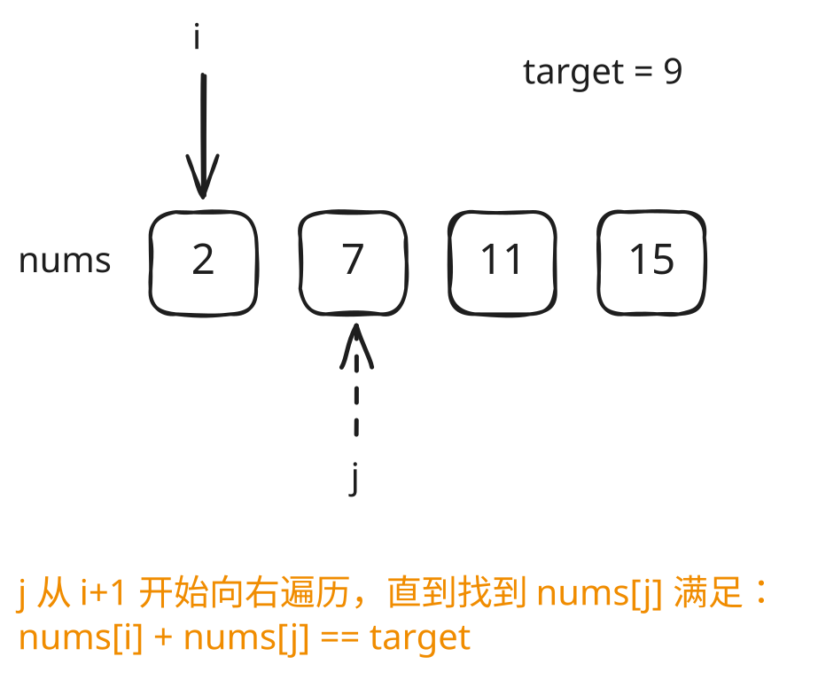
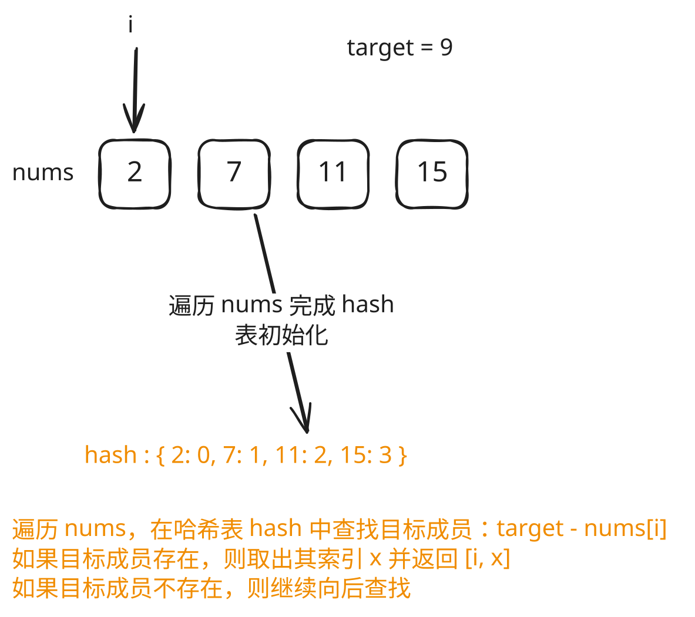
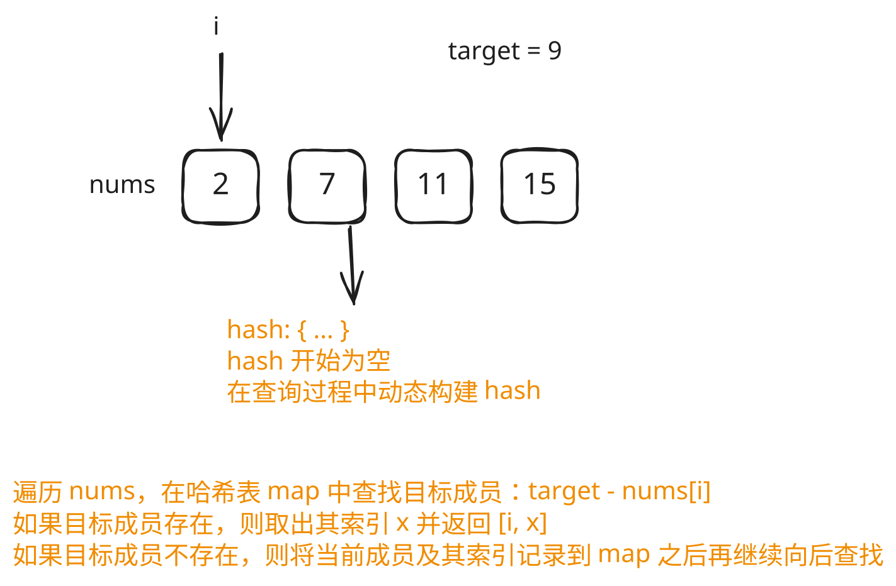

## 1. 题目描述

[leetcode](https://leetcode.cn/problems/two-sum/)

给定一个整数数组 `nums` 和一个整数目标值 `target`，请你在该数组中找出和为目标值 `target` 的那两个整数，并返回它们的数组下标。

你可以假设每种输入只会对应一个答案。但是，数组中同一个元素在答案里不能重复出现。你可以按任意顺序返回答案。

***

示例 1：

```txt
输入：nums = [2,7,11,15], target = 9
输出：[0,1]
```

解释：因为 `nums[0] + nums[1] == 9`，返回 `[0, 1]`。

***

示例 2：

```txt
-输入：nums = [3,2,4], target = 6
输出：[1,2]
```

***

示例 3：

```txt
输入：nums = [3,3], target = 6
输出：[0,1]
```

***

提示：

- `2 <= nums.length <= 10^4`
- `-10^9 <= nums[i] <= 10^9`
- `-10^9 <= target <= 10^9`
- 只会存在一个有效答案

***

进阶：你可以想出一个时间复杂度小于 `O(n^2)` 的算法吗？

## 2. s.1 - 双指针暴力求解

 {align=center}

::: code-group

```c [c]
/**
 * Note: The returned array must be malloced, assume caller calls free().
 */
int* twoSum(int* nums, int numsSize, int target, int* returnSize) {
    for (int i = 0; i < numsSize - 1; i++) {
        for (int j = i + 1; j < numsSize; j++) {
            if (target == nums[i] + nums[j]) {
                int* result = (int*)malloc(2 * sizeof(int));
                result[0] = i;
                result[1] = j;
                *returnSize = 2;
                return result;
            }
        }
    }
    *returnSize = 0;
    return NULL;
}
```

```js [js]
/**
 * @param {number[]} nums
 * @param {number} target
 * @return {number[]}
 */
var twoSum = function (nums, target) {
  for (let i = 0; i < nums.length - 1; i++)
    for (let j = i + 1; j < nums.length; j++)
      if (target === nums[j] + nums[i]) return [i, j];
};
```

```py [py]
class Solution:
    def twoSum(self, nums: List[int], target: int) -> List[int]:
        for i in range(len(nums) - 1):
            for j in range(i + 1, len(nums)):
                if target == nums[i] + nums[j]:
                    return [i, j]
        return []
```

:::

- 时间复杂度：$O(n^2)$，两层嵌套循环枚举所有数对
- 空间复杂度：$O(1)$，只使用常数额外空间

算法思路：

- 双层循环枚举所有数对 `(i, j)`（`i < j`）
- 若 `nums[i] + nums[j] === target`，返回 `[i, j]`

## 3. s.2 - 静态哈希表



::: code-group

```c [c]
#define HASH_SIZE 20011

typedef struct {
    int key;
    int val;
    int used;
} Entry;

/**
 * Note: The returned array must be malloced, assume caller calls free().
 */
int* twoSum(int* nums, int numsSize, int target, int* returnSize) {
    Entry table[HASH_SIZE];
    memset(table, 0, sizeof(table));

    // 第一步：构建哈希表
    for (int i = 0; i < numsSize; i++) {
        int h = ((nums[i] % HASH_SIZE) + HASH_SIZE) % HASH_SIZE;
        while (table[h].used && table[h].key != nums[i])
            h = (h + 1) % HASH_SIZE;
        table[h].key = nums[i];
        table[h].val = i;
        table[h].used = 1;
    }

    // 第二步：查询哈希表
    int* res = (int*)malloc(2 * sizeof(int));
    *returnSize = 2;
    for (int i = 0; i < numsSize; i++) {
        int anotherNum = target - nums[i];
        int h = ((anotherNum % HASH_SIZE) + HASH_SIZE) % HASH_SIZE;
        while (table[h].used && table[h].key != anotherNum)
            h = (h + 1) % HASH_SIZE;
        if (table[h].used && table[h].val != i) {
            res[0] = i;
            res[1] = table[h].val;
            return res;
        }
    }
    return res;
}
```

```js [js]
var twoSum = function (nums, target) {
  // 初始化哈希表
  const map = new Map();
  for (let i = 0; i < nums.length; i++) map.set(nums[i], i);

  // 查询哈希表
  for (let i = 0; i < nums.length; i++) {
    const anotherNum = target - nums[i];
    if (map.has(anotherNum) && map.get(anotherNum) !== i)
      return [i, map.get(anotherNum)];
  }
};
```

```py [py]
class Solution:
    def twoSum(self, nums: List[int], target: int) -> List[int]:
        # 第一步：构建哈希表
        map = {}
        for i, num in enumerate(nums):
            map[num] = i

        # 第二步：查询哈希表
        for i, num in enumerate(nums):
            another = target - num
            if another in map and map[another] != i:
                return [i, map[another]]
```

:::

- 时间复杂度：$O(n)$，两次线性遍历，构建和查询各 $O(n)$
- 空间复杂度：$O(n)$，哈希表最多存储 n 个元素

算法思路：

- 第一步：遍历 `nums`，将每个数字及其下标写入哈希表 `map`（重复数字保留最后一个下标）
- 第二步：再次遍历 `nums`，对当前元素 `nums[i]` 查找 `anotherNum = target - nums[i]` 是否在 `map` 中，且不是自身（`map[anotherNum] !== i`），若满足则返回 `[i, map[anotherNum]]`

## 4. s.3 - 动态哈希表



::: code-group

```c [c]
#define HASH_SIZE 20011

typedef struct {
    int key;
    int val;
    int used;
} Entry;

/**
 * Note: The returned array must be malloced, assume caller calls free().
 */
int* twoSum(int* nums, int numsSize, int target, int* returnSize) {
    Entry table[HASH_SIZE];
    memset(table, 0, sizeof(table));

    int* res = (int*)malloc(2 * sizeof(int));
    *returnSize = 2;

    for (int i = 0; i < numsSize; i++) {
        int anotherNum = target - nums[i];
        // 先查
        int h = ((anotherNum % HASH_SIZE) + HASH_SIZE) % HASH_SIZE;
        while (table[h].used && table[h].key != anotherNum)
            h = (h + 1) % HASH_SIZE;
        if (table[h].used) {
            res[0] = i;
            res[1] = table[h].val;
            return res;
        }
        // 后写
        int hw = ((nums[i] % HASH_SIZE) + HASH_SIZE) % HASH_SIZE;
        while (table[hw].used && table[hw].key != nums[i])
            hw = (hw + 1) % HASH_SIZE;
        table[hw].key = nums[i];
        table[hw].val = i;
        table[hw].used = 1;
    }
    return res;
}
```

```js [js]
var twoSum = function (nums, target) {
  const map = new Map();
  for (let i = 0; i < nums.length; i++) {
    const item = nums[i];
    const anotherNum = target - item;
    if (map.has(anotherNum)) {
      return [i, map.get(anotherNum)];
    }
    map.set(item, i);
  }
};
```

```py [py]
class Solution:
    def twoSum(self, nums: List[int], target: int) -> List[int]:
        map = {}
        for i, item in enumerate(nums):
            another = target - item
            if another in map:
                return [i, map[another]]
            map[item] = i
```

:::

- 时间复杂度：$O(n)$，单次遍历，查和写各 $O(1)$
- 空间复杂度：$O(n)$，哈希表最多存储 n 个元素

算法思路：

- 一边遍历 `nums`，对当前元素 `nums[i]`，先查询 `anotherNum = target - nums[i]` 是否已在 `map` 中，若在则返回 `[i, map[anotherNum]]`
- 查不到再将 `nums[i]` 写入 `map`，保证不会查到自身
