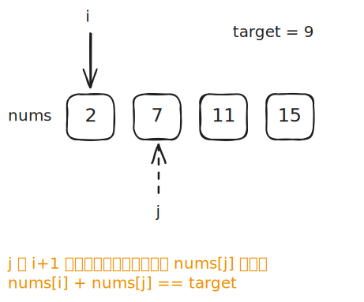
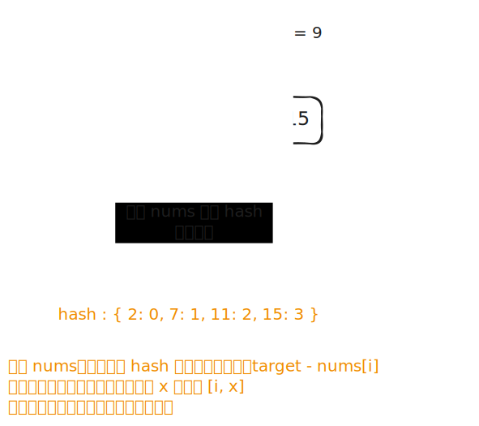
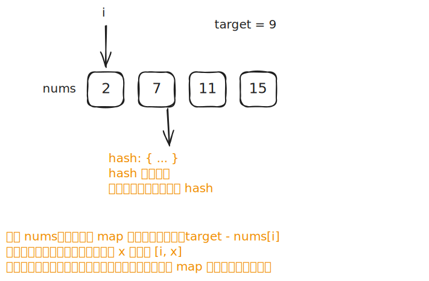

# [0001. 两数之和【简单】](https://github.com/tnotesjs/TNotes.leetcode/tree/main/notes/0001.%20%E4%B8%A4%E6%95%B0%E4%B9%8B%E5%92%8C%E3%80%90%E7%AE%80%E5%8D%95%E3%80%91)

<!-- region:toc -->

- [1. 📝 题目描述](#1--题目描述)
- [2. 🎯 s.1 - 双指针暴力求解](#2--s1---双指针暴力求解)
- [3. 🎯 s.2 - 静态哈希表](#3--s2---静态哈希表)
- [4. 🎯 s.3 - 动态哈希表](#4--s3---动态哈希表)

<!-- endregion:toc -->

## 1. 📝 题目描述

- [leetcode](https://leetcode.cn/problems/two-sum/)

给定一个整数数组 `nums` 和一个整数目标值 `target`，请你在该数组中找出和为目标值 `target` 的那两个整数，并返回它们的数组下标。

你可以假设每种输入只会对应一个答案。但是，数组中同一个元素在答案里不能重复出现。你可以按任意顺序返回答案。

示例 1：

```txt
输入：nums = [2,7,11,15], target = 9
输出：[0,1]
```

解释：因为 `nums[0] + nums[1] == 9`，返回 `[0, 1]`。

---

示例 2：

```txt
输入：nums = [3,2,4], target = 6
输出：[1,2]
```

---

示例 3：

```txt
输入：nums = [3,3], target = 6
输出：[0,1]
```

提示：

- `2 <= nums.length <= 10^4`
- `-10^9 <= nums[i] <= 10^9`
- `-10^9 <= target <= 10^9`
- 只会存在一个有效答案

进阶：你可以想出一个时间复杂度小于 `O(n^2)` 的算法吗？

## 2. 🎯 s.1 - 双指针暴力求解



::: code-group

<<< ./solutions/1/1.c [c]

<<< ./solutions/1/1.js [js]

<<< ./solutions/1/1.py [py]

:::

- 时间复杂度：$O(n^2)$，两层嵌套循环枚举所有数对
- 空间复杂度：$O(1)$，只使用常数额外空间

算法思路：

- 双层循环枚举所有数对 `(i, j)`（`i < j`）
- 若 `nums[i] + nums[j] === target`，返回 `[i, j]`

## 3. 🎯 s.2 - 静态哈希表



::: code-group

<<< ./solutions/2/1.c [c]

<<< ./solutions/2/1.js [js]

<<< ./solutions/2/1.py [py]

:::

- 时间复杂度：$O(n)$，两次线性遍历，构建和查询各 $O(n)$
- 空间复杂度：$O(n)$，哈希表最多存储 n 个元素

算法思路：

- 第一步：遍历 `nums`，将每个数字及其下标写入哈希表 `map`（重复数字保留最后一个下标）
- 第二步：再次遍历 `nums`，对当前元素 `nums[i]` 查找 `anotherNum = target - nums[i]` 是否在 `map` 中，且不是自身（`map[anotherNum] !== i`），若满足则返回 `[i, map[anotherNum]]`

## 4. 🎯 s.3 - 动态哈希表



::: code-group

<<< ./solutions/3/1.c [c]

<<< ./solutions/3/1.js [js]

<<< ./solutions/3/1.py [py]

<<< ./solutions/3/1.ts [ts]

:::

- 时间复杂度：$O(n)$，单次遍历，查和写各 $O(1)$
- 空间复杂度：$O(n)$，哈希表最多存储 n 个元素

算法思路：

- 一边遍历 `nums`，对当前元素 `nums[i]`，先查询 `anotherNum = target - nums[i]` 是否已在 `map` 中，若在则返回 `[i, map[anotherNum]]`
- 查不到再将 `nums[i]` 写入 `map`，保证不会查到自身
