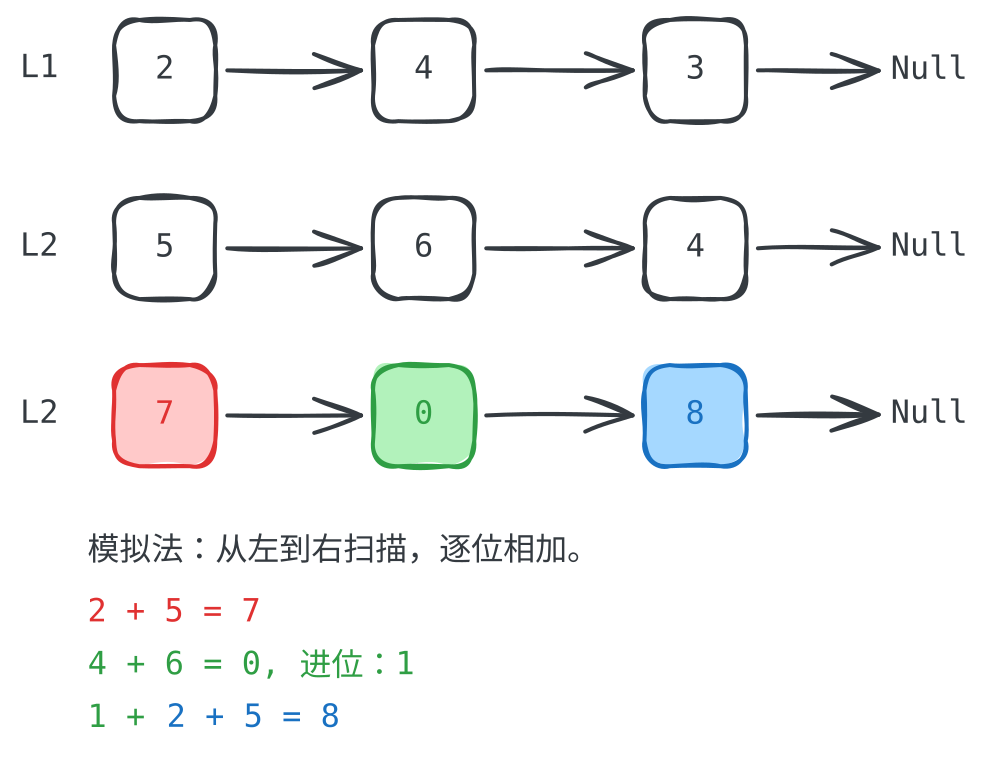

## 1. 题目描述

[leetcode](https://leetcode.cn/problems/add-two-numbers)

给你两个非空的链表，表示两个非负的整数。它们每位数字都是按照逆序的方式存储的，并且每个节点只能存储一位数字。

请你将两个数相加，并以相同形式返回一个表示和的链表。

你可以假设除了数字 0 之外，这两个数都不会以 0 开头。

---

示例 1：

<br />

```txt
输入：l1 = [2,4,3], l2 = [5,6,4]
输出：[7,0,8]
```

解释：342 + 465 = 807

---

示例 2：

```txt
输入：l1 = [0], l2 = [0]
输出：[0]
```

---

示例 3：

```txt
输入：l1 = [9,9,9,9,9,9,9], l2 = [9,9,9,9]
输出：[8,9,9,9,0,0,0,1]
```

---

提示：

- 每个链表中的节点数在范围 `[1, 100]` 内
- `0 <= Node.val <= 9`
- 题目数据保证列表表示的数字不含前导零

## 2. s.1 - 模拟法

 {align=center}

::: code-group

```c [c]
/**
 * Definition for singly-linked list.
 * struct ListNode {
 *     int val;
 *     struct ListNode *next;
 * };
 */
struct ListNode* addTwoNumbers(struct ListNode* l1, struct ListNode* l2) {
    struct ListNode* head = NULL;
    struct ListNode* tail = NULL;
    int carry = 0;

    while (l1 || l2) {
        int n1 = l1 ? l1->val : 0;
        int n2 = l2 ? l2->val : 0;
        int sum = n1 + n2 + carry;

        struct ListNode* node =
            (struct ListNode*)malloc(sizeof(struct ListNode));
        node->val = sum % 10;
        node->next = NULL;

        if (!head) {
            head = tail = node;
        } else {
            tail->next = node;
            tail = tail->next;
        }
        carry = sum / 10;

        if (l1)
            l1 = l1->next;
        if (l2)
            l2 = l2->next;
    }

    if (carry > 0) {
        struct ListNode* node =
            (struct ListNode*)malloc(sizeof(struct ListNode));
        node->val = carry;
        node->next = NULL;
        tail->next = node;
    }

    return head;
}
```

```js [js]
/**
 * Definition for singly-linked list.
 * function ListNode(val, next) {
 *     this.val = (val===undefined ? 0 : val)
 *     this.next = (next===undefined ? null : next)
 * }
 */
/**
 * @param {ListNode} l1
 * @param {ListNode} l2
 * @return {ListNode}
 */
var addTwoNumbers = function (l1, l2) {
  let head = null // 新链表的头节点
  let tail = null // 新链表的尾节点
  let carry = 0 // 模拟逐位求和的进位

  while (l1 || l2) {
    const n1 = l1 ? l1.val : 0
    const n2 = l2 ? l2.val : 0
    const sum = n1 + n2 + carry
    if (!head) {
      head = tail = new ListNode(sum % 10)
    } else {
      tail.next = new ListNode(sum % 10)
      tail = tail.next
    }
    carry = Math.floor(sum / 10)

    // 移动指针，继续检查后续位
    if (l1) l1 = l1.next
    if (l2) l2 = l2.next
  }

  // 最后检查是否有新的进位
  if (carry > 0) tail.next = new ListNode(carry)

  return head
}
```

```py [py]
# Definition for singly-linked list.
# class ListNode:
#     def __init__(self, val=0, next=None):
#         self.val = val
#         self.next = next
class Solution:
    def addTwoNumbers(
        self, l1: Optional[ListNode], l2: Optional[ListNode]
    ) -> Optional[ListNode]:
        head = None
        tail = None
        carry = 0

        while l1 or l2:
            n1 = l1.val if l1 else 0
            n2 = l2.val if l2 else 0
            total = n1 + n2 + carry

            node = ListNode(total % 10)
            if not head:
                head = tail = node
            else:
                tail.next = node
                tail = tail.next
            carry = total // 10

            if l1:
                l1 = l1.next
            if l2:
                l2 = l2.next

        if carry > 0:
            tail.next = ListNode(carry)

        return head
```

:::

- 时间复杂度：$O(\max(m, n))$，其中 m 和 n 分别是两个链表的长度
- 空间复杂度：$O(\max(m, n))$，新链表最多有 $\max(m, n) + 1$ 个节点

算法思路：

- 同时遍历两个链表，短链表对应位取 0，逐位计算 `n1 + n2 + carry`
- 每轮取 `sum % 10` 作为新节点值，`sum / 10` 作为下一轮进位
- 遍历结束后若 `carry > 0`，在尾部追加进位节点
