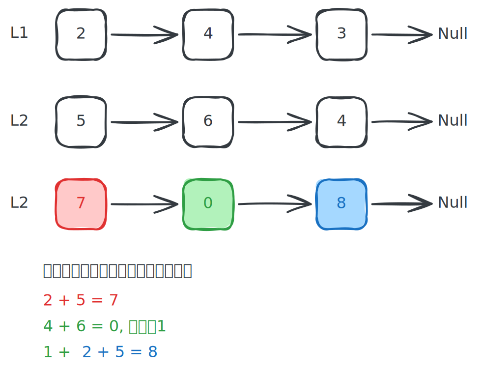

# [0002. 两数相加【中等】](https://github.com/tnotesjs/TNotes.leetcode/tree/main/notes/0002.%20%E4%B8%A4%E6%95%B0%E7%9B%B8%E5%8A%A0%E3%80%90%E4%B8%AD%E7%AD%89%E3%80%91)

<!-- region:toc -->

- [1. 📝 题目描述](#1--题目描述)
- [2. 🎯 s.1 - 模拟法](#2--s1---模拟法)

<!-- endregion:toc -->

## 1. 📝 题目描述

- [leetcode](https://leetcode.cn/problems/add-two-numbers)

给你两个非空的链表，表示两个非负的整数。它们每位数字都是按照逆序的方式存储的，并且每个节点只能存储一位数字。

请你将两个数相加，并以相同形式返回一个表示和的链表。

你可以假设除了数字 0 之外，这两个数都不会以 0 开头。

---

示例 1：


```txt
输入：l1 = [2,4,3], l2 = [5,6,4]
输出：[7,0,8]
```

解释：342 + 465 = 807

---

示例 2：

```txt
输入：l1 = [0], l2 = [0]
输出：[0]
```

---

示例 3：

```txt
输入：l1 = [9,9,9,9,9,9,9], l2 = [9,9,9,9]
输出：[8,9,9,9,0,0,0,1]
```

---

提示：

- 每个链表中的节点数在范围 `[1, 100]` 内
- `0 <= Node.val <= 9`
- 题目数据保证列表表示的数字不含前导零

## 2. 🎯 s.1 - 模拟法



::: code-group

<<< ./solutions/1/1.c [c]

<<< ./solutions/1/1.js [js]

<<< ./solutions/1/1.py [py]

:::

- 时间复杂度：$O(\max(m, n))$，其中 m 和 n 分别是两个链表的长度
- 空间复杂度：$O(\max(m, n))$，新链表最多有 $\max(m, n) + 1$ 个节点

算法思路：

- 同时遍历两个链表，短链表对应位取 0，逐位计算 `n1 + n2 + carry`
- 每轮取 `sum % 10` 作为新节点值，`sum / 10` 作为下一轮进位
- 遍历结束后若 `carry > 0`，在尾部追加进位节点
