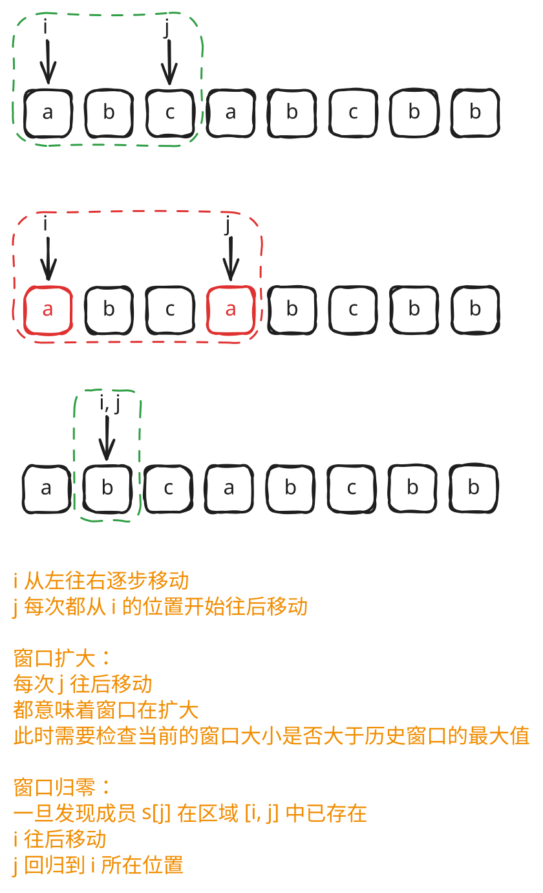
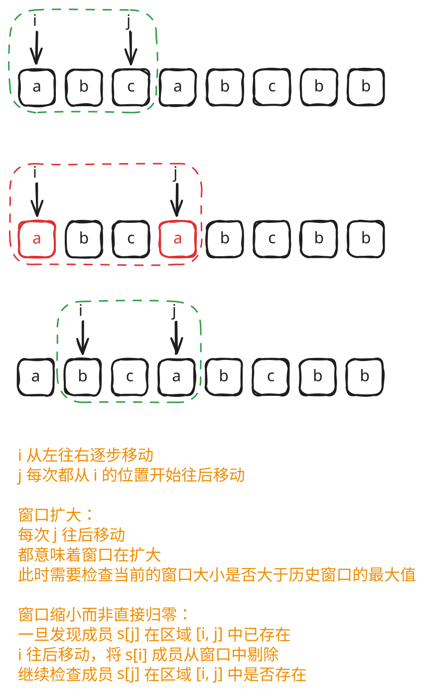

## 1. 题目描述

- [leetcode](https://leetcode.cn/problems/longest-substring-without-repeating-characters/)

给定一个字符串 `s`，请你找出其中不含有重复字符的最长子串的长度。

> 子字符串是字符串中连续的非空字符序列。

---

示例 1：

```
输入：s = "abcabcbb"
输出：3
```

解释：因为无重复字符的最长子串是 `"abc"`，所以其长度为 3。

---

示例 2：

```
输入：s = "bbbbb"
输出：1
```

解释：因为无重复字符的最长子串是 `"b"`，所以其长度为 1。

---

示例 3：

```
输入：s = "pwwkew"
输出：3
```

解释：因为无重复字符的最长子串是 `"wke"`，所以其长度为 3。请注意，你的答案必须是 子串 的长度，`"pwke"` 是一个子序列，不是子串。

---

提示：

- `0 <= s.length <= 5 * 10^4`
- `s` 由英文字母、数字、符号和空格组成

## 2. s.1 - 暴力解法



::: code-group

```c [c]
int lengthOfLongestSubstring(char* s) {
    int len = strlen(s);
    int ans = 0;
    for (int i = 0; i < len; i++) {
        int seen[128] = {0}; // start
        for (int j = i; j < len; j++) {
            // end
            if (seen[(unsigned char)s[j]])
                break; // start 右移
            seen[(unsigned char)s[j]] = 1;
            int cur = j - i + 1;
            if (cur > ans)
                ans = cur;
        }
    }
    return ans;
}
```

```js [js]
var lengthOfLongestSubstring = function (s) {
  const len = s.length
  const set = new Set()
  let ans = 0
  for (let i = 0; i < len; i++) {
    // start
    for (let j = i; j < len; j++) {
      // end
      if (!set.has(s[j])) {
        set.add(s[j])
        ans = ans > set.size ? ans : set.size
      } else {
        set.clear()
        break // start 右移
      }
    }
  }
  return ans
}
```

```py [py]
class Solution:
    def lengthOfLongestSubstring(self, s: str) -> int:
        ans = 0
        for i in range(len(s)):  # start
            seen = set()
            for j in range(i, len(s)):  # end
                if s[j] in seen:
                    break  # start 右移
                seen.add(s[j])
                ans = max(ans, len(seen))
        return ans
```

:::

- 时间复杂度：$O(n^2)$，外层枚举起始位置，内层向右扩展直到遇到重复字符
- 空间复杂度：$O(|\Sigma|)$，其中 $|\Sigma|$ 为字符集大小，集合最多存储所有不重复字符

算法思路：

- 枚举所有可能的子串起始位置 `i`，从 `i` 开始向右逐字符扩展
- 若当前字符 `s[j]` 不在集合中，则加入并更新最大长度
- 若已存在重复字符，清空集合，移动起始位置 `i` 右移

## 3. s.2 - 滑动窗口



::: code-group

```c [c]
int lengthOfLongestSubstring(char* s) {
    int len = strlen(s);
    int seen[128] = {0};
    int ans = 0;
    int left = 0, right = 0;
    while (right < len) {
        if (!seen[(unsigned char)s[right]]) {
            // 窗口扩大
            seen[(unsigned char)s[right]] = 1;
            right++;
            int cur = right - left;
            if (cur > ans)
                ans = cur;
        } else {
            // 窗口缩小
            seen[(unsigned char)s[left]] = 0;
            left++;
        }
    }
    return ans;
}
```

```js [js]
var lengthOfLongestSubstring = function (s) {
  const len = s.length
  const set = new Set()

  let ans = 0
  let left = 0
  let right = 0

  while (right < len) {
    if (!set.has(s[right])) {
      // 窗口扩大
      set.add(s[right])
      right++
      ans = Math.max(ans, set.size)
    } else {
      // 窗口缩小
      set.delete(s[left])
      left++
    }
  }
  return ans
}

// 其他写法：
/* var lengthOfLongestSubstring = function (s) {
  const len = s.length
  const set = new Set()

  let ans = 0
  let end = -1

  for (let i = 0; i < len; i++) {
    // 收缩窗口 - 缩 1 格
    if (i !== 0) set.delete(s[i - 1])
    // 扩展窗口 - 尽可能多扩展
    while (end + 1 < len && !set.has(s[end + 1])) {
      set.add(s[end + 1])
      end++
    }
    ans = Math.max(ans, set.size)
  }
  return ans
} */
```

```py [py]
class Solution:
    def lengthOfLongestSubstring(self, s: str) -> int:
        seen = set()
        ans = 0
        left = 0
        right = 0
        while right < len(s):
            if s[right] not in seen:
                # 窗口扩大
                seen.add(s[right])
                right += 1
                ans = max(ans, len(seen))
            else:
                # 窗口缩小
                seen.discard(s[left])
                left += 1
        return ans
```

:::

- 时间复杂度：$O(n)$，左右指针各最多移动 $n$ 次
- 空间复杂度：$O(|\Sigma|)$，其中 $|\Sigma|$ 为字符集大小，集合最多存储所有不重复字符

算法思路：

- 维护滑动窗口 `[left, right)`，用集合记录窗口内字符
- `right` 右扩：若 `s[right]` 不在集合中，加入并 `right++`，更新最大长度
- `right` 遇到重复：从左侧收缩，移除 `s[left]` 并 `left++`，直到窗口内无重复字符
