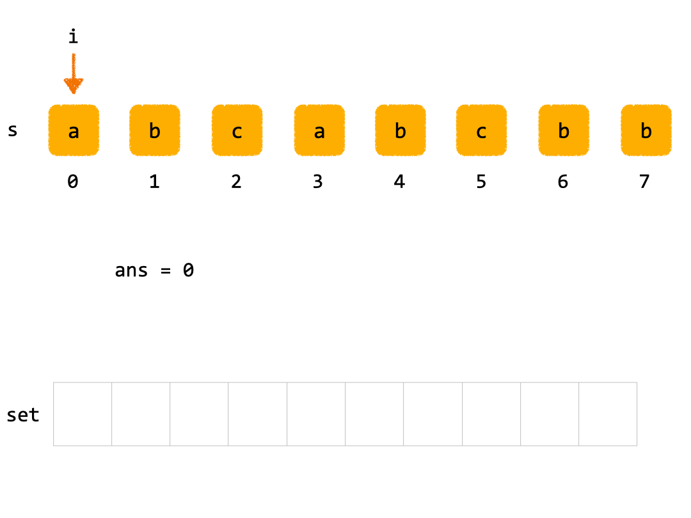
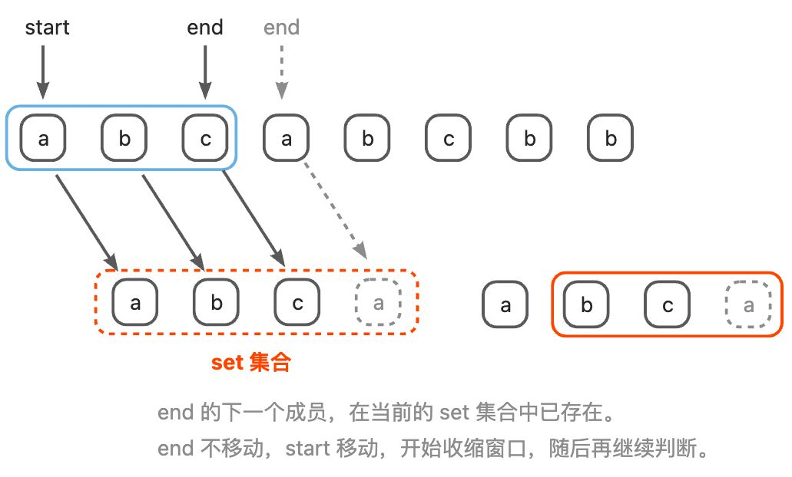

# [0003. 无重复字符的最长子串【中等】](https://github.com/Tdahuyou/TNotes.leetcode/tree/main/notes/0003.%20%E6%97%A0%E9%87%8D%E5%A4%8D%E5%AD%97%E7%AC%A6%E7%9A%84%E6%9C%80%E9%95%BF%E5%AD%90%E4%B8%B2%E3%80%90%E4%B8%AD%E7%AD%89%E3%80%91)

<!-- region:toc -->

- [1. 📝 Description](#1--description)
- [2. 💻 题解.1 - 暴力解法](#2--题解1---暴力解法)
- [3. 💻 题解.2 - 滑动窗口](#3--题解2---滑动窗口)

<!-- endregion:toc -->

## 1. 📝 Description

::: details [leetcode](https://leetcode.cn/problems/longest-substring-without-repeating-characters/)

给定一个字符串 `s` ，请你找出其中不含有重复字符的 **最长子串** 的长度。

> **子字符串** 是字符串中连续的 **非空** 字符序列。

**示例 1:**

- 输入: s = "abcabcbb"
- 输出: 3
- 解释: 因为无重复字符的最长子串是 `"abc"`，所以其长度为 3。

**示例 2:**

- 输入: s = "bbbbb"
- 输出: 1
- 解释: 因为无重复字符的最长子串是 `"b"`，所以其长度为 1。

**示例 3:**

- 输入: s = "pwwkew"
- 输出: 3
- 解释: 因为无重复字符的最长子串是 `"wke"`，所以其长度为 3。请注意，你的答案必须是 **子串** 的长度，`"pwke"` 是一个子序列，不是子串。

**提示：**

- `0 <= s.length <= 5 * 10^4`
- `s` 由英文字母、数字、符号和空格组成

:::

## 2. 💻 题解.1 - 暴力解法


::: code-group

```js
var lengthOfLongestSubstring = function (s) {
  const len = s.length, set = new Set()
  let ans = 0
  for (let i = 0; i < len; i++) { // start
    for (let j = i; j < len; j++) { // end
      if (!set.has(s[j])) {
        set.add(s[j])
        ans = ans > set.size ? ans : set.size
      } else {
        set.clear()
        break // start 右移
      }
    }
  }
  return ans
}
```

:::

::: details

- 时间复杂度：O(n^2)
- 空间复杂度：O(n)

---

**原理简述**


`start` 表示每次扫描的开始位置，`end` 表示每次扫描的结束位置，`end` 每次出生的位置就是 `start` 所在的位置。在每次扫描的过程中，`start` 不动，`end` 不断向右偏移，`end` 已经扫过的区域都加入到 `set` 中记录起来。

- 如果 `end` 位置的字符在 `set` 中出现过，那么将 `set` 清空，开启下一次扫描。此时退出内层循环，`start` 向右偏移。
- 如果 `end` 位置的字符在 `set` 中没有出现过，那么将该字符加入 `set` 中，并记录最长子串的长度。

---

**流程分析**

1. **初始化变量**：
    - `len`：保存字符串 `s` 的长度。
    - `set`：一个用于存储字符的 `Set` 集合，用于检查子串中是否有重复字符。
    - `ans`：用于记录最长无重复字符子串的长度，初始值为 0，也是该函数最终返回的结果。
        * **为什么要初始为 0？**
        * **特殊情况：**`s = ""` 输入的 s 为空字符串，此时将不会进入循环，因此需要注意将 `ans` 的初始值设置为 `0`。
2. **双层循环遍历字符串**：
    - 外层循环 `for (let i = 0; i < len; i++)`：`i` 表示子串的起始位置。
    - 内层循环 `for (let j = i; j < len; j++)`：`j` 表示子串的结束位置，每次 `j` 扫描过的区域就是从当前 `i` 位置开始的最长子串。
3. **检查子串中的字符**：
    - 在内层循环中，检查当前字符 `s[j]` 是否已经存在于 `set` 中。
    - 如果当前字符不在 `set` 中：
        * 将字符 `s[j]` 添加到 `set` 中。
        * 更新 `ans` 的值为 `set.size` 和 `ans` 中的较大者。
    - 如果当前字符已经在 `set` 中：
        * 清空 `set`，表示需要重新开始寻找新的子串。
        * 使用 `break` 跳出内层循环，继续外层循环，以 `i+1` 为新的起始位置重新寻找子串。
4. **返回结果**：
    - 外层循环结束后，返回 `ans`，即最长无重复字符子串的长度。

---

**示例执行流程**

假设输入字符串为 `"abcabcbb"`。

1. **初始状态**：
    - `len = 8`
    - `set = new Set()`
    - `ans = 0`
2. **外层循环**（起始位置 `i` 从 0 开始）：
    - **第一轮内层循环**（起始位置 `i = 0`）：
        * `j = 0`，字符 `a` 不在 `set` 中，添加到 `set`，`set = {'a'}`，更新 `ans = 1`。
        * `j = 1`，字符 `b` 不在 `set` 中，添加到 `set`，`set = {'a', 'b'}`，更新 `ans = 2`。
        * `j = 2`，字符 `c` 不在 `set` 中，添加到 `set`，`set = {'a', 'b', 'c'}`，更新 `ans = 3`。
        * `j = 3`，字符 `a` 在 `set` 中，清空 `set`，跳出内层循环。
    - **第二轮内层循环**（起始位置 `i = 1`）：
        * `j = 1`，字符 `b` 不在 `set` 中，添加到 `set`，`set = {'b'}`，更新 `ans = 3`。
        * `j = 2`，字符 `c` 不在 `set` 中，添加到 `set`，`set = {'b', 'c'}`，更新 `ans = 3`。
        * `j = 3`，字符 `a` 不在 `set` 中，添加到 `set`，`set = {'b', 'c', 'a'}`，更新 `ans = 3`。
        * `j = 4`，字符 `b` 在 `set` 中，清空 `set`，跳出内层循环。
    - **第三轮内层循环**（起始位置 `i = 2`）：
        * 以此类推... 直到外层循环结束，将找到无重复的最长子串返回。

---

**如何改进**

- `set.clear()` 每次遇到重复字符后，集合会被清空，可能丢失之前已经统计的有效子串。
- **思考切入点：**如何让收集到的子串能够被充分利用起来，不要每次都清空，然后从 0 继续开始收集。
    - 通过使用滑动窗口和哈希集合，可以优化为线性时间复杂度 O(n)。

:::

## 3. 💻 题解.2 - 滑动窗口



::: code-group

```js
/**
 * @param {string} s
 * @return {number}
 */
var lengthOfLongestSubstring = function (s) {
  const set = new Set()
  let ans = 0, left = 0, right = 0

  while (right < s.length) {
    if (!set.has(s[right])) {
      set.add(s[right])
      right++
      ans = Math.max(ans, set.size)
    } else {
      set.delete(s[left])
      left++
    }
  }
  return ans
};
```

:::

::: details

- 时间复杂度：O(n)
- 空间复杂度：O(n)

---

**原理简述**



- 收缩窗口：start 移动，start 扫过的区域，全部都从 set 集合中移除 `set.delete(...)`。
- 扩展窗口：end 移动，end 扫过的区域，全部都丢到 set 集合中 `set.add(...)`。

和上述“solutions - 暴力解法”非常类似，不同点在于 end 指针的移动不再是从 start 开始，而是基于上一次的位置开始。

**`end = -1`、`end` 的移动逻辑**

end 移动时，意味着扩展窗口。但是 end 每次移动之前，需要处理的逻辑：

1. 判断下一个位置是否还有成员，如果没有，则不移动；否则进入下一步。
2. 判断下一个位置的成员是否已经在哈希表中存在，若存在，则不移动；否则进入下一步。
3. 将下一个成员加入到哈希表中
4. 重复以上步骤

end 开始赋值为 -1，也是为了让代码更优雅，好从字符串下标 0 的位置开始判断。

**记录结果的两个时刻：**

1. 在每次收缩窗口之前
2. 在遍历完字符串的时候

:::
