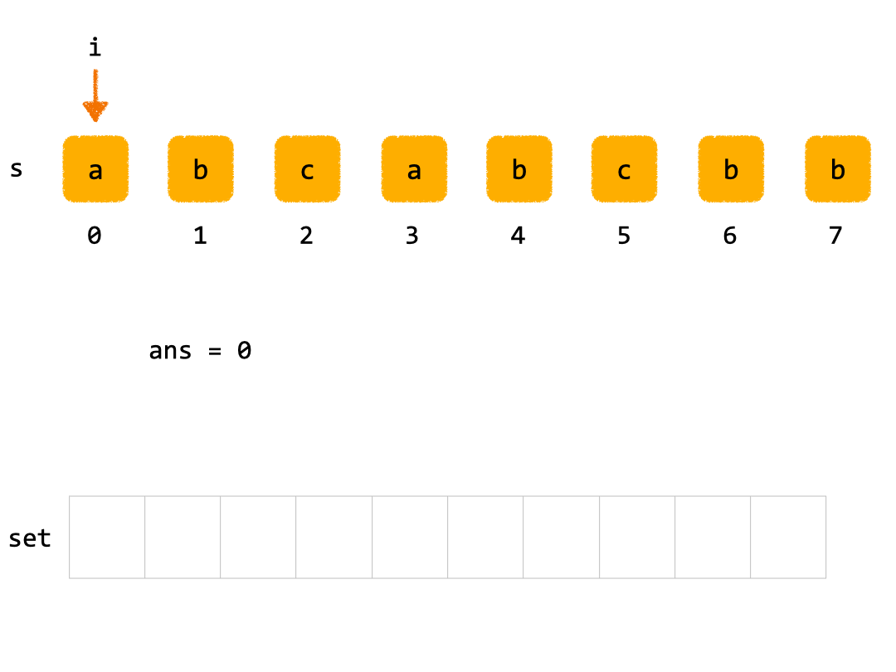

# [0003. 无重复字符的最长子串【中等】](https://github.com/tnotesjs/TNotes.leetcode/tree/main/notes/0003.%20%E6%97%A0%E9%87%8D%E5%A4%8D%E5%AD%97%E7%AC%A6%E7%9A%84%E6%9C%80%E9%95%BF%E5%AD%90%E4%B8%B2%E3%80%90%E4%B8%AD%E7%AD%89%E3%80%91)

<!-- region:toc -->

::: details 📚 相关资源

- [📂 TNotes.yuque（笔记附件资源）](https://www.yuque.com/tdahuyou/tnotes.yuque/)
  - [TNotes.yuque.leetcode.0003](https://www.yuque.com/tdahuyou/tnotes.yuque/leetcode.0003)

:::

- [1. 📝 题目描述](#1--题目描述)
- [2. 🎯 s.1 - 暴力解法](#2--s1---暴力解法)
- [3. 🎯 s.2 - 滑动窗口](#3--s2---滑动窗口)

<!-- endregion:toc -->

## 1. 📝 题目描述

- [leetcode](https://leetcode.cn/problems/longest-substring-without-repeating-characters/)

给定一个字符串 `s`，请你找出其中不含有重复字符的最长子串的长度。

> 子字符串是字符串中连续的非空字符序列。

---

示例 1：

```
输入: s = "abcabcbb"
输出: 3
```

解释: 因为无重复字符的最长子串是 `"abc"`，所以其长度为 3。

---

示例 2：

```
输入: s = "bbbbb"
输出: 1
```

解释: 因为无重复字符的最长子串是 `"b"`，所以其长度为 1。

---

示例 3：

```
输入: s = "pwwkew"
输出: 3
```

解释: 因为无重复字符的最长子串是 `"wke"`，所以其长度为 3。请注意，你的答案必须是 子串 的长度，`"pwke"` 是一个子序列，不是子串。

---

提示：

- `0 <= s.length <= 5 * 10^4`
- `s` 由英文字母、数字、符号和空格组成

## 2. 🎯 s.1 - 暴力解法


::: code-group

<<< ./solutions/1/1.js [js]

<<< ./solutions/1/1.ts [ts]

:::

- 时间复杂度：$O(n^2)$
- 空间复杂度：$O(n)$

## 3. 🎯 s.2 - 滑动窗口



::: code-group

<<< ./solutions/2/1.js [js-1]

<<< ./solutions/2/2.js [js-2]

<<< ./solutions/2/1.ts [ts]

:::

- 时间复杂度：$O(n)$
- 空间复杂度：$O(n)$
