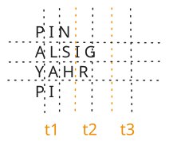
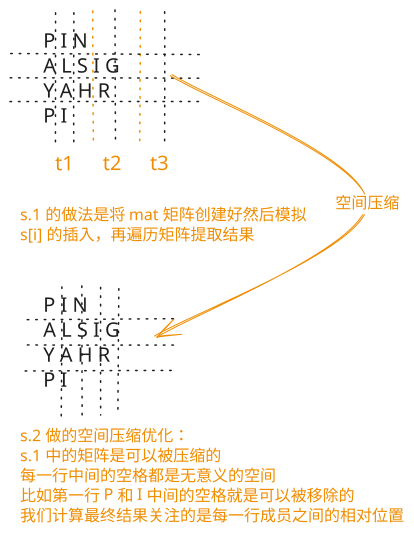

## 1. 题目描述

- [leetcode](https://leetcode.cn/problems/zigzag-conversion/)

将一个给定字符串 `s` 根据给定的行数 `numRows`，以从上往下、从左到右进行 Z 字形排列。

比如输入字符串为 `"PAYPALISHIRING"` 行数为 `3` 时，排列如下：

```
P   A   H   N
A P L S I I G
Y   I   R
```

之后，你的输出需要从左往右逐行读取，产生出一个新的字符串，比如：`"PAHNAPLSIIGYIR"`。

请你实现这个将字符串进行指定行数变换的函数：

> string convert(string s, int numRows);

---

示例 1：

```
输入：s = "PAYPALISHIRING", numRows = 3
输出："PAHNAPLSIIGYIR"
```

---

示例 2：

```
输入：s = "PAYPALISHIRING", numRows = 4
输出："PINALSIGYAHRPI"
```

解释：

```
P     I    N
A   L S  I G
Y A   H R
P     I
```

---

示例 3：

```
输入：s = "A", numRows = 1
输出："A"
```

---

提示：

- `1 <= s.length <= 1000`
- `s` 由英文字母（小写和大写）、`','` 和 `'.'` 组成
- `1 <= numRows <= 1000`

## 2. s.1 - 利用二维矩阵模拟



::: code-group

```c [c]
char* convert(char* s, int numRows) {
    int n = strlen(s);
    int r = numRows;
    if (r == 1 || r >= n)
        return s;

    int t = r * 2 - 2;
    int c = ((n + t - 1) / t) * (r - 1);

    // 分配二维矩阵（r 行 c 列），初始化为 0
    char* mat = (char*)calloc(r * c, sizeof(char));

    int x = 0, y = 0;
    for (int i = 0; i < n; i++) {
        mat[x * c + y] = s[i];
        if (i % t < r - 1) {
            x++; // 向下移动
        } else {
            x--;
            y++; // 向右上移动
        }
    }

    char* ans = (char*)malloc((n + 1) * sizeof(char));
    int idx = 0;
    for (int i = 0; i < r; i++) {
        for (int j = 0; j < c; j++) {
            if (mat[i * c + j] != 0) {
                ans[idx++] = mat[i * c + j];
            }
        }
    }
    ans[idx] = '\0';
    free(mat);
    return ans;
}
```

```js [js]
/**
 * @param {string} s
 * @param {number} numRows
 * @return {string}
 */
var convert = function (s, numRows) {
  const n = s.length
  const r = numRows
  if (r === 1 || r >= n) return s

  const t = r * 2 - 2
  const c = Math.floor((n + t - 1) / t) * (r - 1)
  const mat = new Array(r).fill(0).map(() => new Array(c).fill(0))
  for (let i = 0, x = 0, y = 0; i < n; ++i) {
    mat[x][y] = s[i]
    if (i % t < r - 1) {
      ++x // 向下移动
    } else {
      --x
      ++y // 向右上移动
    }
  }
  const ans = []
  for (const row of mat) {
    for (const ch of row) {
      if (ch !== 0) {
        ans.push(ch)
      }
    }
  }
  return ans.join('')
}
```

```py [py]
class Solution:
    def convert(self, s: str, numRows: int) -> str:
        n = len(s)
        r = numRows
        if r == 1 or r >= n:
            return s

        t = r * 2 - 2
        c = ((n + t - 1) // t) * (r - 1)
        mat = [[""] * c for _ in range(r)]

        x, y = 0, 0
        for i, ch in enumerate(s):
            mat[x][y] = ch
            if i % t < r - 1:
                x += 1  # 向下移动
            else:
                x -= 1
                y += 1  # 向右上移动

        return "".join(ch for row in mat for ch in row if ch)
```

:::

- 时间复杂度：$O(r \cdot n)$，其中 $r$ 为行数，需初始化并遍历整个二维矩阵
- 空间复杂度：$O(r \cdot n)$，需要一张 $r \times c$ 的二维矩阵存储所有字符

算法思路：

- 初始化二维矩阵 `mat`
  - Z 字形遍历的一个周期的字符数为 `t = 2r - 2`
  - 根据字符数 `n` 计算需要的列数 `c` 初始化二维矩阵
- 用指针 `(x, y)` 模拟字符串 `s` 进行 Z 字形排列的过程（就是写入矩阵 mat 的过程）
  - `i % t < r - 1` 时向下移动（`x++`）
  - 否则向右上移动（`x--`, `y++`）
- 按行读取矩阵中的非零元素拼接得到结果

### 2.1. 计算一个周期的字符数

周期 $t$ 是指 Z 字形排列中，字符运动轨迹重复一次所需的最小字符数量。我们可以通过分析字符在行之间的移动路径来推导：

向下阶段：字符从第 $0$ 行开始，依次向下移动直到第 $r-1$ 行（最后一行）。

- 经过的行号：$0, 1, 2, \dots, r-1$。
- 包含的字符数量：$r$ 个。

向上阶段：到达底部后，字符改变方向，向右上移动，直到回到第 $1$ 行（注意：第 $0$ 行是下一个周期的起点，因此不计入当前周期的向上阶段）。

- 经过的行号：$r-2, r-3, \dots, 1$。
- 包含的字符数量：从 $1$ 到 $r-2$，共 $r-2$ 个。

合并计算：一个完整的周期包含“向下”和“向上”两个阶段的所有字符：

$$
t = (\text{向下字符数}) + (\text{向上字符数})
$$

$$
t = r + (r - 2)
$$

$$
t = 2r - 2
$$

### 2.2. 计算列数

列数 $c$ 是为了初始化二维矩阵 `mat[r][c]` 而计算的宽度。我们需要知道 $n$ 个字符在 Z 字形排列中最多会占据多少列。

单个周期的列宽：观察一个完整周期在水平方向上占据的列数：

- 竖直部分：字符在第 $0$ 行到第 $r-1$ 行垂直排列，只占用 1 列。
- 斜线部分：字符从第 $r-2$ 行向右上移动到第 $1$ 行。每移动一行，列号加 1。
  - 移动的行数为 $r-2$ 行（从 $r-2$ 到 $1$）。
  - 因此，斜线部分在水平方向上跨越了 $r-2$ 列。
- 单周期总列宽 = $1 + (r - 2) = r - 1$。

周期的数量：字符串总长度为 $n$，每个周期容纳 $t$ 个字符。

需要的周期数（向上取整）为：

$$
\text{cycles} = \lceil \frac{n}{t} \rceil
$$

总列数计算：

$$
c = \text{周期数} \times \text{单周期列宽}
$$

$$
c = \lceil \frac{n}{t} \rceil \times (r - 1)
$$

注意：这种计算方法实际上是一种最大宽度的估算。

- 如果字符串最后一个周期没有走完（例如只走了竖直部分，还没走斜线），实际占用的列数会小于计算出的 $c$。
- 但这会导致矩阵右侧多出若干全为 `0`（或空）的列。
- 由于后续读取逻辑会跳过空元素 (`if (ch !== 0)`)，这种“多算”不会影响最终结果的正确性，同时避免了复杂的边界判断来精确计算最后一列的位置。

## 3. s.2 - 压缩矩阵空间



::: code-group

```c [c]
char* convert(char* s, int numRows) {
    int n = strlen(s);
    int r = numRows;
    if (r == 1 || r >= n)
        return s;

    int t = r * 2 - 2;
    // 每行分配足够空间（最多 n 个字符）
    char** rows = (char**)malloc(r * sizeof(char*));
    int* lens = (int*)calloc(r, sizeof(int));
    for (int i = 0; i < r; i++) {
        rows[i] = (char*)malloc((n + 1) * sizeof(char));
    }

    int x = 0;
    for (int i = 0; i < n; i++) {
        rows[x][lens[x]++] = s[i];
        if (i % t < r - 1) {
            x++;
        } else {
            x--;
        }
    }

    char* ans = (char*)malloc((n + 1) * sizeof(char));
    int idx = 0;
    for (int i = 0; i < r; i++) {
        for (int j = 0; j < lens[i]; j++) {
            ans[idx++] = rows[i][j];
        }
        free(rows[i]);
    }
    ans[idx] = '\0';
    free(rows);
    free(lens);
    return ans;
}
```

```js [js]
/**
 * @param {string} s
 * @param {number} numRows
 * @return {string}
 */
var convert = function (s, numRows) {
  const n = s.length
  const r = numRows
  if (r === 1 || r >= n) return s

  const mat = new Array(r).fill(0)
  for (let i = 0; i < r; ++i) mat[i] = []
  for (let i = 0, x = 0, t = r * 2 - 2; i < n; ++i) {
    mat[x].push(s[i])
    i % t < r - 1 ? ++x : --x // 模拟指针移动，计算下一个 s[i] 应该插入到 mat[x] 的哪一行
  }
  const ans = []
  for (const row of mat) {
    ans.push(row.join(''))
  }
  return ans.join('')
}
```

```py [py]
class Solution:
    def convert(self, s: str, numRows: int) -> str:
        n = len(s)
        r = numRows
        if r == 1 or r >= n:
            return s

        t = r * 2 - 2
        rows = [[] for _ in range(r)]
        x = 0
        for i, ch in enumerate(s):
            rows[x].append(ch)
            if i % t < r - 1:
                x += 1
            else:
                x -= 1  # 模拟指针移动，计算下一个 s[i] 应该插入到 rows[x] 的哪一行

        return "".join("".join(row) for row in rows)
```

:::

- 时间复杂度：$O(n)$，只需一次遍历字符串
- 空间复杂度：$O(n)$，用 $r$ 个字符数组共存储所有字符

算法思路：

- 相比 s.1，用 $r$ 个一维数组代替二维矩阵，每个数组对应矩阵的一行
- 同样用 `i % t` 判断当前行号 `x` 的方向，将字符直接 `push` 到对应行的数组
- 最后按行合并所有数组得到结果

## 4. s.3 - 直接构造

::: code-group

```c [c]
char* convert(char* s, int numRows) {
    int n = strlen(s);
    int r = numRows;
    if (r == 1 || r >= n)
        return s;

    int t = r * 2 - 2;
    char* ans = (char*)malloc((n + 1) * sizeof(char));
    int idx = 0;

    for (int i = 0; i < r; i++) {            // 枚举行
        for (int j = 0; j + i < n; j += t) { // 枚举每个周期的起始下标
            ans[idx++] = s[j + i];           // 当前周期第一个字符
            if (i > 0 && i < r - 1 && j + t - i < n) {
                ans[idx++] = s[j + t - i]; // 当前周期第二个字符
            }
        }
    }
    ans[idx] = '\0';
    return ans;
}
```

```js [js]
/**
 * @param {string} s
 * @param {number} numRows
 * @return {string}
 */
var convert = function (s, numRows) {
  const n = s.length
  const r = numRows
  if (r === 1 || r >= n) return s

  const t = r * 2 - 2
  const ans = []

  // 外层枚举行
  for (let i = 0; i < r; i++) {
    // 内层跨周期枚举该行的成员
    for (let j = 0; j < n - i; j += t) {
      ans.push(s[j + i])
      if (
        0 < i && // 同一个周期 t 内，第一行只有一个成员
        i < r - 1 && // 同一个周期 t 内，第 r - 1 行只有一个成员
        j + t - i < n // 确保插入的成员是有效的
      ) {
        ans.push(s[j + t - i])
      }
    }
  }
  return ans.join('')
}
```

```py [py]
class Solution:
    def convert(self, s: str, numRows: int) -> str:
        n = len(s)
        r = numRows
        if r == 1 or r >= n:
            return s

        t = r * 2 - 2
        ans = []
        for i in range(r):  # 枚举行
            for j in range(0, n - i, t):  # 枚举每个周期的起始下标
                ans.append(s[j + i])  # 当前周期第一个字符
                if 0 < i < r - 1 and j + t - i < n:
                    ans.append(s[j + t - i])  # 当前周期第二个字符
        return "".join(ans)
```

:::

- 时间复杂度：$O(n)$，每个字符恰好被访问一次
- 空间复杂度：$O(n)$，结果数组存储所有字符

算法思路：

- 直接按照读取顺序构造结果，无需中间矩阵
- 周期 `t = 2r - 2`，外层枚举行号 `i`，内层偏移量 `j` 按周期 `t` 为步长，依次取同一行的字符
- 在遍历每个周期的时候，需要注意插入的第二个成员的条件：
  - 同一个周期内，第一行和第 r - 1 行只会存在一个成员
  - 确保插入的成员索引 `j + t - i` 未越界
