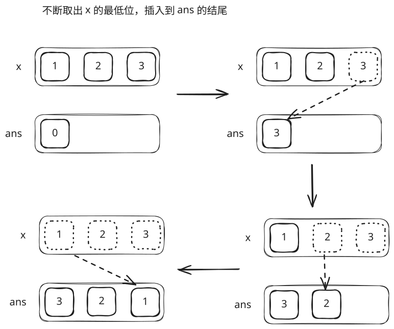

## 1. 题目描述

- [leetcode](https://leetcode.cn/problems/reverse-integer/)

给你一个 32 位的有符号整数 `x`，返回将 `x` 中的数字部分反转后的结果。

如果反转后整数超过 32 位的有符号整数的范围 $[-2^{31}, 2^{31} - 1]$，就返回 0。

假设环境不允许存储 64 位整数（有符号或无符号）。

---

示例 1：

```
输入：x = 123
输出：321
```

---

示例 2：

```
输入：x = -123
输出：-321
```

---

示例 3：

```
输入：x = 120
输出：21
```

---

示例 4：

```
输入：x = 0
输出：0
```

---

提示：

- $-2^{31} <= x <= 2^{31} - 1$

## 2. s.1 - 转为字符串求解

::: code-group

```c [c]
int reverse(int x) {
    char buf[12];
    sprintf(buf, "%d", x);

    int start = (buf[0] == '-') ? 1 : 0;
    int end = strlen(buf) - 1;
    while (start < end) {
        char tmp = buf[start];
        buf[start++] = buf[end];
        buf[end--] = tmp;
    }

    long long ans = atoll(buf);
    if (ans < -2147483648 || ans > 2147483647)
        return 0;
    return (int)ans;
}
```

```js [js]
/**
 * @param {number} x
 * @return {number}
 */
var reverse = function (x) {
  let ans =
    x < 0
      ? '-' + x.toString().substring(1).split('').reverse().join('') - 0
      : x.toString().split('').reverse().join('') - 0

  const max = 2 ** 31 - 1
  const min = -(2 ** 31)

  return ans < min || ans > max ? 0 : ans
}
```

```py [py]
class Solution:
    def reverse(self, x: int) -> int:
        sign = -1 if x < 0 else 1
        ans = sign * int(str(abs(x))[::-1])
        if ans < -(2**31) or ans > 2**31 - 1:
            return 0
        return ans
```

:::

- 时间复杂度：$O(\log N)$，字符串转换与反转的操作次数均与整数位数正相公
- 空间复杂度：$O(\log N)$，字符串转换和拆分会产生这个长度的中间字符串

算法思路：

- 将 `x` 转为字符串后反转，负数先去掉负号再处理尾部符号
- 将反转结果转回数字后加回正负号，检查是否超出 $[-2^{31}, 2^{31}-1]$ 范围

## 3. s.2 - 数学方法



::: code-group

```c [c]
int reverse(int x) {
    long long ans = 0;
    while (x != 0) {
        ans = ans * 10 + x % 10;
        x /= 10;
    }
    if (ans < -2147483648 || ans > 2147483647)
        return 0;
    return (int)ans;
}
```

```js [js]
/**
 * @param {number} x
 * @return {number}
 */
var reverse = function (x) {
  const max = 2 ** 31 - 1
  const min = -(2 ** 31)

  let ans = 0
  while (x !== 0) {
    ans = ans * 10 + (x % 10)
    x = Math.trunc(x / 10)
  }

  return ans < min || ans > max ? 0 : ans
}
```

```py [py]
class Solution:
    def reverse(self, x: int) -> int:
        sign = -1 if x < 0 else 1
        ans = 0
        x = abs(x)
        while x != 0:
            ans = ans * 10 + x % 10
            x //= 10
        ans *= sign
        if ans < -(2**31) or ans > 2**31 - 1:
            return 0
        return ans
```

:::

- 时间复杂度：$O(\log N)$，循环执行次数等于整数位数
- 空间复杂度：$O(1)$，只使用了常数级别的额外空间

算法思路：

- 每次迭代取出 `x` 的最低位数字 `x % 10`，拼接到 `ans` 的最高位：`ans = ans * 10 + x % 10`
- 同时 `x /= 10` 去掉已处理的最低位，直到 `x == 0`
- 最后检查 `ans` 是否超出 $[-2^{31}, 2^{31}-1]$ 范围，超出则返回 0
