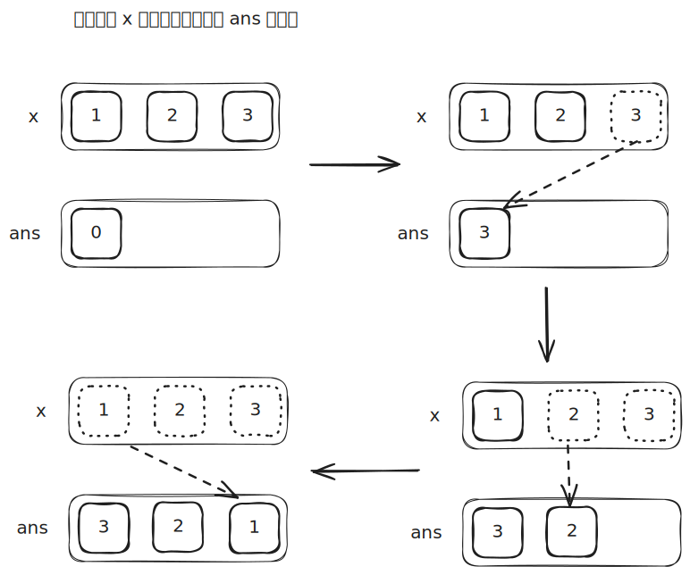

# [0007. 整数反转【中等】](https://github.com/tnotesjs/TNotes.leetcode/tree/main/notes/0007.%20%E6%95%B4%E6%95%B0%E5%8F%8D%E8%BD%AC%E3%80%90%E4%B8%AD%E7%AD%89%E3%80%91)

<!-- region:toc -->

- [1. 📝 题目描述](#1--题目描述)
- [2. 🎯 s.1 - 转为字符串求解](#2--s1---转为字符串求解)
- [3. 🎯 s.2 - 数学方法](#3--s2---数学方法)

<!-- endregion:toc -->

## 1. 📝 题目描述

- [leetcode](https://leetcode.cn/problems/reverse-integer/)

给你一个 32 位的有符号整数 `x`，返回将 `x` 中的数字部分反转后的结果。

如果反转后整数超过 32 位的有符号整数的范围 $[-2^{31}, 2^{31} - 1]$，就返回 0。

假设环境不允许存储 64 位整数（有符号或无符号）。

---

示例 1：

```
输入：x = 123
输出：321
```

---

示例 2：

```
输入：x = -123
输出：-321
```

---

示例 3：

```
输入：x = 120
输出：21
```

---

示例 4：

```
输入：x = 0
输出：0
```

---

提示：

- $-2^{31} <= x <= 2^{31} - 1$

## 2. 🎯 s.1 - 转为字符串求解

::: code-group

<<< ./solutions/1/1.c [c]

<<< ./solutions/1/1.js [js]

<<< ./solutions/1/1.py [py]

:::

- 时间复杂度：$O(\log N)$，字符串转换与反转的操作次数均与整数位数正相公
- 空间复杂度：$O(\log N)$，字符串转换和拆分会产生这个长度的中间字符串

算法思路：

- 将 `x` 转为字符串后反转，负数先去掉负号再处理尾部符号
- 将反转结果转回数字后加回正负号，检查是否超出 $[-2^{31}, 2^{31}-1]$ 范围

## 3. 🎯 s.2 - 数学方法



::: code-group

<<< ./solutions/2/1.c [c]

<<< ./solutions/2/1.js [js]

<<< ./solutions/2/1.py [py]

:::

- 时间复杂度：$O(\log N)$，循环执行次数等于整数位数
- 空间复杂度：$O(1)$，只使用了常数级别的额外空间

算法思路：

- 每次迭代取出 `x` 的最低位数字 `x % 10`，拼接到 `ans` 的最高位：`ans = ans * 10 + x % 10`
- 同时 `x /= 10` 去掉已处理的最低位，直到 `x == 0`
- 最后检查 `ans` 是否超出 $[-2^{31}, 2^{31}-1]$ 范围，超出则返回 0
