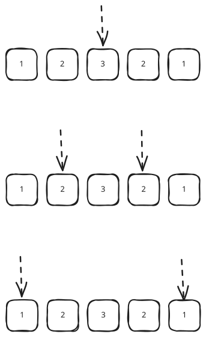

## 1. 题目描述

- [leetcode](https://leetcode.cn/problems/palindrome-number/)

给你一个整数 `x`，如果 `x` 是一个回文整数，返回 `true`；否则，返回 `false`。

回文数是指正序（从左向右）和倒序（从右向左）读都是一样的整数。

- 例如，`121` 是回文，而 `123` 不是。

---

示例 1：

```
输入：x = 121
输出：true
```

---

示例 2：

```
输入：x = -121
输出：false
```

解释：

- 从左向右读，为 `-121`。
- 从右向左读，为 `121-`。
- 因此它不是一个回文数。

---

示例 3：

```
输入：x = 10
输出：false
```

解释：

- 从右向左读，为 `01`。
- 因此它不是一个回文数。

---

提示：

- `-2^31 <= x <= 2^31 - 1`

---

进阶：你能不将整数转为字符串来解决这个问题吗？

## 2. s.1 - 字符串反转

::: code-group

```c [c]
bool isPalindrome(int x) {
    if (x < 0)
        return false;
    char buf[12];
    sprintf(buf, "%d", x);
    int n = strlen(buf);
    // 反转字符串
    char rev[12];
    for (int i = 0; i < n; i++)
        rev[i] = buf[n - 1 - i];
    rev[n] = '\0';
    return strcmp(buf, rev) == 0;
}
```

```js [js]
/**
 * @param {number} x
 * @return {boolean}
 */
var isPalindrome = function (x) {
  // 如果 x 是负数，那么它不可能是回文串
  if (x < 0) return false
  return x.toString() === x.toString().split('').reverse().join('')
}
```

```py [py]
class Solution:
    def isPalindrome(self, x: int) -> bool:
        if x < 0:
            return False
        s = str(x)
        return s == s[::-1]
```

:::

- 时间复杂度：$O(\log N)$，其中 $N$ 是整数的值，字符串转换与反转的操作次数均与位数正相公
- 空间复杂度：$O(\log N)$，将整数转为字符串和反转字符串各需要 $O(\log N)$ 的额外空间

算法思路：

- 将整数转为字符串，直接与其反转字符串比较，相等则是回文数
- 这种解法不符合进阶要求

## 3. s.2 - 先反转再比较

::: code-group

```c [c]
bool isPalindrome(int x) {
    if (x < 0)
        return false;
    int originalNum = x;
    long long resultNum = 0;
    while (x != 0) {
        resultNum = resultNum * 10 + x % 10;
        x /= 10;
    }
    return originalNum == resultNum;
}
```

```js [js]
/**
 * @param {number} x
 * @return {boolean}
 */
var isPalindrome = function (x) {
  if (x < 0) return false
  const originalNum = x // 原始值
  let resultNum = 0 // 经过反转后的结果
  while (x !== 0) {
    resultNum = resultNum * 10 + (x % 10)
    x = parseInt(x / 10)
  }
  return originalNum === resultNum
}
```

```py [py]
class Solution:
    def isPalindrome(self, x: int) -> bool:
        if x < 0:
            return False
        original_num = x
        result_num = 0
        while x != 0:
            result_num = result_num * 10 + x % 10
            x //= 10
        return original_num == result_num
```

:::

- 时间复杂度：$O(n)$，其中 n 是数字的位数
- 空间复杂度：$O(1)$，只使用常数级别的额外空间

算法思路：

- 通过数学运算反转整个数字，然后与原数字比较
- 使用取余和整除操作逐位构建反转后的数字
- 这种解法符合进阶要求

## 4. s.3 - 二分对比



::: code-group

```c [c]
bool isPalindrome(int x) {
    if (x < 0)
        return false;
    char buf[12];
    sprintf(buf, "%d", x);
    int left = 0, right = strlen(buf) - 1;
    while (left < right) {
        if (buf[left] != buf[right])
            return false;
        left++;
        right--;
    }
    return true;
}
```

```js [js]
/**
 * @param {number} x
 * @return {boolean}
 */
var isPalindrome = function (x) {
  if (x < 0) return false
  const arr = x.toString().split('') // 转化为数组
  const len = arr.length
  let endIndex = len - 1 // 数组的最后一个下标
  for (let i = 0; i <= len / 2; i++) {
    if (arr[i] !== arr[endIndex - i]) return false
  }
  return true
}
```

```py [py]
class Solution:
    def isPalindrome(self, x: int) -> bool:
        if x < 0:
            return False
        s = str(x)
        left, right = 0, len(s) - 1
        while left < right:
            if s[left] != s[right]:
                return False
            left += 1
            right -= 1
        return True
```

:::

- 时间复杂度：$O(\log N)$，其中 $N$ 是整数的值，遍历次数等于字符串长度即数字位数
- 空间复杂度：$O(\log N)$，将整数转为字符串需要 $O(\log N)$ 的额外空间

算法思路：

- 将整数转为字符串，用双指针 `left`、`right` 分别指向首尾，向中间收拢
- 每步比较 `s[left]` 与 `s[right]`，不等则直接返回 `false`，全部相等则返回 `true`
- 这种解法不符合进阶要求
