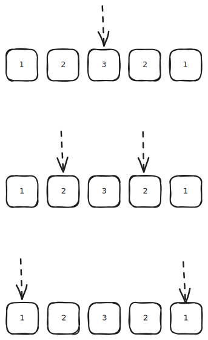

# [0009. 回文数【简单】](https://github.com/tnotesjs/TNotes.leetcode/tree/main/notes/0009.%20%E5%9B%9E%E6%96%87%E6%95%B0%E3%80%90%E7%AE%80%E5%8D%95%E3%80%91)

<!-- region:toc -->

- [1. 📝 题目描述](#1--题目描述)
- [2. 🎯 s.1 - 字符串反转](#2--s1---字符串反转)
- [3. 🎯 s.2 - 先反转再比较](#3--s2---先反转再比较)
- [4. 🎯 s.3 - 二分对比](#4--s3---二分对比)

<!-- endregion:toc -->

## 1. 📝 题目描述

- [leetcode](https://leetcode.cn/problems/palindrome-number/)

给你一个整数 `x`，如果 `x` 是一个回文整数，返回 `true`；否则，返回 `false`。

回文数是指正序（从左向右）和倒序（从右向左）读都是一样的整数。

- 例如，`121` 是回文，而 `123` 不是。

---

示例 1：

```
输入：x = 121
输出：true
```

---

示例 2：

```
输入：x = -121
输出：false
```

解释：

- 从左向右读，为 `-121`。
- 从右向左读，为 `121-`。
- 因此它不是一个回文数。

---

示例 3：

```
输入：x = 10
输出：false
```

解释：

- 从右向左读，为 `01`。
- 因此它不是一个回文数。

---

提示：

- `-2^31 <= x <= 2^31 - 1`

---

进阶：你能不将整数转为字符串来解决这个问题吗？

## 2. 🎯 s.1 - 字符串反转

::: code-group

<<< ./solutions/1/1.c [c]

<<< ./solutions/1/1.js [js]

<<< ./solutions/1/1.py [py]

:::

- 时间复杂度：$O(\log N)$，其中 $N$ 是整数的值，字符串转换与反转的操作次数均与位数正相公
- 空间复杂度：$O(\log N)$，将整数转为字符串和反转字符串各需要 $O(\log N)$ 的额外空间

算法思路：

- 将整数转为字符串，直接与其反转字符串比较，相等则是回文数
- 这种解法不符合进阶要求

## 3. 🎯 s.2 - 先反转再比较

::: code-group

<<< ./solutions/2/1.c [c]

<<< ./solutions/2/1.js [js]

<<< ./solutions/2/1.py [py]

:::

- 时间复杂度：$O(n)$，其中 n 是数字的位数
- 空间复杂度：$O(1)$，只使用常数级别的额外空间

算法思路：

- 通过数学运算反转整个数字，然后与原数字比较
- 使用取余和整除操作逐位构建反转后的数字
- 这种解法符合进阶要求

## 4. 🎯 s.3 - 二分对比



::: code-group

<<< ./solutions/3/1.c [c]

<<< ./solutions/3/1.js [js]

<<< ./solutions/3/1.py [py]

:::

- 时间复杂度：$O(\log N)$，其中 $N$ 是整数的值，遍历次数等于字符串长度即数字位数
- 空间复杂度：$O(\log N)$，将整数转为字符串需要 $O(\log N)$ 的额外空间

算法思路：

- 将整数转为字符串，用双指针 `left`、`right` 分别指向首尾，向中间收拢
- 每步比较 `s[left]` 与 `s[right]`，不等则直接返回 `false`，全部相等则返回 `true`
- 这种解法不符合进阶要求
