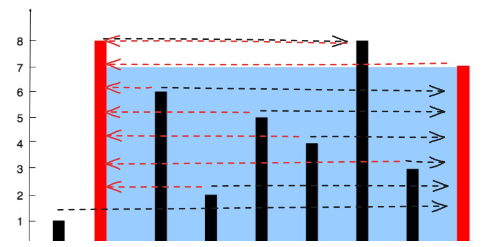
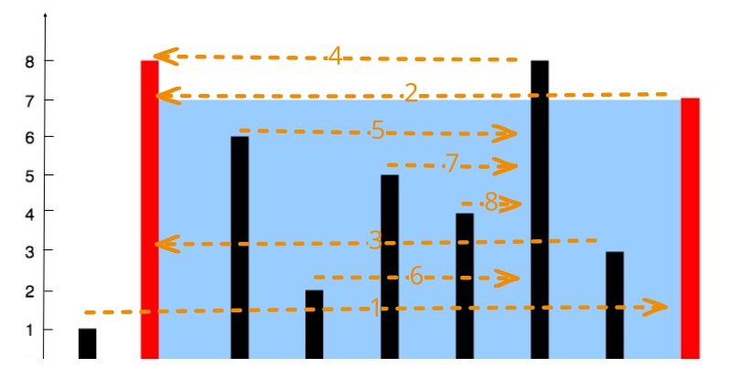

## 1. 题目描述

- [leetcode](https://leetcode.cn/problems/container-with-most-water/)

给定一个长度为 `n` 的整数数组 `height`。有 `n` 条垂线，第 `i` 条线的两个端点是 `(i, 0)` 和 `(i, height[i])`。

找出其中的两条线，使得它们与 `x` 轴共同构成的容器可以容纳最多的水。

返回容器可以储存的最大水量。

说明：你不能倾斜容器。

---

示例 1：


```
输入：[1, 8, 6, 2, 5, 4, 8, 3, 7]
输出：49
```

解释：

- 图中垂直线代表输入数组 `[1, 8, 6, 2, 5, 4, 8, 3, 7]`。
- 在此情况下，容器能够容纳水（表示为蓝色部分）的最大值为 49。

---

示例 2：

```
输入：height = [1, 1]
输出：1
```

---

提示：

- `n == height.length`
- `2 <= n <= 10^5`
- `0 <= height[i] <= 10^4`

## 2. s.1 - 暴力枚举



::: code-group

```c [c]
int maxArea(int* height, int heightSize) {
    int n = heightSize;
    int maxA =
        (n - 1) * (height[0] < height[n - 1] ? height[0] : height[n - 1]);

    // -> 以左柱为基准，找距离左柱最远的且高度大于等于左柱的右柱
    for (int l = 0; l < n; l++) {
        for (int r = n - 1; r > l; r--) {
            if (height[r] >= height[l]) {
                int area = (r - l) * height[l];
                if (area > maxA)
                    maxA = area;
                break;
            }
        }
    }

    // <- 以右柱为基准，找距离右柱最远的且高度大于等于右柱的左柱
    for (int r = n - 1; r > 0; r--) {
        for (int l = 0; l < r; l++) {
            if (height[l] >= height[r]) {
                int area = (r - l) * height[r];
                if (area > maxA)
                    maxA = area;
                break;
            }
        }
    }

    return maxA;
}
```

```js [js]
/**
 * @param {number[]} height
 * @return {number}
 */
var maxArea = function (height) {
  const len = height.length
  let maxArea = (len - 1) * Math.min(height[0], height[len - 1])

  // -> 以左柱为基准，找距离左柱最远的且高度大于等于左柱的右住
  for (let l = 0; l < len; l++) {
    for (let r = len - 1; r > l; r--) {
      if (height[r] >= height[l]) {
        const area = (r - l) * height[l]
        maxArea = maxArea > area ? maxArea : area
        break
      }
    }
  }

  // <- 以右柱为基准，找距离右柱最远的且高度大于等于右柱的左住
  for (let r = len - 1; r > 0; r--) {
    for (let l = 0; l < r; l++) {
      if (height[l] >= height[r]) {
        const area = (r - l) * height[r]
        maxArea = maxArea > area ? maxArea : area
        break
      }
    }
  }

  return maxArea
}
```

```py [py]
class Solution:
    def maxArea(self, height: List[int]) -> int:
        n = len(height)
        max_a = (n - 1) * min(height[0], height[-1])

        # -> 以左柱为基准，找距离左柱最远的且高度大于等于左柱的右柱
        for l in range(n):
            for r in range(n - 1, l, -1):
                if height[r] >= height[l]:
                    max_a = max(max_a, (r - l) * height[l])
                    break

        # <- 以右柱为基准，找距离右柱最远的且高度大于等于右柱的左柱
        for r in range(n - 1, 0, -1):
            for l in range(r):
                if height[l] >= height[r]:
                    max_a = max(max_a, (r - l) * height[r])
                    break

        return max_a
```

:::

- 时间复杂度：$O(n^2)$，其中 $n$ 为数组长度，两趟双层循环各 $O(n^2)$
- 空间复杂度：$O(1)$，只使用了常数级别的额外空间

算法思路：

- 对于任意一根柱子 X，它的最优解是距离它最远的，且高度大于等于 X 的柱子 Y，Y 可能出现在 X 的左侧或者右侧
- 两趟扫描
  - -> 以左柱 A 为基准，找距离 A 最远的且高度大于等于 A 的右住 B，对 A 来说，B 是它的最优解
  - <- 以右柱 C 为基准，找距离 C 最远的且高度大于等于 C 的左住 D，对 C 来说，D 是它的最优解
- 每次找到最优解之后，检查是否需要更新 `maxArea`

## 3. s.2 - 碰撞指针



::: code-group

```c [c]
int maxArea(int* height, int heightSize) {
    int l = 0, r = heightSize - 1, max_area = 0;
    while (l < r) {
        int h = height[l] < height[r] ? height[l] : height[r];
        int area = (r - l) * h;
        if (area > max_area)
            max_area = area;
        if (height[l] < height[r])
            l++;
        else
            r--;
    }
    return max_area;
}
```

```js [js]
var maxArea = function (height) {
  const len = height.length
  let l = 0,
    r = len - 1,
    max_area = 0

  while (l < r) {
    max_area = Math.max(max_area, (r - l) * Math.min(height[l], height[r]))
    height[l] < height[r] ? l++ : r--
  }

  return max_area
}
```

```py [py]
class Solution:
    def maxArea(self, height: List[int]) -> int:
        l, r, max_area = 0, len(height) - 1, 0
        while l < r:
            max_area = max(max_area, (r - l) * min(height[l], height[r]))
            if height[l] < height[r]:
                l += 1
            else:
                r -= 1
        return max_area
```

:::

- 时间复杂度：$O(n)$，其中 $n$ 为数组长度，左右指针各最多移动 $n$ 次
- 空间复杂度：$O(1)$，只使用了常数级别的额外空间

算法思路：

- 初始化指针 l、r 分别指向左右两端的柱子
- 收窄区间：每次向内移动其中较短的柱子一步
- 每次收窄区间之后都要维护 `maxArea` 是最大容量

### 3.1. 为什么要移动短的柱子，而不是较长的柱子？

- 首先明确容量的计算公式：`area = min(h[l], h[r]) * (r - l)`
- 无论移动哪根柱子，最终 `(r - l)` 都会减 1，因此这部分无需考虑，最终决定 area 的是 `min(h[l], h[r])`
  - 【1】移动较短的：`min(h[l], h[r])` 可能会变大或者不变
  - 【2】移动较长的：`min(h[l], h[r])` 可能会变小或者不变
- 我们追求的是容量最大化，因此应该走【1】才有可能找到最优解

## 4. 引用

- [11. 盛最多水的容器（双指针，清晰图解） - Leetcode 题解 - Krahets][1]

[1]: https://leetcode.cn/problems/container-with-most-water/solutions/11491/container-with-most-water-shuang-zhi-zhen-fa-yi-do/
