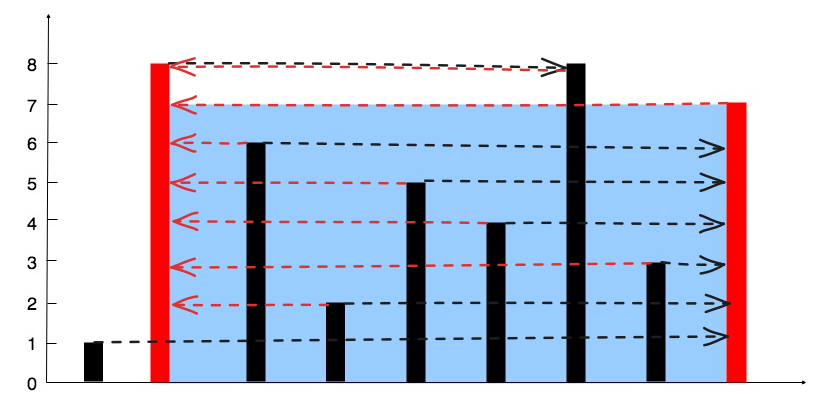
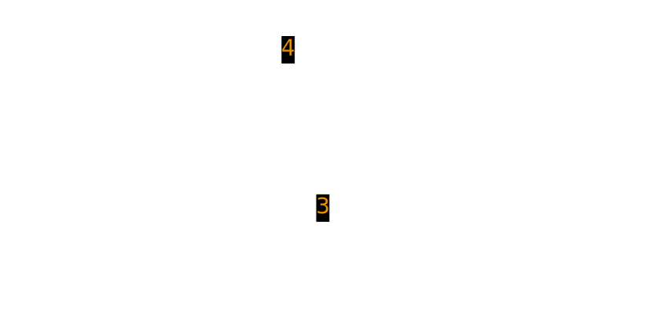

# [0011. 盛最多水的容器【中等】](https://github.com/tnotesjs/TNotes.leetcode/tree/main/notes/0011.%20%E7%9B%9B%E6%9C%80%E5%A4%9A%E6%B0%B4%E7%9A%84%E5%AE%B9%E5%99%A8%E3%80%90%E4%B8%AD%E7%AD%89%E3%80%91)

<!-- region:toc -->

- [1. 📝 题目描述](#1--题目描述)
- [2. 🎯 s.1 - 暴力枚举](#2--s1---暴力枚举)
- [3. 🎯 s.2 - 碰撞指针](#3--s2---碰撞指针)
  - [3.1. 为什么要移动短的柱子，而不是较长的柱子？](#31-为什么要移动短的柱子而不是较长的柱子)
- [4. 🔗 引用](#4--引用)

<!-- endregion:toc -->

## 1. 📝 题目描述

- [leetcode](https://leetcode.cn/problems/container-with-most-water/)

给定一个长度为 `n` 的整数数组 `height`。有 `n` 条垂线，第 `i` 条线的两个端点是 `(i, 0)` 和 `(i, height[i])`。

找出其中的两条线，使得它们与 `x` 轴共同构成的容器可以容纳最多的水。

返回容器可以储存的最大水量。

说明：你不能倾斜容器。

---

示例 1：


```
输入：[1, 8, 6, 2, 5, 4, 8, 3, 7]
输出：49
```

解释：

- 图中垂直线代表输入数组 `[1, 8, 6, 2, 5, 4, 8, 3, 7]`。
- 在此情况下，容器能够容纳水（表示为蓝色部分）的最大值为 49。

---

示例 2：

```
输入：height = [1, 1]
输出：1
```

---

提示：

- `n == height.length`
- `2 <= n <= 10^5`
- `0 <= height[i] <= 10^4`

## 2. 🎯 s.1 - 暴力枚举



::: code-group

<<< ./solutions/1/1.c [c]

<<< ./solutions/1/1.js [js]

<<< ./solutions/1/1.py [py]

:::

- 时间复杂度：$O(n^2)$，其中 $n$ 为数组长度，两趟双层循环各 $O(n^2)$
- 空间复杂度：$O(1)$，只使用了常数级别的额外空间

算法思路：

- 对于任意一根柱子 X，它的最优解是距离它最远的，且高度大于等于 X 的柱子 Y，Y 可能出现在 X 的左侧或者右侧
- 两趟扫描
  - -> 以左柱 A 为基准，找距离 A 最远的且高度大于等于 A 的右住 B，对 A 来说，B 是它的最优解
  - <- 以右柱 C 为基准，找距离 C 最远的且高度大于等于 C 的左住 D，对 C 来说，D 是它的最优解
- 每次找到最优解之后，检查是否需要更新 `maxArea`

## 3. 🎯 s.2 - 碰撞指针



::: code-group

<<< ./solutions/2/1.c [c]

<<< ./solutions/2/1.js [js]

<<< ./solutions/2/1.py [py]

:::

- 时间复杂度：$O(n)$，其中 $n$ 为数组长度，左右指针各最多移动 $n$ 次
- 空间复杂度：$O(1)$，只使用了常数级别的额外空间

算法思路：

- 初始化指针 l、r 分别指向左右两端的柱子
- 收窄区间：每次向内移动其中较短的柱子一步
- 每次收窄区间之后都要维护 `maxArea` 是最大容量

### 3.1. 为什么要移动短的柱子，而不是较长的柱子？

- 首先明确容量的计算公式：`area = min(h[l], h[r]) * (r - l)`
- 无论移动哪根柱子，最终 `(r - l)` 都会减 1，因此这部分无需考虑，最终决定 area 的是 `min(h[l], h[r])`
  - 【1】移动较短的：`min(h[l], h[r])` 可能会变大或者不变
  - 【2】移动较长的：`min(h[l], h[r])` 可能会变小或者不变
- 我们追求的是容量最大化，因此应该走【1】才有可能找到最优解

## 4. 🔗 引用

- [11. 盛最多水的容器（双指针，清晰图解） - Leetcode 题解 - Krahets][1]

[1]: https://leetcode.cn/problems/container-with-most-water/solutions/11491/container-with-most-water-shuang-zhi-zhen-fa-yi-do/
