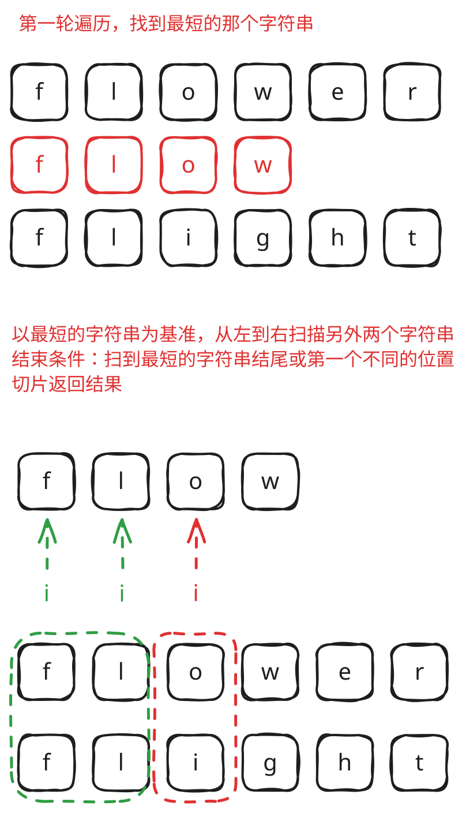
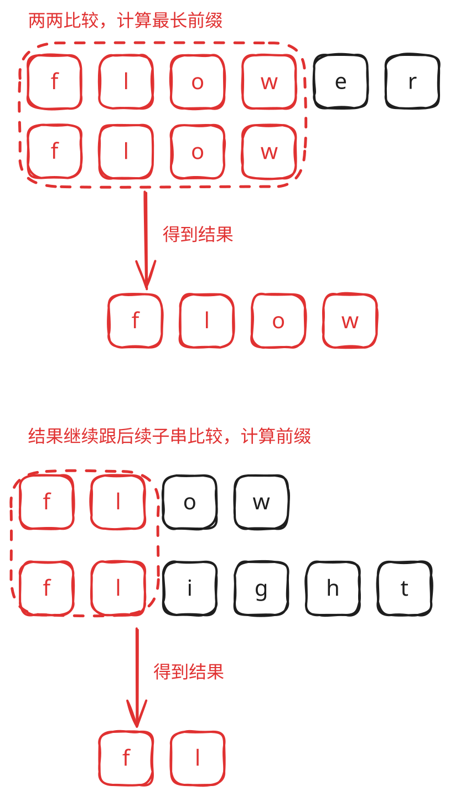
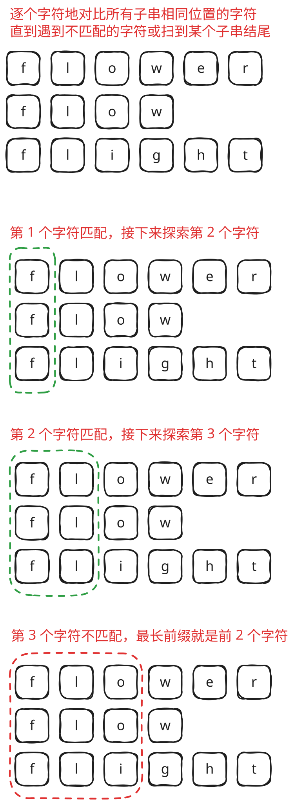

## 1. 题目描述

- [leetcode](https://leetcode.cn/problems/longest-common-prefix)

编写一个函数来查找字符串数组中的最长公共前缀。

如果不存在公共前缀，返回空字符串 `""`。

---

示例 1：

```
输入：strs = ["flower","flow","flight"]
输出："fl"
```

---

示例 2：

```
输入：strs = ["dog","racecar","car"]
输出：""
```

解释：输入不存在公共前缀。

---

提示：

- `1 <= strs.length <= 200`
- `0 <= strs[i].length <= 200`
- `strs[i]` 仅由小写英文字母组成

## 2. s.1 - 以最短字符串为基准逐列比较



::: code-group

```c [c]
char* longestCommonPrefix(char** strs, int strsSize) {
    // 找最短字符串
    char* minStr = strs[0];
    for (int i = 1; i < strsSize; i++)
        if (strlen(strs[i]) < strlen(minStr))
            minStr = strs[i];

    int m = strlen(minStr);
    for (int i = 0; i < m; i++)
        for (int j = 0; j < strsSize; j++)
            if (strs[j][i] != minStr[i]) {
                char* res = (char*)malloc((i + 1) * sizeof(char));
                strncpy(res, minStr, i);
                res[i] = '\0';
                return res;
            }
    return minStr;
}
```

```js [js]
/**
 * @param {string[]} strs
 * @return {string}
 */
var longestCommonPrefix = function (strs) {
  // 找到长度最小的字符串
  let minStr = strs[0];
  for (let i = 1; i < strs.length; i++)
    minStr = strs[i].length < minStr.length ? strs[i] : minStr;

  // 挨个遍历每个成员，从每个成员的首字符开始检查
  for (let i = 0; i < minStr.length; i++)
    for (let j = 0; j < strs.length; j++)
      if (strs[j][i] !== minStr[i]) return minStr.slice(0, i);

  return minStr;
};
```

```py [py]
class Solution:
    def longestCommonPrefix(self, strs: List[str]) -> str:
        # 找最短字符串
        min_str = min(strs, key=len)
        for i, c in enumerate(min_str):
            for s in strs:
                if s[i] != c:
                    return min_str[:i]
        return min_str
```

:::

- 时间复杂度：$O(m \cdot n)$，其中 $m$ 是最短字符串的长度，$n$ 是字符串数组的长度
- 空间复杂度：$O(1)$，只使用了常数级别的额外空间

算法思路：

- 先找到数组中长度最短的字符串 `minStr`，公共前缀必然不超过它的长度
- 以 `minStr` 为基准，逐列（`i`）逐串（`j`）比较，一旦发现不等字符就立即返回 `minStr[:i]`

## 3. s.2 - 横向扫描



::: code-group

```c [c]
char* longestCommonPrefix(char** strs, int strsSize) {
    // 以第一个字符串为初始公共前缀
    char* prefix = strs[0];
    int len = strlen(prefix);

    for (int i = 1; i < strsSize; i++) {
        // 不断缩短前缀直到它是 strs[i] 的前缀
        while (strncmp(strs[i], prefix, len) != 0) {
            len--;
            if (len == 0) {
                char* res = (char*)malloc(1);
                res[0] = '\0';
                return res;
            }
        }
    }

    char* res = (char*)malloc((len + 1) * sizeof(char));
    strncpy(res, prefix, len);
    res[len] = '\0';
    return res;
}
```

```js [js]
/**
 * @param {string[]} strs
 * @return {string}
 */
var longestCommonPrefix = function (strs) {
  let str = strs[0];
  for (let i = 1; i < strs.length; i++) {
    while (strs[i].indexOf(str) !== 0) {
      str = str.substring(0, str.length - 1); // 不断的截去最后一个字符
      if (str === "") return str;
    }
  }
  return str;
};
```

```py [py]
class Solution:
    def longestCommonPrefix(self, strs: List[str]) -> str:
        prefix = strs[0]
        for s in strs[1:]:
            # 不断缩短前缀直到它是 s 的前缀
            while not s.startswith(prefix):
                prefix = prefix[:-1]
                if not prefix:
                    return ""
        return prefix
```

:::

- 时间复杂度：$O(m \cdot n)$，其中 $n$ 是字符串数组的长度，$m$ 是公共前缀的长度
- 空间复杂度：$O(1)$，只使用了常数级别的额外空间

算法思路：

- 以第一个字符串为初始公共前缀 `prefix`，依次与每个字符串匹配
- 若 `prefix` 不是当前字符串的前缀，则不断去掉末尾一个字符，直到匹配成功或 `prefix` 变为空；逐串遍历完后 `prefix` 即为最终结果

## 4. s.3 - 纵向扫描

 {w=424px align=center}

::: code-group

```c [c]
char* longestCommonPrefix(char** strs, int strsSize) {
    int i = 0;
    while (strs[0][i] != '\0') {
        char c = strs[0][i];
        for (int j = 1; j < strsSize; j++) {
            if (strs[j][i] == '\0' || strs[j][i] != c) {
                char* res = (char*)malloc((i + 1) * sizeof(char));
                strncpy(res, strs[0], i);
                res[i] = '\0';
                return res;
            }
        }
        i++;
    }
    return strs[0];
}
```

```js [js]
/**
 * @param {string[]} strs
 * @return {string}
 */
var longestCommonPrefix = function (strs) {
  for (let i = 0; i < strs[0].length; i++) {
    const char = strs[0][i];
    for (let j = 1; j < strs.length; j++) {
      if (i === strs[j].length || strs[j][i] !== char) {
        return strs[0].substring(0, i);
      }
    }
  }
  return strs[0];
};
```

```py [py]
class Solution:
    def longestCommonPrefix(self, strs: List[str]) -> str:
        for i, c in enumerate(strs[0]):
            for s in strs[1:]:
                if i == len(s) or s[i] != c:
                    return strs[0][:i]
        return strs[0]
```

:::

- 时间复杂度：$O(m \cdot n)$，其中 $m$ 是第一个字符串的长度，$n$ 是字符串数组的长度
- 空间复杂度：$O(1)$，只使用了常数级别的额外空间

算法思路：

- 以第一个字符串为基准，第外层按列索引 `i`、内层逐串比较第 `i` 个字符
- 一旦某个字符串的第 `i` 位不存在（遍历到结尾）或与基准不等，立即返回 `strs[0][:i]`
