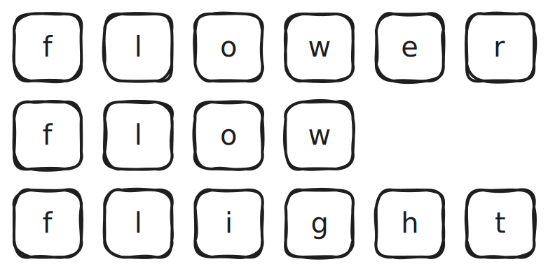
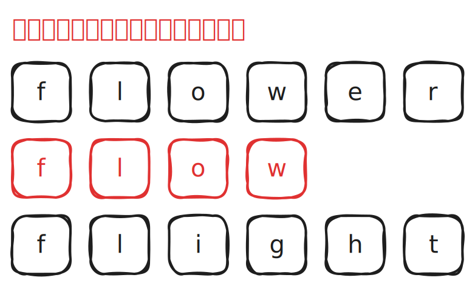
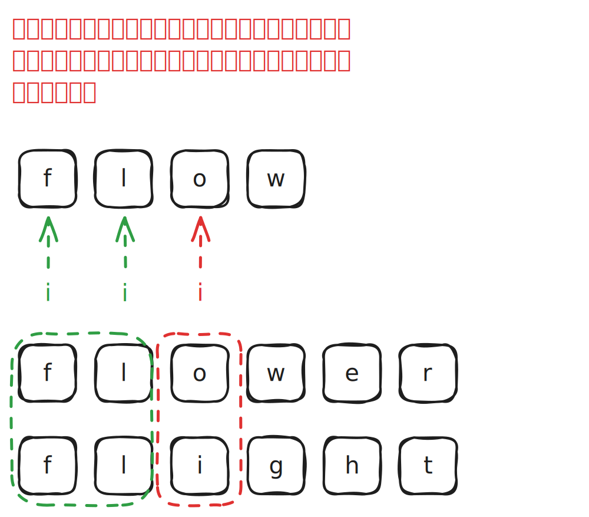
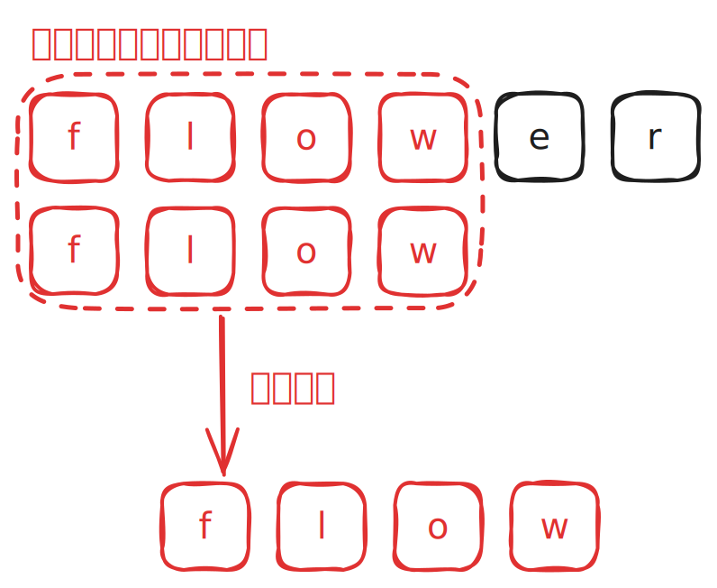
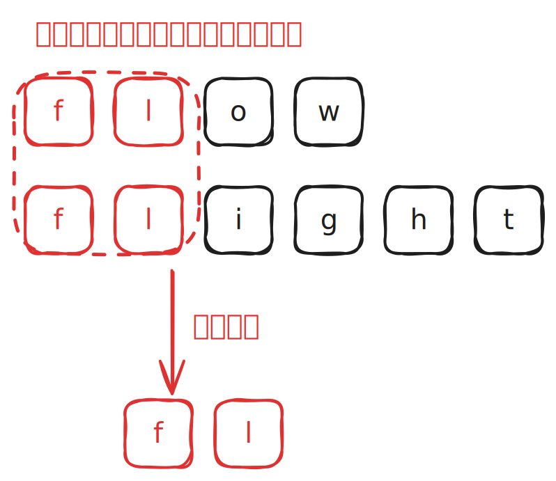
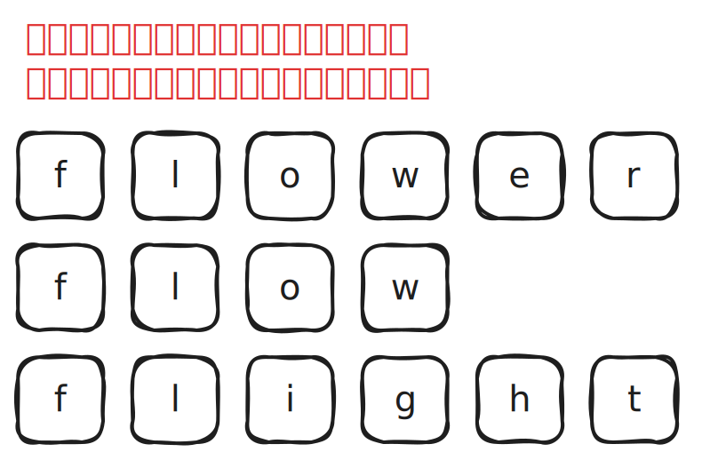
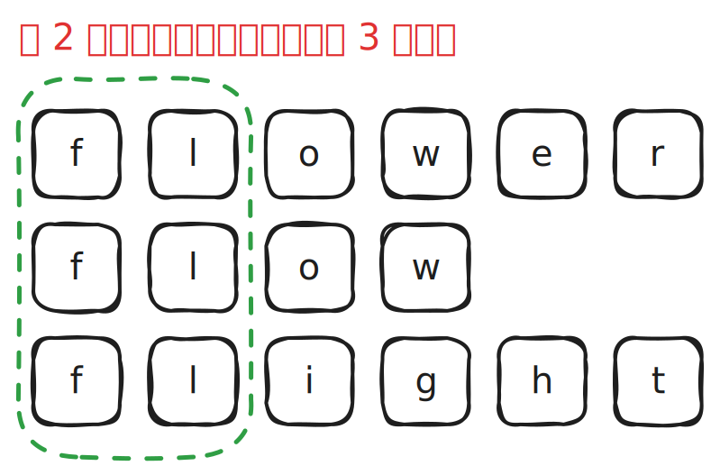
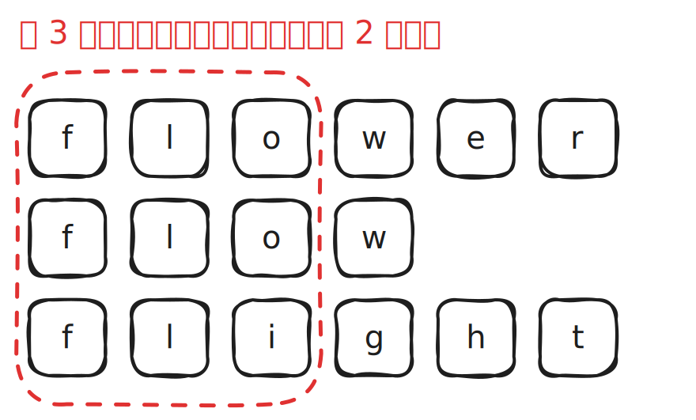

# [0014. 最长公共前缀【简单】](https://github.com/tnotesjs/TNotes.leetcode/tree/main/notes/0014.%20%E6%9C%80%E9%95%BF%E5%85%AC%E5%85%B1%E5%89%8D%E7%BC%80%E3%80%90%E7%AE%80%E5%8D%95%E3%80%91)

<!-- region:toc -->

- [1. 📝 题目描述](#1--题目描述)
- [2. 🎯 s.1 - 暴力解法](#2--s1---暴力解法)
- [3. 🎯 s.2 - 横向扫描](#3--s2---横向扫描)
- [4. 🎯 s.3 - 纵向扫描](#4--s3---纵向扫描)

<!-- endregion:toc -->

## 1. 📝 题目描述

- [leetcode](https://leetcode.cn/problems/longest-common-prefix)

编写一个函数来查找字符串数组中的最长公共前缀。

如果不存在公共前缀，返回空字符串 `""`。

示例 1：

- 输入：strs = ["flower","flow","flight"]
- 输出："fl"

示例 2：

- 输入：strs = ["dog","racecar","car"]
- 输出：""
- 解释：输入不存在公共前缀。

提示：

- `1 <= strs.length <= 200`
- `0 <= strs[i].length <= 200`
- `strs[i]` 仅由小写英文字母组成

## 2. 🎯 s.1 - 暴力解法

::: swiper

:::

::: code-group

<<< ./solutions/1/1.js {}

:::

- 时间复杂度： $O(m*n)$
- 空间复杂度： $O(1)$

这种暴力解法的时间复杂度取决于最短字符串的长度，记为 m，以及字符串数组的长度，记为 n。在算法中，我们需要遍历最短字符串的每个字符，并且对于每个字符，需要检查字符串数组中的每个字符串的相应位置是否相等。因此，时间复杂度为 $O(m*n)$。

对于空间复杂度，算法并没有使用额外的空间，除了一些常量级别的辅助变量。因此，空间复杂度为 $O(1)$。

核心步骤：

1. 找到长度最短的字符串。
2. 依次遍历最短字符串的每个字符以及字符串数组的每一项，从头开始比较，一旦发现不等的字符直接 return 切片结果。

## 3. 🎯 s.2 - 横向扫描

::: swiper

:::

::: code-group

<<< ./solutions/2/1.js {}

:::

- 时间复杂度： $O(m*n)$，其中 n 是字符串数组的长度，m 是公共前缀的长度
- 空间复杂度： $O(1)$

解题思路：

在这个算法中，我们首先将第一个字符串设置为初始公共前缀 str。然后，我们依次遍历字符串数组中的每个字符串，并在每一步中，我们不断地将 str 与当前字符串进行匹配，直到 str 是当前字符串的前缀为止。这个过程中，我们会逐渐缩短 str 的长度，直到它成为所有字符串的公共前缀。

- `strs[i].indexOf(str) === 0` 要求 `strs[i]` 中存在子串 `str`，并且是从 `strs[i]` 的第一个字符开始匹配的。
- while 循环执行完第一轮，意味着已确定 strs 中的第一项和第二项的最长公共前缀 `flow`；
- while 循环执行完第二轮，意味着已确定前一次 while 循环得到的结果 `flow` 与 strs 中的第三项的最长公共前缀 `fl`；
- 。。。以此类推，直到 strs 遍历结束；

## 4. 🎯 s.3 - 纵向扫描

::: swiper

:::

::: code-group

<<< ./solutions/3/1.js {}

:::

- 时间复杂度： $O(m*n)$
- 空间复杂度： $O(1)$
