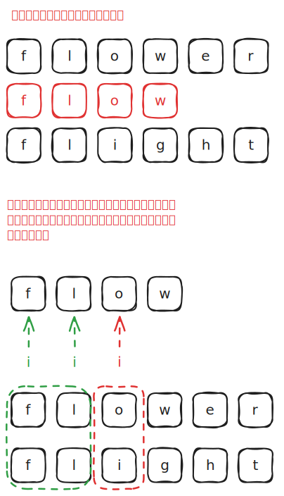
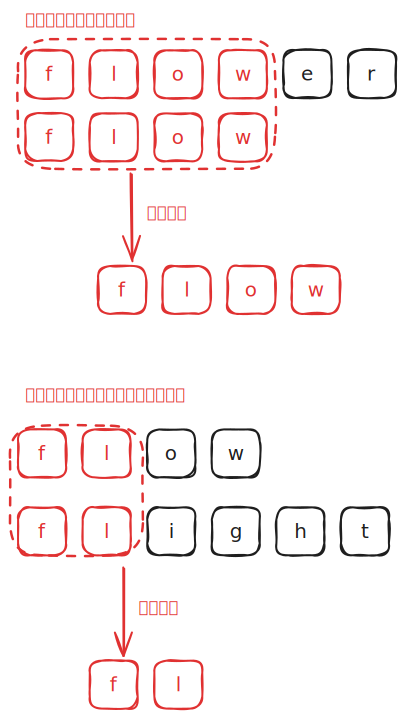
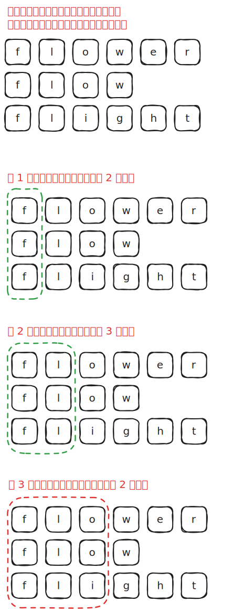

# [0014. 最长公共前缀【简单】](https://github.com/tnotesjs/TNotes.leetcode/tree/main/notes/0014.%20%E6%9C%80%E9%95%BF%E5%85%AC%E5%85%B1%E5%89%8D%E7%BC%80%E3%80%90%E7%AE%80%E5%8D%95%E3%80%91)

<!-- region:toc -->

- [1. 📝 题目描述](#1--题目描述)
- [2. 🎯 s.1 - 以最短字符串为基准逐列比较](#2--s1---以最短字符串为基准逐列比较)
- [3. 🎯 s.2 - 横向扫描](#3--s2---横向扫描)
- [4. 🎯 s.3 - 纵向扫描](#4--s3---纵向扫描)

<!-- endregion:toc -->

## 1. 📝 题目描述

- [leetcode](https://leetcode.cn/problems/longest-common-prefix)

编写一个函数来查找字符串数组中的最长公共前缀。

如果不存在公共前缀，返回空字符串 `""`。

---

示例 1：

```
输入：strs = ["flower","flow","flight"]
输出："fl"
```

---

示例 2：

```
输入：strs = ["dog","racecar","car"]
输出：""
```

解释：输入不存在公共前缀。

---

提示：

- `1 <= strs.length <= 200`
- `0 <= strs[i].length <= 200`
- `strs[i]` 仅由小写英文字母组成

## 2. 🎯 s.1 - 以最短字符串为基准逐列比较



::: code-group

<<< ./solutions/1/1.c [c]

<<< ./solutions/1/1.js [js]

<<< ./solutions/1/1.py [py]

:::

- 时间复杂度：$O(m \cdot n)$，其中 $m$ 是最短字符串的长度，$n$ 是字符串数组的长度
- 空间复杂度：$O(1)$，只使用了常数级别的额外空间

算法思路：

- 先找到数组中长度最短的字符串 `minStr`，公共前缀必然不超过它的长度
- 以 `minStr` 为基准，逐列（`i`）逐串（`j`）比较，一旦发现不等字符就立即返回 `minStr[:i]`

## 3. 🎯 s.2 - 横向扫描



::: code-group

<<< ./solutions/2/1.c [c]

<<< ./solutions/2/1.js [js]

<<< ./solutions/2/1.py [py]

:::

- 时间复杂度：$O(m \cdot n)$，其中 $n$ 是字符串数组的长度，$m$ 是公共前缀的长度
- 空间复杂度：$O(1)$，只使用了常数级别的额外空间

算法思路：

- 以第一个字符串为初始公共前缀 `prefix`，依次与每个字符串匹配
- 若 `prefix` 不是当前字符串的前缀，则不断去掉末尾一个字符，直到匹配成功或 `prefix` 变为空；逐串遍历完后 `prefix` 即为最终结果

## 4. 🎯 s.3 - 纵向扫描



::: code-group

<<< ./solutions/3/1.c [c]

<<< ./solutions/3/1.js [js]

<<< ./solutions/3/1.py [py]

:::

- 时间复杂度：$O(m \cdot n)$，其中 $m$ 是第一个字符串的长度，$n$ 是字符串数组的长度
- 空间复杂度：$O(1)$，只使用了常数级别的额外空间

算法思路：

- 以第一个字符串为基准，第外层按列索引 `i`、内层逐串比较第 `i` 个字符
- 一旦某个字符串的第 `i` 位不存在（遍历到结尾）或与基准不等，立即返回 `strs[0][:i]`
