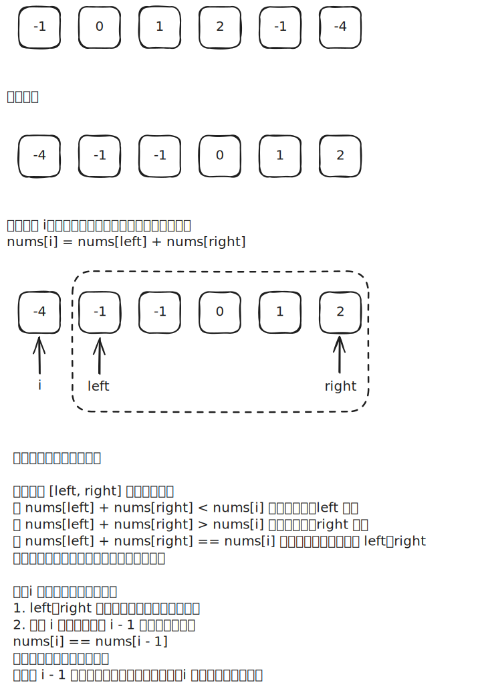

# [0015. 三数之和【中等】](https://github.com/tnotesjs/TNotes.leetcode/tree/main/notes/0015.%20%E4%B8%89%E6%95%B0%E4%B9%8B%E5%92%8C%E3%80%90%E4%B8%AD%E7%AD%89%E3%80%91)

<!-- region:toc -->

- [1. 📝 题目描述](#1--题目描述)
- [2. 🎯 s.1 - 排序 + 双指针](#2--s1---排序--双指针)

<!-- endregion:toc -->

## 1. 📝 题目描述

- [leetcode](https://leetcode.cn/problems/3sum/description/)

给你一个整数数组 `nums`，判断是否存在三元组 `[nums[i], nums[j], nums[k]]` 满足 `i != j`、`i != k` 且 `j != k`，同时还满足 `nums[i] + nums[j] + nums[k] == 0`。请你返回所有和为 `0` 且不重复的三元组。

注意：答案中不可以包含重复的三元组。

---

示例 1：

```
输入：nums = [-1, 0, 1, 2, -1, -4]
输出：[[-1, -1, 2], [-1, 0, 1]]
```

解释：

- `nums[0] + nums[1] + nums[2] = (-1) + 0 + 1 = 0`。
- `nums[1] + nums[2] + nums[4] = 0 + 1 + (-1) = 0`。
- `nums[0] + nums[3] + nums[4] = (-1) + 2 + (-1) = 0`。
- 不同的三元组是 `[-1, 0, 1]` 和 `[-1, -1, 2]`。
- 注意，输出的顺序和三元组的顺序并不重要。

---

示例 2：

```
输入：nums = [0, 1, 1]
输出：[]
```

解释：唯一可能的三元组和不为 0。

---

示例 3：

```
输入：nums = [0,0,0]
输出：[[0,0,0]]
```

解释：唯一可能的三元组和为 0。

---

提示：

- `3 <= nums.length <= 3000`
- `-10^5 <= nums[i] <= 10^5`

## 2. 🎯 s.1 - 排序 + 双指针



::: code-group

<<< ./solutions/1/1.c [c]

<<< ./solutions/1/1.js [js]

<<< ./solutions/1/1.py [py]

:::

- 时间复杂度：$O(n^2)$，排序 $O(n \log n)$，外层枚举 $O(n)$，内层双指针 $O(n)$，整体 $O(n^2)$ 主导
- 空间复杂度：$O(\log n)$，排序递归栈空间（不计输出数组）

算法思路：

- 先对数组升序排序
  - 作用 1：确保单调性
  - 作用 2：使相同元素相邻，便于去重
- 固定成员 + 窗口收缩
  - 我们假定 `i` 指向的是三元组中的最小成员，`left` 指向的是三元组中的中间成员，`right` 指向的是三元组中的最大成员
  - 每次初始化窗口时固定窗口前边儿的第一个数 `nums[i]`（枚举 `i` 从 `0` 到 `n-3`），问题转化为在 `i` 后边儿的窗口中找两数之和等于 `-nums[i]`
  - 用左右双指针 `left = i+1`、`right = n-1` 收缩：三数之和 < `0` 则 `left++`，> `0` 则 `right--`，等于 `0` 则记录结果并跳过所有相邻重复值后再同时收缩
  - `i` 若与前一个元素相同则跳过，避免产生重复三元组
