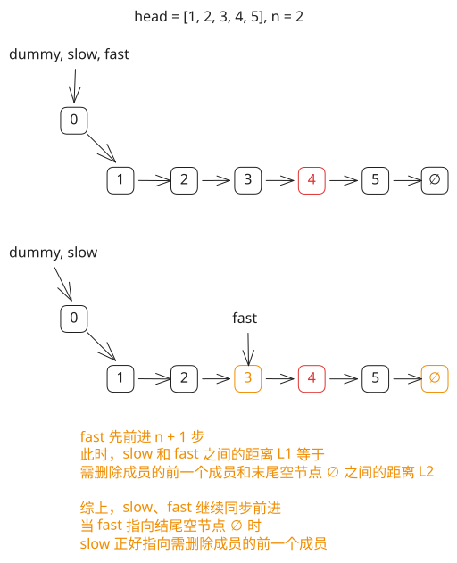

## 1. 题目描述

- [leetcode](https://leetcode.cn/problems/remove-nth-node-from-end-of-list/description/)

给你一个链表，删除链表的倒数第 `n` 个结点，并且返回链表的头结点。

---

示例 1：


```txt
输入：head = [1,2,3,4,5], n = 2
输出：[1,2,3,5]
```

---

示例 2：

```txt
输入：head = [1], n = 1
输出：[]
```

---

示例 3：

```txt
输入：head = [1,2], n = 1
输出：[1]
```

---

提示：

- 链表中结点的数目为 `sz`
- `1 <= sz <= 30`
- `0 <= Node.val <= 100`
- `1 <= n <= sz`

进阶：你能尝试使用一趟扫描实现吗？

## 2. s.1 - 快慢指针



::: code-group

```c [c]
/**
 * Definition for singly-linked list.
 * struct ListNode {
 *     int val;
 *     struct ListNode *next;
 * };
 */
struct ListNode* removeNthFromEnd(struct ListNode* head, int n) {
    struct ListNode dummy;
    dummy.next = head;
    struct ListNode* fast = &dummy;
    struct ListNode* slow = &dummy;

    // fast 先走 n + 1 步
    for (int i = 0; i <= n; i++)
        fast = fast->next;

    // fast 和 slow 同步前进，直到 fast 到达末尾
    while (fast) {
        fast = fast->next;
        slow = slow->next;
    }

    // slow->next 即为待删除节点
    struct ListNode* del = slow->next;
    slow->next = del->next;
    free(del);
    return dummy.next;
}
```

```js [js]
/**
 * Definition for singly-linked list.
 * function ListNode(val, next) { this.val = (val===undefined ? 0 : val); this.next = (next===undefined ? null : next); }
 */
/**
 * @param {ListNode} head
 * @param {number} n
 * @return {ListNode}
 */
var removeNthFromEnd = function (head, n) {
  const dummy = new ListNode(0, head)
  let fast = dummy
  let slow = dummy

  // fast 先走 n + 1 步
  for (let i = 0; i <= n; i++) fast = fast.next

  // fast 和 slow 同步前进，直到 fast 到达末尾
  while (fast) {
    fast = fast.next
    slow = slow.next
  }

  // slow.next 即为待删除节点
  slow.next = slow.next.next
  return dummy.next
}
```

```py [py]
# Definition for singly-linked list.
# class ListNode:
#     def __init__(self, val=0, next=None):
#         self.val = val
#         self.next = next
class Solution:
    def removeNthFromEnd(self, head: Optional[ListNode], n: int) -> Optional[ListNode]:
        dummy = ListNode(0, head)
        fast = slow = dummy

        # fast 先走 n + 1 步
        for _ in range(n + 1):
            fast = fast.next

        # fast 和 slow 同步前进，直到 fast 到达末尾
        while fast:
            fast = fast.next
            slow = slow.next

        # slow.next 即为待删除节点
        slow.next = slow.next.next
        return dummy.next
```

:::

- 时间复杂度：$O(L)$，其中 $L$ 是链表长度，只需一趟扫描
- 空间复杂度：$O(1)$，只使用了常数级别的额外空间

算法思路：

- 创建哨兵节点 `dummy` 指向 `head`，用来统一处理删除头节点的边界情况
- 让快指针 `fast` 从 `dummy` 出发，先走 `n + 1` 步
- 然后让慢指针 `slow` 从 `dummy` 出发，与 `fast` 同步前进，每次各走一步
- 当 `fast` 到达链表末尾（`null`）时，`fast` 和 `slow` 之间始终保持 `n + 1` 的间距，此时 `slow` 恰好停在待删除节点的前驱位置
- 执行 `slow.next = slow.next.next` 即可跳过待删除节点，最后返回 `dummy.next`
