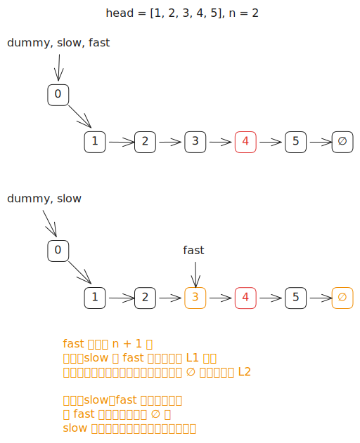

# [0019. 删除链表的倒数第 N 个结点【中等】](https://github.com/tnotesjs/TNotes.leetcode/tree/main/notes/0019.%20%E5%88%A0%E9%99%A4%E9%93%BE%E8%A1%A8%E7%9A%84%E5%80%92%E6%95%B0%E7%AC%AC%20N%20%E4%B8%AA%E7%BB%93%E7%82%B9%E3%80%90%E4%B8%AD%E7%AD%89%E3%80%91)

<!-- region:toc -->

- [1. 📝 题目描述](#1--题目描述)
- [2. 🎯 s.1 - 快慢指针](#2--s1---快慢指针)

<!-- endregion:toc -->

## 1. 📝 题目描述

- [leetcode](https://leetcode.cn/problems/remove-nth-node-from-end-of-list/description/)

给你一个链表，删除链表的倒数第 `n` 个结点，并且返回链表的头结点。

---

示例 1：


```txt
输入：head = [1,2,3,4,5], n = 2
输出：[1,2,3,5]
```

---

示例 2：

```txt
输入：head = [1], n = 1
输出：[]
```

---

示例 3：

```txt
输入：head = [1,2], n = 1
输出：[1]
```

---

提示：

- 链表中结点的数目为 `sz`
- `1 <= sz <= 30`
- `0 <= Node.val <= 100`
- `1 <= n <= sz`

进阶：你能尝试使用一趟扫描实现吗？

## 2. 🎯 s.1 - 快慢指针



::: code-group

<<< ./solutions/1/1.c [c]

<<< ./solutions/1/1.js [js]

<<< ./solutions/1/1.py [py]

:::

- 时间复杂度：$O(L)$，其中 $L$ 是链表长度，只需一趟扫描
- 空间复杂度：$O(1)$，只使用了常数级别的额外空间

算法思路：

- 创建哨兵节点 `dummy` 指向 `head`，用来统一处理删除头节点的边界情况
- 让快指针 `fast` 从 `dummy` 出发，先走 `n + 1` 步
- 然后让慢指针 `slow` 从 `dummy` 出发，与 `fast` 同步前进，每次各走一步
- 当 `fast` 到达链表末尾（`null`）时，`fast` 和 `slow` 之间始终保持 `n + 1` 的间距，此时 `slow` 恰好停在待删除节点的前驱位置
- 执行 `slow.next = slow.next.next` 即可跳过待删除节点，最后返回 `dummy.next`
