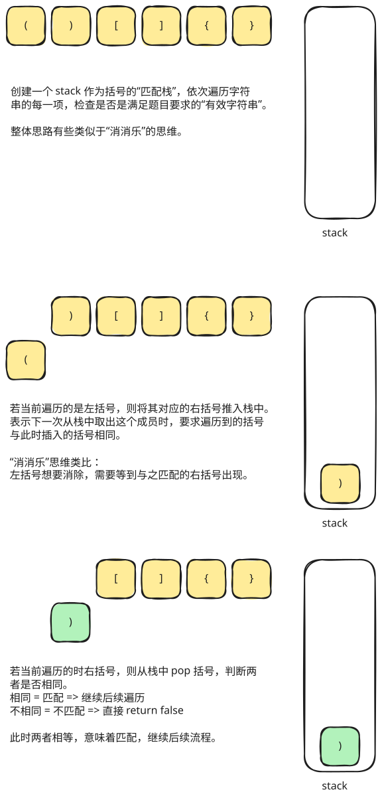

## 1. 题目描述

- [leetcode](https://leetcode.cn/problems/valid-parentheses/)

给定一个只包括 `'('`，`')'`，`'{'`，`'}'`，`'['`，`']'` 的字符串 `s`，判断字符串是否有效。

有效字符串需满足：

1. 左括号必须用相同类型的右括号闭合。
2. 左括号必须以正确的顺序闭合。
3. 每个右括号都有一个对应的相同类型的左括号。

---

示例 1：

```
输入：s = "()"
输出：true
```

---

示例 2：

```
输入：s = "()[]{}"
输出：true
```

---

示例 3：

```
输入：s = "(]"
输出：false
```

---

示例 4：

```
输入：s = "([])"
输出：true
```

---

提示：

- `1 <= s.length <= 10^4`
- `s` 仅由括号 `'()[]{}'` 组成

## 2. s.1 - 栈 + 预期右括号



::: code-group

```c [c]
bool isValid(char* s) {
    int len = strlen(s);
    if (len % 2 != 0)
        return false;

    char* stack = (char*)malloc(sizeof(char) * len);
    int top = 0;

    for (int i = 0; i < len; i++) {
        char ch = s[i];

        if (ch == '(') {
            stack[top++] = ')';
        } else if (ch == '[') {
            stack[top++] = ']';
        } else if (ch == '{') {
            stack[top++] = '}';
        } else {
            if (top == 0 || ch != stack[--top]) {
                free(stack);
                return false;
            }
        }
    }

    bool valid = top == 0;
    free(stack);
    return valid;
}
```

```js [js]
/**
 * @param {string} s
 * @return {boolean}
 */
var isValid = function (s) {
  const len = s.length
  if (len % 2 !== 0) {
    return false
  }
  const stack = []
  for (let i = 0; i < len; i++) {
    const str = s[i]
    if (str === '(') {
      stack.push(')')
    } else if (str === '[') {
      stack.push(']')
    } else if (str === '{') {
      stack.push('}')
    } else {
      if (str !== stack.pop()) return false
    }
  }
  return stack.length === 0
}
```

```py [py]
class Solution:
    def isValid(self, s: str) -> bool:
        if len(s) % 2 != 0:
            return False

        stack = []

        for ch in s:
            if ch == "(":
                stack.append(")")
            elif ch == "[":
                stack.append("]")
            elif ch == "{":
                stack.append("}")
            else:
                if not stack or ch != stack.pop():
                    return False

        return len(stack) == 0
```

:::

- 时间复杂度：$O(n)$，其中 n 是字符串的长度，需要遍历字符串一次
- 空间复杂度：$O(n)$，最坏情况下需要将所有左括号都压入栈中

算法思路：

- 先判断字符串长度是否为奇数
  - 如果是奇数，括号不可能两两配对，直接返回 `false`
- 遍历字符串，使用栈保存“后续应该遇到的右括号”
- 遇到左括号时，不是把左括号本身入栈，而是把它对应的右括号压入栈中
- 遇到右括号时，检查它是否与栈顶的预期右括号一致
  - 如果栈为空，或当前字符与栈顶不一致，说明匹配失败，返回 `false`
  - 如果一致，则弹出栈顶，继续处理后续字符
- 遍历结束后，若栈为空，说明所有括号都恰好完成匹配；否则仍有未匹配的左括号，返回 `false`
