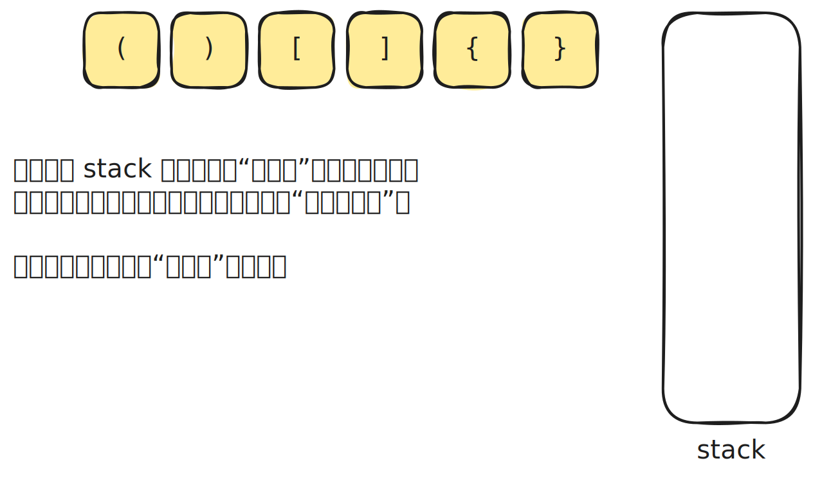
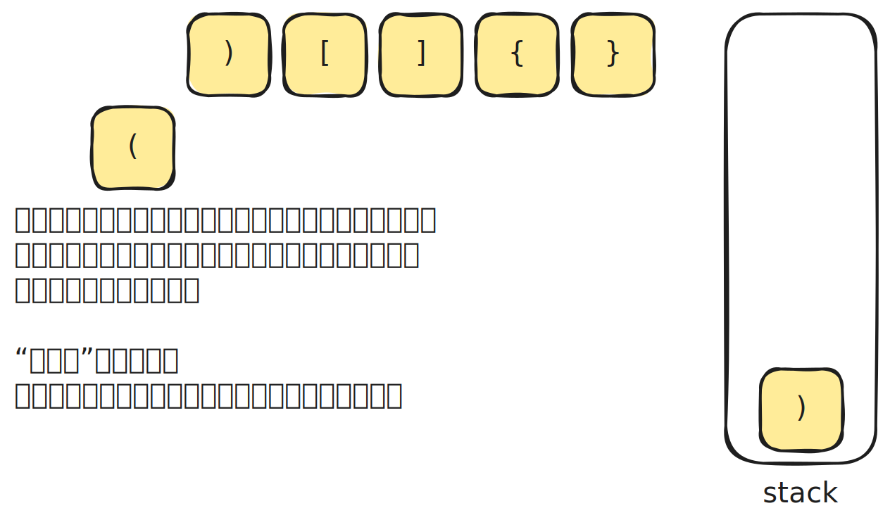
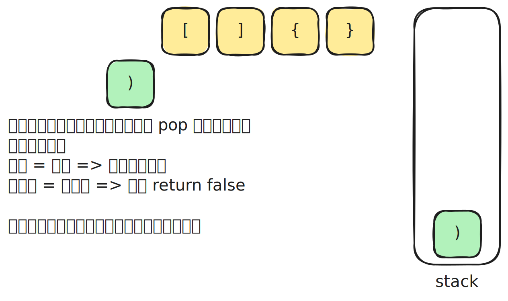

# [0020. 有效的括号【简单】](https://github.com/tnotesjs/TNotes.leetcode/tree/main/notes/0020.%20%E6%9C%89%E6%95%88%E7%9A%84%E6%8B%AC%E5%8F%B7%E3%80%90%E7%AE%80%E5%8D%95%E3%80%91)

<!-- region:toc -->

- [1. 📝 题目描述](#1--题目描述)
- [2. 🎯 s.1 - 栈](#2--s1---栈)

<!-- endregion:toc -->

## 1. 📝 题目描述

- [leetcode](https://leetcode.cn/problems/valid-parentheses/)

给定一个只包括 `'('`，`')'`，`'{'`，`'}'`，`'['`，`']'` 的字符串 `s` ，判断字符串是否有效。

有效字符串需满足：

1. 左括号必须用相同类型的右括号闭合。
2. 左括号必须以正确的顺序闭合。
3. 每个右括号都有一个对应的相同类型的左括号。

示例 1：

- 输入：`s = "()"`
- 输出：`true`

示例 2：

- 输入：`s = "()[]{}"`
- 输出：`true`

示例 3：

- 输入：`s = "(]"`
- 输出：`false`

示例 4：

- 输入：`s = "([])"`
- 输出：`true`

提示：

- `1 <= s.length <= 10^4`
- `s` 仅由括号 `'()[]{}'` 组成

## 2. 🎯 s.1 - 栈

::: swiper

:::

::: code-group

<<< ./solutions/1/1.js

:::

- 时间复杂度：$O(n)$，其中 n 是字符串的长度，需要遍历字符串一次
- 空间复杂度：$O(n)$，最坏情况下需要将所有左括号都压入栈中

使用栈来匹配括号。遍历字符串时，遇到左括号就将对应的右括号压入栈，遇到右括号则与栈顶元素比较。如果匹配则弹出栈顶，不匹配则返回 `false`。最后检查栈是否为空，为空说明所有括号都成功配对。
