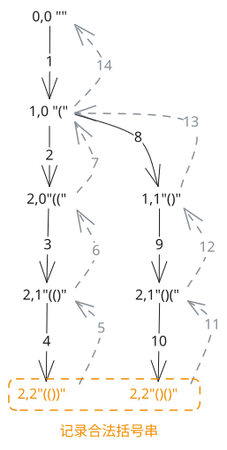

## 1. 题目描述

- [leetcode](https://leetcode.cn/problems/generate-parentheses/)

数字 `n` 代表生成括号的对数，请你设计一个函数，用于能够生成所有可能的并且有效的括号组合。

---

示例 1：

```
输入：n = 3
输出：["((()))","(()())","(())()","()(())","()()()"]
```

---

示例 2：

```
输入：n = 1
输出：["()"]
```

---

提示：

- `1 <= n <= 8`

## 2. s.1 - 回溯 + 合法性剪枝



::: code-group

```c [c]
/**
 * Note: The returned array must be malloced, assume caller calls free().
 */
char** answers;
int answerSize;
int answerCap;

void ensureCapacity() {
    if (answerSize < answerCap)
        return;
    answerCap *= 2;
    answers = (char**)realloc(answers, answerCap * sizeof(char*));
}

void dfs(int n, int leftUsed, int rightUsed, char* path) {
    if (leftUsed == n && rightUsed == n) {
        ensureCapacity();
        char* str = (char*)malloc((2 * n + 1) * sizeof(char));
        memcpy(str, path, 2 * n * sizeof(char));
        str[2 * n] = '\0';
        answers[answerSize++] = str;
        return;
    }

    int idx = leftUsed + rightUsed;

    if (leftUsed < n) {
        path[idx] = '(';
        dfs(n, leftUsed + 1, rightUsed, path);
    }

    if (rightUsed < leftUsed) {
        path[idx] = ')';
        dfs(n, leftUsed, rightUsed + 1, path);
    }
}

char** generateParenthesis(int n, int* returnSize) {
    answerSize = 0;
    answerCap = 16;
    answers = (char**)malloc(answerCap * sizeof(char*));
    char* path = (char*)malloc((2 * n + 1) * sizeof(char));

    dfs(n, 0, 0, path);

    free(path);
    *returnSize = answerSize;
    return answers;
}
```

```js [js]
/**
 * @param {number} n
 * @return {string[]}
 */
var generateParenthesis = function (n) {
  const ans = []
  const path = new Array(n * 2)

  const dfs = (leftUsed, rightUsed) => {
    if (leftUsed === n && rightUsed === n) {
      ans.push(path.join(''))
      return
    }

    const idx = leftUsed + rightUsed

    if (leftUsed < n) {
      path[idx] = '('
      dfs(leftUsed + 1, rightUsed)
    }

    if (rightUsed < leftUsed) {
      path[idx] = ')'
      dfs(leftUsed, rightUsed + 1)
    }
  }

  dfs(0, 0)
  return ans
}
```

```py [py]
class Solution:
    def generateParenthesis(self, n: int) -> list[str]:
        ans: list[str] = []
        path = [""] * (n * 2)

        def dfs(left_used: int, right_used: int) -> None:
            if left_used == n and right_used == n:
                ans.append("".join(path))
                return

            idx = left_used + right_used

            if left_used < n:
                path[idx] = "("
                dfs(left_used + 1, right_used)

            if right_used < left_used:
                path[idx] = ")"
                dfs(left_used, right_used + 1)

        dfs(0, 0)
        return ans
```

:::

- 时间复杂度：$O(C_n \times n)$，其中 $C_n$ 是第 $n$ 个卡特兰数；合法括号组合一共有 $C_n$ 个，而构造每个结果都需要 $O(n)$ 的拷贝或拼接开销
- 空间复杂度：$O(n)$，递归栈深度和当前构造路径的长度都与括号对数成正比（不计答案）

算法思路：

- 用回溯逐位构造答案，`leftUsed` 和 `rightUsed` 分别表示当前已经放入的左括号和右括号数量，`path` 表示当前构造中的括号序列
- 任意时刻只要 `leftUsed < n`，就可以继续放左括号，因为左括号总数最多只能使用 `n` 个
- 只有当 `rightUsed < leftUsed` 时，才允许放右括号；这保证了任意前缀中右括号数量都不会超过左括号数量，从而始终保持前缀合法
- 当 `leftUsed == n` 且 `rightUsed == n` 时，说明已经构造出一个长度为 `2n` 的合法括号串，将其加入答案
- 这种写法不会先生成所有长度为 `2n` 的括号序列再去校验，而是只在合法状态上继续搜索，因此是这题的标准最优解
