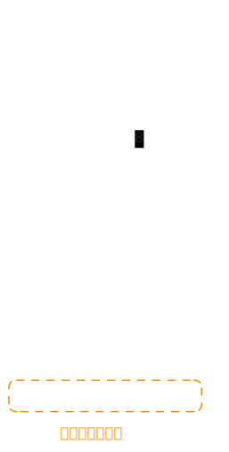

# [0022. 括号生成【中等】](https://github.com/tnotesjs/TNotes.leetcode/tree/main/notes/0022.%20%E6%8B%AC%E5%8F%B7%E7%94%9F%E6%88%90%E3%80%90%E4%B8%AD%E7%AD%89%E3%80%91)

<!-- region:toc -->

- [1. 📝 题目描述](#1--题目描述)
- [2. 🎯 s.1 - 回溯 + 合法性剪枝](#2--s1---回溯--合法性剪枝)

<!-- endregion:toc -->

## 1. 📝 题目描述

- [leetcode](https://leetcode.cn/problems/generate-parentheses/)

数字 `n` 代表生成括号的对数，请你设计一个函数，用于能够生成所有可能的并且有效的括号组合。

---

示例 1：

```
输入：n = 3
输出：["((()))","(()())","(())()","()(())","()()()"]
```

---

示例 2：

```
输入：n = 1
输出：["()"]
```

---

提示：

- `1 <= n <= 8`

## 2. 🎯 s.1 - 回溯 + 合法性剪枝



::: code-group

<<< ./solutions/1/1.c [c]

<<< ./solutions/1/1.js [js]

<<< ./solutions/1/1.py [py]

:::

- 时间复杂度：$O(C_n \times n)$，其中 $C_n$ 是第 $n$ 个卡特兰数；合法括号组合一共有 $C_n$ 个，而构造每个结果都需要 $O(n)$ 的拷贝或拼接开销
- 空间复杂度：$O(n)$，递归栈深度和当前构造路径的长度都与括号对数成正比（不计答案）

算法思路：

- 用回溯逐位构造答案，`leftUsed` 和 `rightUsed` 分别表示当前已经放入的左括号和右括号数量，`path` 表示当前构造中的括号序列
- 任意时刻只要 `leftUsed < n`，就可以继续放左括号，因为左括号总数最多只能使用 `n` 个
- 只有当 `rightUsed < leftUsed` 时，才允许放右括号；这保证了任意前缀中右括号数量都不会超过左括号数量，从而始终保持前缀合法
- 当 `leftUsed == n` 且 `rightUsed == n` 时，说明已经构造出一个长度为 `2n` 的合法括号串，将其加入答案
- 这种写法不会先生成所有长度为 `2n` 的括号序列再去校验，而是只在合法状态上继续搜索，因此是这题的标准最优解
