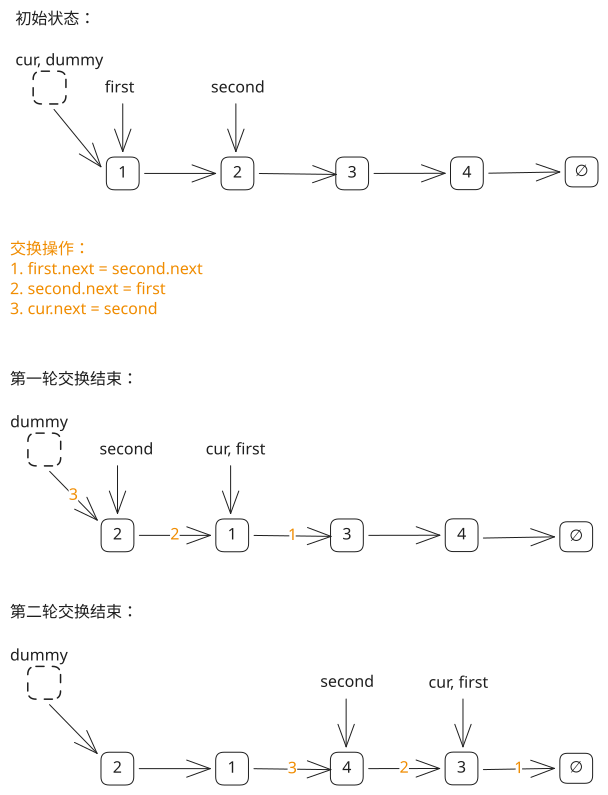

## 1. 题目描述

- [leetcode](https://leetcode.cn/problems/swap-nodes-in-pairs/)

给你一个链表，两两交换其中相邻的节点，并返回交换后链表的头节点。你必须在不修改节点内部的值的情况下完成本题（即，只能进行节点交换）。

---

示例 1：


```txt
输入：head = [1, 2, 3, 4]
输出：[2, 1, 4, 3]
```

---

示例 2：

```txt
输入：head = []
输出：[]
```

---

示例 3：

```txt
输入：head = [1]
输出：[1]
```

---

提示：

- 链表中节点的数目在范围 `[0, 100]` 内
- `0 <= Node.val <= 100`

## 2. s.1 - 虚拟头节点 + 迭代



::: code-group

```c [c]
/**
 * Definition for singly-linked list.
 * struct ListNode {
 *     int val;
 *     struct ListNode *next;
 * };
 */
struct ListNode* swapPairs(struct ListNode* head) {
    struct ListNode dummy;
    dummy.next = head;
    struct ListNode* cur = &dummy;

    while (cur->next && cur->next->next) {
        struct ListNode* first = cur->next;        // 第一个节点
        struct ListNode* second = cur->next->next; // 第二个节点
        first->next = second->next;                // first 指向第二个节点后续
        second->next = first;                      // second 指向 first
        cur->next = second;                        // 前驱节点指向 second
        cur = first;                               // 移动到下一对的前驱
    }

    return dummy.next;
}
```

```js [js]
/**
 * Definition for singly-linked list.
 * function ListNode(val, next) {
 *     this.val = (val===undefined ? 0 : val)
 *     this.next = (next===undefined ? null : next)
 * }
 */
/**
 * @param {ListNode} head
 * @return {ListNode}
 */
var swapPairs = function (head) {
  const dummy = new ListNode(0, head)
  let cur = dummy

  while (cur.next && cur.next.next) {
    const first = cur.next // 第一个节点
    const second = cur.next.next // 第二个节点
    first.next = second.next // first 指向第二个节点后续
    second.next = first // second 指向 first
    cur.next = second // 前驱节点指向 second
    cur = first // 移动到下一对的前驱
  }

  return dummy.next
}
```

```py [py]
# Definition for singly-linked list.
# class ListNode:
#     def __init__(self, val=0, next=None):
#         self.val = val
#         self.next = next
class Solution:
    def swapPairs(self, head: Optional[ListNode]) -> Optional[ListNode]:
        dummy = ListNode(0, head)
        cur = dummy

        while cur.next and cur.next.next:
            first = cur.next  # 第一个节点
            second = cur.next.next  # 第二个节点
            first.next = second.next  # first 指向第二个节点后续
            second.next = first  # second 指向 first
            cur.next = second  # 前驱节点指向 second
            cur = first  # 移动到下一对的前驱

        return dummy.next
```

:::

- 时间复杂度：$O(n)$，其中 $n$ 是链表节点数，每个节点处理一次
- 空间复杂度：$O(1)$，只使用了常数部的辅助指针

算法思路：

- 引入虚拟头节点 `dummy`，避免对头节点做特殊处理
- 用 `cur` 指向当前对的前驱节点，每次交换之前，根据 `cur` 初始化辅助指针 `first`、`second` 的指向：
  - `first = cur.next`
  - `second = cur.next.next`
- 交换操作：`1. first.next = second.next` → `2. second.next = first` → `3. cur.next = second`
  - 注意：顺序不可调换，每一次交换操作完成，相当于将链表相邻的俩成员调换了位置
  - 提示：若理解起来比较吃力，可拿纸笔画一下指针指向的变化
- 每轮结束后 `first` 就是下一对的前驱，更新 `cur` 的指向 `cur = first`，继续循环
