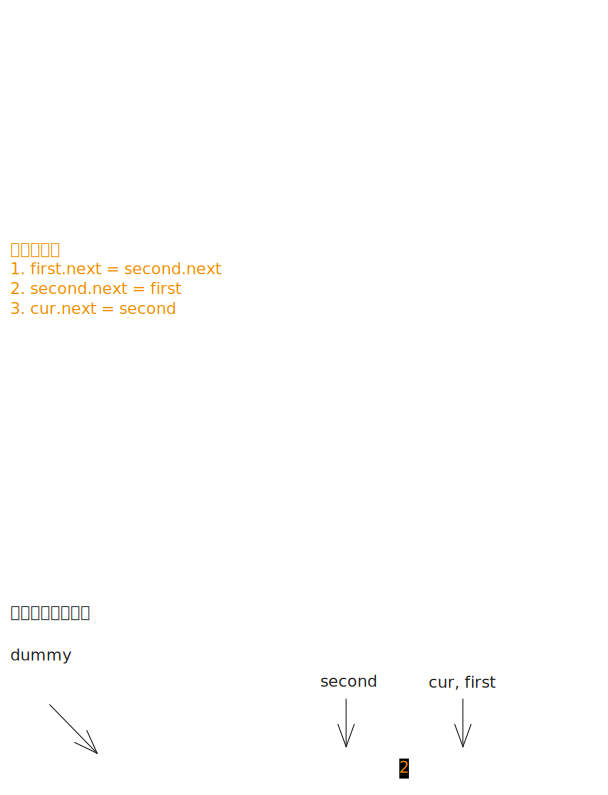

# [0024. 两两交换链表中的节点【中等】](https://github.com/tnotesjs/TNotes.leetcode/tree/main/notes/0024.%20%E4%B8%A4%E4%B8%A4%E4%BA%A4%E6%8D%A2%E9%93%BE%E8%A1%A8%E4%B8%AD%E7%9A%84%E8%8A%82%E7%82%B9%E3%80%90%E4%B8%AD%E7%AD%89%E3%80%91)

<!-- region:toc -->

- [1. 📝 题目描述](#1--题目描述)
- [2. 🎯 s.1 - 虚拟头节点 + 迭代](#2--s1---虚拟头节点--迭代)

<!-- endregion:toc -->

## 1. 📝 题目描述

- [leetcode](https://leetcode.cn/problems/swap-nodes-in-pairs/)

给你一个链表，两两交换其中相邻的节点，并返回交换后链表的头节点。你必须在不修改节点内部的值的情况下完成本题（即，只能进行节点交换）。

---

示例 1：


```txt
输入：head = [1, 2, 3, 4]
输出：[2, 1, 4, 3]
```

---

示例 2：

```txt
输入：head = []
输出：[]
```

---

示例 3：

```txt
输入：head = [1]
输出：[1]
```

---

提示：

- 链表中节点的数目在范围 `[0, 100]` 内
- `0 <= Node.val <= 100`

## 2. 🎯 s.1 - 虚拟头节点 + 迭代



::: code-group

<<< ./solutions/1/1.c [c]

<<< ./solutions/1/1.js [js]

<<< ./solutions/1/1.py [py]

:::

- 时间复杂度：$O(n)$，其中 $n$ 是链表节点数，每个节点处理一次
- 空间复杂度：$O(1)$，只使用了常数部的辅助指针

算法思路：

- 引入虚拟头节点 `dummy`，避免对头节点做特殊处理
- 用 `cur` 指向当前对的前驱节点，每次交换之前，根据 `cur` 初始化辅助指针 `first`、`second` 的指向：
  - `first = cur.next`
  - `second = cur.next.next`
- 交换操作：`1. first.next = second.next` → `2. second.next = first` → `3. cur.next = second`
  - 注意：顺序不可调换，每一次交换操作完成，相当于将链表相邻的俩成员调换了位置
  - 提示：若理解起来比较吃力，可拿纸笔画一下指针指向的变化
- 每轮结束后 `first` 就是下一对的前驱，更新 `cur` 的指向 `cur = first`，继续循环
