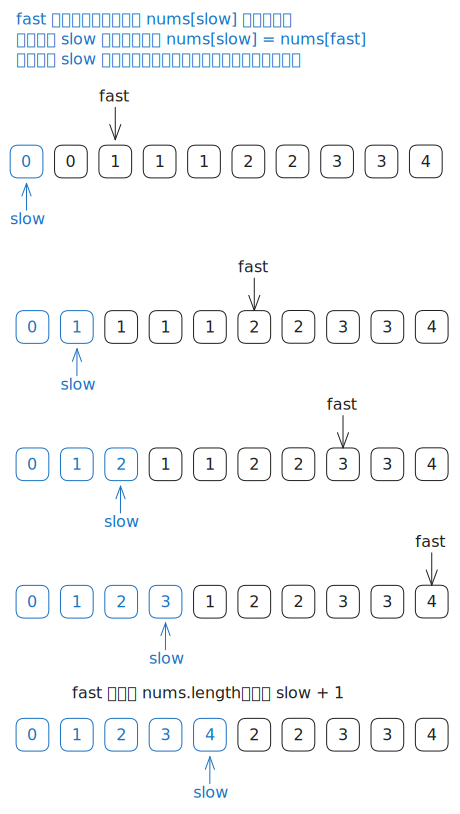

# [0026. 删除有序数组中的重复项【简单】](https://github.com/tnotesjs/TNotes.leetcode/tree/main/notes/0026.%20%E5%88%A0%E9%99%A4%E6%9C%89%E5%BA%8F%E6%95%B0%E7%BB%84%E4%B8%AD%E7%9A%84%E9%87%8D%E5%A4%8D%E9%A1%B9%E3%80%90%E7%AE%80%E5%8D%95%E3%80%91)

<!-- region:toc -->

- [1. 📝 题目描述](#1--题目描述)
- [2. 🎯 s.1 - 快慢指针](#2--s1---快慢指针)
- [3. 🔗 引用](#3--引用)

<!-- endregion:toc -->

## 1. 📝 题目描述

- [leetcode](https://leetcode.cn/problems/remove-duplicates-from-sorted-array)

给你一个非严格递增排列的数组 `nums`，请你 [原地][1] 删除重复出现的元素，使每个元素只出现一次，返回删除后数组的新长度。元素的相对顺序应该保持一致。然后返回 `nums` 中唯一元素的个数。

考虑 `nums` 的唯一元素的数量为 `k`，你需要做以下事情确保你的题解可以被通过：

- 更改数组 `nums`，使 `nums` 的前 `k` 个元素包含唯一元素，并按照它们最初在 `nums` 中出现的顺序排列。`nums` 的其余元素与 `nums` 的大小不重要。
- 返回 `k`。

判题标准:

系统会用下面的代码来测试你的题解:

```
int[] nums = [...]; // 输入数组
int[] expectedNums = [...]; // 长度正确的期望答案

int k = removeDuplicates(nums); // 调用

assert k == expectedNums.length;
for (int i = 0; i < k; i++) {
    assert nums[i] == expectedNums[i];
}
```

如果所有断言都通过，那么您的题解将被通过。

---

示例 1：

```txt
输入：nums = [1,1,2]
输出：2, nums = [1,2,_]
```

解释：函数应该返回新的长度 2，并且原数组 nums 的前两个元素被修改为 1, 2。不需要考虑数组中超出新长度后面的元素。

---

示例 2：

```txt
输入：nums = [0,0,1,1,1,2,2,3,3,4]
输出：5, nums = [0,1,2,3,4]
```

解释：函数应该返回新的长度 5，并且原数组 nums 的前五个元素被修改为 0, 1, 2, 3, 4。不需要考虑数组中超出新长度后面的元素。

---

提示：

- `1 <= nums.length <= 3 * 10^4`
- `-10^4 <= nums[i] <= 10^4`
- `nums` 已按非严格递增排列

## 2. 🎯 s.1 - 快慢指针



::: code-group

<<< ./solutions/1/1.c [c]

<<< ./solutions/1/1.js [js]

<<< ./solutions/1/1.py [py]

:::

- 时间复杂度：$O(n)$，其中 $n$ 是数组长度；快指针从左到右扫描一遍数组，每个元素最多访问一次
- 空间复杂度：$O(1)$，只使用了快慢指针这几个常数级别的额外变量

算法思路：

- 因为数组已经按非严格递增顺序排列，所以重复元素一定连续出现，这使得我们可以只比较相邻的“新元素”和当前已保留区间的最后一个元素
- 用慢指针 `slow` 表示当前去重后数组最后一个有效元素的位置，也就是下一个唯一元素应该写入位置的前一个下标
- 用快指针 `fast` 从左到右扫描数组，负责寻找新的唯一元素
- 如果 `nums[fast] != nums[slow]`，说明找到了一个新的唯一值，就先将 `slow` 向后移动一位，再把 `nums[fast]` 写到 `nums[slow]` 上
- 如果 `nums[fast] == nums[slow]`，说明当前元素是重复项，直接跳过即可
- 遍历结束后，数组前 `slow + 1` 个位置就是去重后的结果，因此返回 `slow + 1`
- 这种写法在原地完成去重，不需要额外数组，同时只扫描一次输入数组，是这题的标准最优解

## 3. 🔗 引用

- [原地算法 - 百度百科][1]

[1]: http://baike.baidu.com/item/%E5%8E%9F%E5%9C%B0%E7%AE%97%E6%B3%95
