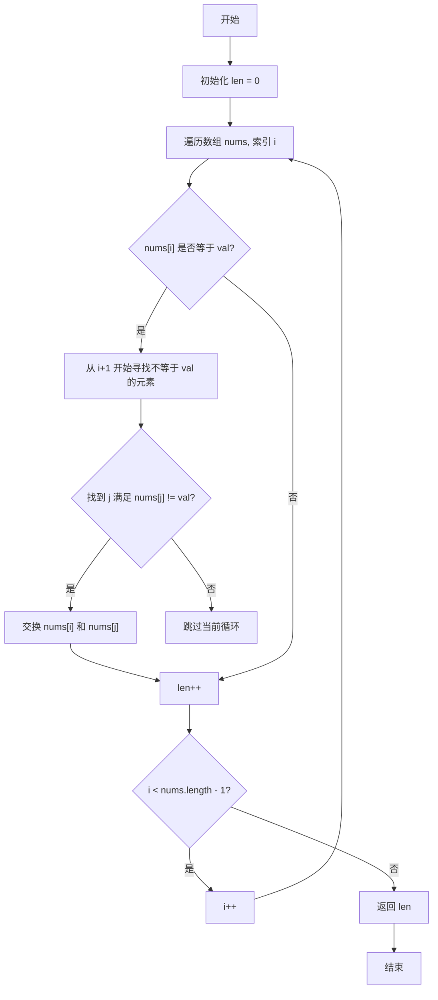

# [0027. 移除元素【简单】](https://github.com/tnotesjs/TNotes.leetcode/tree/main/notes/0027.%20%E7%A7%BB%E9%99%A4%E5%85%83%E7%B4%A0%E3%80%90%E7%AE%80%E5%8D%95%E3%80%91)

<!-- region:toc -->

- [1. 📝 题目描述](#1--题目描述)
- [2. 🎯 s.1 - 双指针-1](#2--s1---双指针-1)
- [3. 🎯 s.2 - 双指针-2](#3--s2---双指针-2)
- [4. 🎯 s.3 - 调用系统函数](#4--s3---调用系统函数)
- [5. 🔗 References](#5--references)

<!-- endregion:toc -->

## 1. 📝 题目描述

- [leetcode](https://leetcode.cn/problems/remove-element/)

给你一个数组 `nums` 和一个值 `val`，你需要 **[原地](https://baike.baidu.com/item/%E5%8E%9F%E5%9C%B0%E7%AE%97%E6%B3%95)** 移除所有数值等于 `val` 的元素。元素的顺序可能发生改变。然后返回 `nums` 中与 `val` 不同的元素的数量。

假设 `nums` 中不等于 `val` 的元素数量为 `k`，要通过此题，您需要执行以下操作：

- 更改 `nums` 数组，使 `nums` 的前 `k` 个元素包含不等于 `val` 的元素。`nums` 的其余元素和 `nums` 的大小并不重要。
- 返回 `k`。

**用户评测：**

评测机将使用以下代码测试您的解决方案：

```txt
int[] nums = [...]; // 输入数组
int val = ...; // 要移除的值
int[] expectedNums = [...]; // 长度正确的预期答案。
                            // 它以不等于 val 的值排序。

int k = removeElement(nums, val); // 调用你的实现

assert k == expectedNums.length;
sort(nums, 0, k); // 排序 nums 的前 k 个元素
for (int i = 0; i < actualLength; i++) {
    assert nums[i] == expectedNums[i];
}
```

如果所有的断言都通过，你的解决方案将会 **通过**。

**示例 1：**

```txt
输入：nums = [3,2,2,3], val = 3
输出：2, nums = [2,2,_,_]
解释：你的函数函数应该返回 k = 2, 并且 nums 中的前两个元素均为 2。
你在返回的 k 个元素之外留下了什么并不重要（因此它们并不计入评测）。
```

**示例 2：**

```txt
输入：nums = [0,1,2,2,3,0,4,2], val = 2
输出：5, nums = [0,1,4,0,3,_,_,_]
解释：你的函数应该返回 k = 5，并且 nums 中的前五个元素为 0,0,1,3,4。
注意这五个元素可以任意顺序返回。
你在返回的 k 个元素之外留下了什么并不重要（因此它们并不计入评测）。
```

**提示：**

- `0 <= nums.length <= 100`
- `0 <= nums[i] <= 50`
- `0 <= val <= 100`

## 2. 🎯 s.1 - 双指针-1



::: code-group

```js
/**
 * @param {number[]} nums
 * @param {number} val
 * @return {number}
 */
var removeElement = function (nums, val) {
  let len = 0
  for (let i = 0; i < nums.length; i++) {
    if (nums[i] === val) {
      // 找后续不为 val 的成员与之交换位置
      for (let j = i + 1; j < nums.length; j++) {
        if (nums[j] !== val) {
          nums[i] = nums[j]
          nums[j] = val
          len++
          break
        }
      }
    } else {
      len++
    }
  }
  return len
}
```

:::

::: details

- 解题思路 - 外层循环找 val
  - 若当前项不等于 val，说明该项不需要移除，那么，满足条件的成员加 1，len++；
  - 若当前项等于 val，那么开启内层循环，从当前项的下一项开始找第一个不为 val 的成员，找到后将它们位置交换，同时，满足条件的成员加 1，len++；
    - 内层循环只要找到第一个不为 val 的成员即可，之后直接 break; 跳出内层循环；
- 注意点
  - 内层循环始终是从外层循环的当前项的下一项开始查找，一旦找到满足条件的成员，意味着数组长度需要加 1。
  - 并非只有在发生交换时，数组长度才需要加 1；若外层循环遍历到的当前项本身就不等于 val，那么也意味着该项是不需要删除的，此时，数组的长度也需要加 1。

:::

## 3. 🎯 s.2 - 双指针-2

::: code-group

```js
var removeElement = function (nums, val) {
  if (nums.length === 0) return 0
  let l = 0,
    r = nums.length - 1
  while (l < r) {
    while (nums[l] !== val && l < r) {
      l++
    }
    while (nums[r] === val && l < r) {
      r--
    }
    let temp = nums[l]
    nums[l] = nums[r]
    nums[r] = temp
  }
  return nums[l] === val ? l : l + 1
}
```

:::

::: details

- 内层两个 while 循环的限制条件 `l < r` 不能少，防止两指针相撞之后继续运动，导致相撞点两侧的数据出现问题。
- 由于循环结束分两种情况，所以最终返回的新数组长度也分两种情况：
  - 左指针撞向右指针 - 直接返回 l
  - 右指针撞向左指针 - 返回 l + 1

:::

::: code-group

```js
/**
 * 22-08-27
 * @param {number[]} nums
 * @param {number} val
 * @return {number}
 */
var removeElement = function (nums, val) {
  let slow = -1,
    fast = 0,
    len = nums.length
  while (fast <= len - 1) {
    if (nums[fast] === val) fast++
    else nums[++slow] = nums[fast++]
  }
  return slow + 1
}
```

:::

## 4. 🎯 s.3 - 调用系统函数

::: code-group

```js
/**
 * @param {number[]} nums
 * @param {number} val
 * @return {number}
 */
var removeElement = function (nums, val) {
  if (!nums.length) return 0
  for (let i = 0; i < nums.length; i++) {
    if (nums[i] === val) {
      nums.splice(i, 1)
      i--
    }
  }
  return nums.length
}
```

:::

::: details

- 调用原生 api，splice。
- 很简单，遍历数组，一旦找到不满足条件的，直接将其从原数组中删除即可。
- splice 这个 api，会改变原数组，所以，最后只要将修改后的原数组 nums 返回即可。
- **注意：这么写虽然能通过，但并不符合题目要求。**

:::

## 5. 🔗 References

::: details

- https://www.bilibili.com/video/BV1xa411A76q?p=7
  - Bilibili - 爱学习的饲养员 Leetcode 力扣 1-300 题视频讲解合集｜手画图解版+代码【持续更新 ing】

:::
