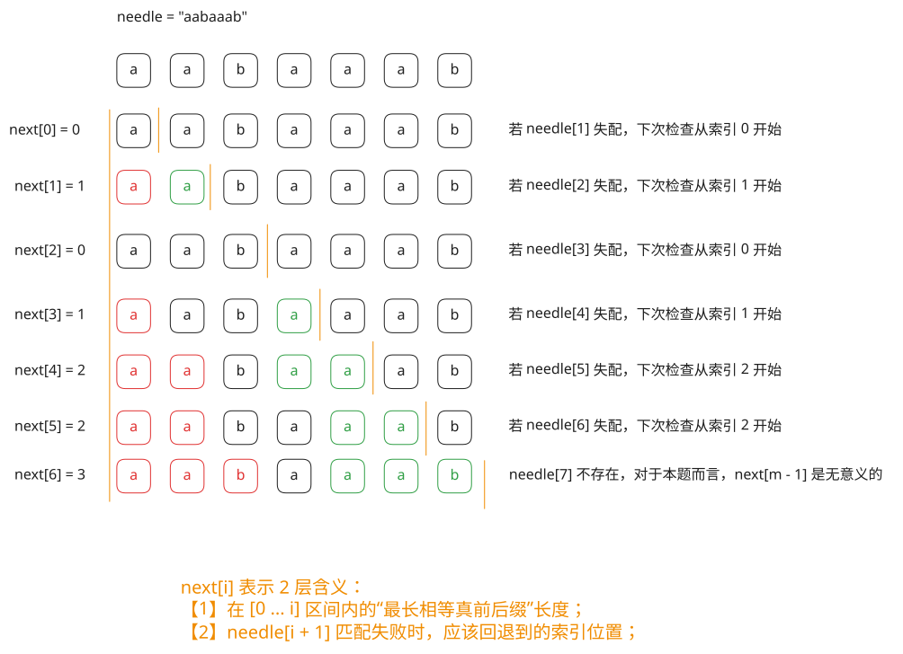

## 1. 题目描述

- [leetcode](https://leetcode.cn/problems/find-the-index-of-the-first-occurrence-in-a-string/)

给你两个字符串 `haystack` 和 `needle`，请你在 `haystack` 字符串中找出 `needle` 字符串的第一个匹配项的下标（下标从 0 开始）。如果 `needle` 不是 `haystack` 的一部分，则返回 `-1`。

---

示例 1：

```txt
输入：haystack = "sadbutsad", needle = "sad"
输出：0
```

解释：

"sad" 在下标 0 和 6 处匹配。

第一个匹配项的下标是 0，所以返回 0。

---

示例 2：

```txt
输入：haystack = "leetcode", needle = "leeto"
输出：-1
```

解释："leeto" 没有在 "leetcode" 中出现，所以返回 -1。

---

提示：

- `1 <= haystack.length, needle.length <= 10^4`
- `haystack` 和 `needle` 仅由小写英文字符组成

## 2. s.1 - 朴素匹配

::: code-group

```c [c]
int strStr(char* haystack, char* needle) {
    int n = strlen(haystack);
    int m = strlen(needle);

    if (m == 0)
        return 0;

    for (int i = 0; i <= n - m; i++) {
        int j = 0;
        while (j < m && haystack[i + j] == needle[j])
            j++;
        if (j == m)
            return i;
    }

    return -1;
}
```

```js [js]
/**
 * @param {string} haystack
 * @param {string} needle
 * @return {number}
 */
var strStr = function (haystack, needle) {
  const n = haystack.length
  const m = needle.length

  if (m === 0) return 0

  for (let i = 0; i <= n - m; i++) {
    let j = 0
    while (j < m && haystack[i + j] === needle[j]) j++
    if (j === m) return i
  }

  return -1
}
```

```py [py]
class Solution:
    def strStr(self, haystack: str, needle: str) -> int:
        n, m = len(haystack), len(needle)

        if m == 0:
            return 0

        for i in range(n - m + 1):
            j = 0
            while j < m and haystack[i + j] == needle[j]:
                j += 1
            if j == m:
                return i

        return -1
```

:::

- 时间复杂度：$O(n \times m)$，其中 $n$ 和 $m$ 分别是 haystack 和 needle 的长度，最坏情况下每个起点都要完整比较一次 needle
- 空间复杂度：$O(1)$，只使用了常数级别的额外空间

算法思路：

- 枚举 haystack 中所有可能的匹配起点，起点范围是 $[0, n - m]$
- 对每个起点继续逐字符比较 `haystack[i + j]` 和 `needle[j]`
- 一旦出现失配，立即结束当前起点的检查并尝试下一个起点
- 如果某个起点能连续匹配完全部 $m$ 个字符，那么它就是第一个匹配项的下标

## 3. s.2 - next 数组 + KMP



::: code-group

```c [c]
int strStr(char* haystack, char* needle) {
    int n = strlen(haystack);
    int m = strlen(needle);

    if (m == 0)
        return 0;

    int* next = (int*)malloc(sizeof(int) * m);
    next[0] = 0;

    for (int i = 1, j = 0; i < m; i++) {
        while (j > 0 && needle[i] != needle[j])
            j = next[j - 1];
        if (needle[i] == needle[j])
            j++;
        next[i] = j;
    }

    for (int i = 0, j = 0; i < n; i++) {
        while (j > 0 && haystack[i] != needle[j])
            j = next[j - 1];
        if (haystack[i] == needle[j])
            j++;
        if (j == m) {
            free(next);
            return i - m + 1;
        }
    }

    free(next);
    return -1;
}
```

```js [js]
/**
 * @param {string} haystack
 * @param {string} needle
 * @return {number}
 */
var strStr = function (haystack, needle) {
  const n = haystack.length
  const m = needle.length

  if (m === 0) return 0

  const next = new Array(m).fill(0)
  let j = 0

  for (let i = 1; i < m; i++) {
    while (j > 0 && needle[i] !== needle[j]) {
      j = next[j - 1]
    }
    if (needle[i] === needle[j]) {
      j++
    }
    next[i] = j
  }

  j = 0
  for (let i = 0; i < n; i++) {
    while (j > 0 && haystack[i] !== needle[j]) {
      j = next[j - 1]
    }
    if (haystack[i] === needle[j]) {
      j++
    }
    if (j === m) {
      return i - m + 1
    }
  }

  return -1
}
```

```py [py]
class Solution:
    def strStr(self, haystack: str, needle: str) -> int:
        n, m = len(haystack), len(needle)

        if m == 0:
            return 0

        next = [0] * m
        j = 0
        for i in range(1, m):
            while j > 0 and needle[i] != needle[j]:
                j = next[j - 1]
            if needle[i] == needle[j]:
                j += 1
            next[i] = j

        j = 0
        for i, ch in enumerate(haystack):
            while j > 0 and ch != needle[j]:
                j = next[j - 1]
            if ch == needle[j]:
                j += 1
            if j == m:
                return i - m + 1

        return -1
```

:::

- 时间复杂度：$O(n + m)$，其中 $n$ 和 $m$ 分别是 haystack 和 needle 的长度，构建 next 数组需要 $O(m)$，匹配过程只需线性扫描 haystack 一次
- 空间复杂度：$O(m)$，需要额外的 next 数组存储模式串的前缀信息

算法思路：

- 先为 needle 构建 next 数组，`next[i]` 表示子串 `needle[0...i]` 的最长相等真前后缀长度
- 匹配时同时扫描 haystack 和 needle，字符相等就让两个指针一起前进
- 如果发生失配，不是直接暴力回退 haystack 指针到位置 0，而是利用 next 数组把 needle 指针跳到上一个可复用的位置
- 当 needle 指针走到长度 $m$ 时，说明已经找到完整匹配，起始下标就是当前下标减去 $m - 1$

## 4. 引用

- [KMP 算法 - TNotes.algorithms][1]

[1]: https://tnotesjs.github.io/TNotes.algorithms/notes/0014.%20KMP%20%E7%AE%97%E6%B3%95/README
