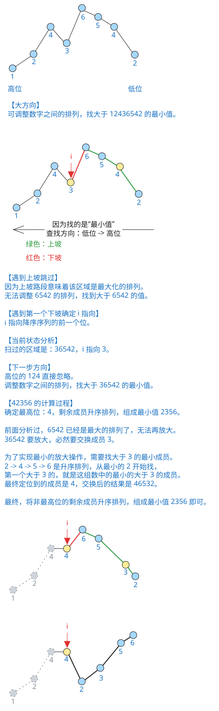

## 1. 题目描述

- [leetcode](https://leetcode.cn/problems/next-permutation/)

整数数组的一个排列就是将其所有成员以序列或线性顺序排列。

- 例如，`arr = [1, 2, 3]`，以下这些都可以视作 `arr` 的排列：`[1, 2, 3]`、`[1, 3, 2]`、`[3, 1, 2]`、`[2, 3, 1]`。

整数数组的下一个排列是指其整数的下一个字典序更大的排列。更正式地，如果数组的所有排列根据其字典顺序从小到大排列在一个容器中，那么数组的下一个排列就是在这个有序容器中排在它后面的那个排列。如果不存在下一个更大的排列，那么这个数组必须重排为字典序最小的排列（即，其元素按升序排列）。

- 例如，`arr = [1, 2, 3]` 的下一个排列是 `[1, 3, 2]`。
- 类似地，`arr = [2, 3, 1]` 的下一个排列是 `[3, 1, 2]`。
- 而 `arr = [3, 2, 1]` 的下一个排列是 `[1, 2, 3]`，因为 `[3, 2, 1]` 不存在一个字典序更大的排列。

给你一个整数数组 `nums`，找出 `nums` 的下一个排列。

必须 [原地][1] 修改，只允许使用额外常数空间。

---

示例 1：

```txt
输入：nums = [1, 2, 3]
输出：[1, 3, 2]
```

---

示例 2：

```txt
输入：nums = [3, 2, 1]
输出：[1, 2, 3]
```

---

示例 3：

```txt
输入：nums = [1, 1, 5]
输出：[1, 5, 1]
```

---

提示：

- `1 <= nums.length <= 100`
- `0 <= nums[i] <= 100`

## 2. s.1 - 从右找降序拐点 + 交换 + 翻转



::: code-group

```c [c]
void nextPermutation(int* nums, int numsSize) {
    int i = numsSize - 2;

    // 步骤 1：从右向左找到第一个下降位 nums[i] < nums[i+1]
    while (i >= 0 && nums[i] >= nums[i + 1])
        i--;

    if (i >= 0) {
        // 步骤 2：在 i 右侧找到最小的比 nums[i] 大的数 nums[j]
        int j = numsSize - 1;
        while (nums[j] <= nums[i])
            j--;
        // 交换
        int tmp = nums[i];
        nums[i] = nums[j];
        nums[j] = tmp;
    }

    // 步骤 3：将 i+1 右侧区域最小化
    int left = i + 1, right = numsSize - 1;
    while (left < right) {
        int tmp = nums[left];
        nums[left] = nums[right];
        nums[right] = tmp;
        left++;
        right--;
    }
}
```

```js [js]
/**
 * @param {number[]} nums
 * @return {void} Do not return anything, modify nums in-place instead.
 */
var nextPermutation = function (nums) {
  const n = nums.length
  let i = n - 2

  // 步骤 1：从右向左找到第一个下降位 nums[i] < nums[i+1]
  while (i >= 0 && nums[i] >= nums[i + 1]) i--

  if (i >= 0) {
    // 步骤 2：在 i 右侧找到最小的比 nums[i] 大的数 nums[j]
    let j = n - 1
    while (nums[j] <= nums[i])
      j--
      // 交换
    ;[nums[i], nums[j]] = [nums[j], nums[i]]
  }

  // 步骤 3：将 i+1 右侧区域最小化
  let left = i + 1
  let right = n - 1
  while (left < right) {
    ;[nums[left], nums[right]] = [nums[right], nums[left]]
    left++
    right--
  }
}
```

```py [py]
class Solution:
    def nextPermutation(self, nums: List[int]) -> None:
        """
        Do not return anything, modify nums in-place instead.
        """
        n = len(nums)
        i = n - 2

        # 步骤 1：从右向左找到第一个下降位 nums[i] < nums[i+1]
        while i >= 0 and nums[i] >= nums[i + 1]:
            i -= 1

        if i >= 0:
            # 步骤 2：在 i 右侧找到最小的比 nums[i] 大的数 nums[j]
            j = n - 1
            while nums[j] <= nums[i]:
                j -= 1
            # 交换
            nums[i], nums[j] = nums[j], nums[i]

        # 步骤 3：将 i+1 右侧区域最小化
        nums[i + 1 :] = nums[i + 1 :][::-1]
```

:::

- 时间复杂度：$O(n)$，三次线性扫描分别完成下降位定位、交换位定位、尾部翻转
- 空间复杂度：$O(1)$，原地修改，不使用额外空间

算法思路：

- 步骤 1 — 找拐点：从右向左扫描，找到第一个满足 `nums[i] < nums[i+1]` 的位置 `i`（即降序序列的前一个位）
- 步骤 2 — 找交换位：如果 `i` 存在，从右向左找到第一个比 `nums[i]` 大的元素 `nums[j]`，交换两者
- 步骤 3 — 翻转尾部：`i+1` 右侧必为降序，翻转为升序即得字典序最小的后缀
- 若整个数组已完全降序（`i < 0`），跳过步骤 2，直接翻转整个数组得到最小排列

## 3. 引用

- [原地算法 - 百度百科][1]

[1]: https://baike.baidu.com/item/%E5%8E%9F%E5%9C%B0%E7%AE%97%E6%B3%95
