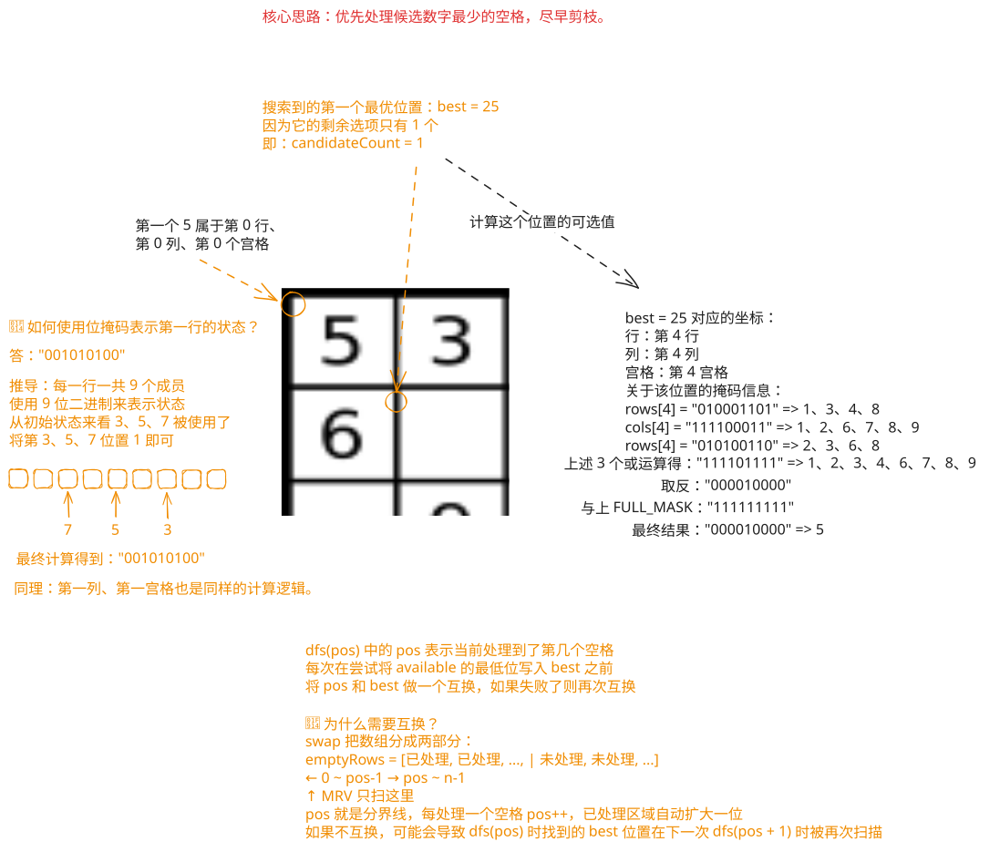

## 1. 题目描述

- [leetcode](https://leetcode.cn/problems/sudoku-solver/)

编写一个程序，通过填充空格来解决数独问题。

数独的解法需遵循如下规则：

1. 数字 `1-9` 在每一行只能出现一次。
2. 数字 `1-9` 在每一列只能出现一次。
3. 数字 `1-9` 在每一个以粗实线分隔的 `3x3` 宫内只能出现一次。（请参考示例图）

数独部分空格内已填入了数字，空白格用 `'.'` 表示。

---

示例 1：


```txt
输入：board = [
  ["5", "3", ".", ".", "7", ".", ".", ".", "."],
  ["6", ".", ".", "1", "9", "5", ".", ".", "."],
  [".", "9", "8", ".", ".", ".", ".", "6", "."],
  ["8", ".", ".", ".", "6", ".", ".", ".", "3"],
  ["4", ".", ".", "8", ".", "3", ".", ".", "1"],
  ["7", ".", ".", ".", "2", ".", ".", ".", "6"],
  [".", "6", ".", ".", ".", ".", "2", "8", "."],
  [".", ".", ".", "4", "1", "9", ".", ".", "5"],
  [".", ".", ".", ".", "8", ".", ".", "7", "9"]
]
输出：[
  ["5", "3", "4", "6", "7", "8", "9", "1", "2"],
  ["6", "7", "2", "1", "9", "5", "3", "4", "8"],
  ["1", "9", "8", "3", "4", "2", "5", "6", "7"],
  ["8", "5", "9", "7", "6", "1", "4", "2", "3"],
  ["4", "2", "6", "8", "5", "3", "7", "9", "1"],
  ["7", "1", "3", "9", "2", "4", "8", "5", "6"],
  ["9", "6", "1", "5", "3", "7", "2", "8", "4"],
  ["2", "8", "7", "4", "1", "9", "6", "3", "5"],
  ["3", "4", "5", "2", "8", "6", "1", "7", "9"]
]
```

解释：输入的数独如上图所示，唯一有效的解决方案如下所示：


---

提示：

- `board.length == 9`
- `board[i].length == 9`
- `board[i][j]` 是一位数字或者 `'.'`
- 题目数据保证输入数独仅有一个解

## 2. s.1 - 回溯 + 位运算 + 最少候选优先



::: code-group

```c [c]
int rows[9];
int cols[9];
int boxes[9];
int emptyRows[81];
int emptyCols[81];
int emptyCount;
int fullMask = (1 << 9) - 1;

int getBoxIndex(int row, int col) {
    return (row / 3) * 3 + col / 3;
}

int countBits(int mask) {
    int count = 0;
    while (mask != 0) {
        mask &= mask - 1;
        count++;
    }
    return count;
}

char getDigitChar(int bit) {
    int digit = 1;
    while ((bit >>= 1) != 0)
        digit++;
    return '0' + digit;
}

void swapPositions(int i, int j) {
    int tempRow = emptyRows[i];
    int tempCol = emptyCols[i];
    emptyRows[i] = emptyRows[j];
    emptyCols[i] = emptyCols[j];
    emptyRows[j] = tempRow;
    emptyCols[j] = tempCol;
}

bool dfs(char** board, int pos) {
    if (pos == emptyCount)
        return true;

    int best = pos;
    int minCount = 10;

    // 优先处理候选数字最少的空格，尽早剪枝。
    for (int i = pos; i < emptyCount; i++) {
        int row = emptyRows[i];
        int col = emptyCols[i];
        int box = getBoxIndex(row, col);
        int available = fullMask & ~(rows[row] | cols[col] | boxes[box]);
        int candidateCount = countBits(available);

        if (candidateCount == 0)
            return false;
        if (candidateCount < minCount) {
            minCount = candidateCount;
            best = i;
            if (candidateCount == 1)
                break;
        }
    }

    swapPositions(pos, best);

    int row = emptyRows[pos];
    int col = emptyCols[pos];
    int box = getBoxIndex(row, col);
    int available = fullMask & ~(rows[row] | cols[col] | boxes[box]);

    // 每次取最低位的 1，表示尝试一个可填数字。
    while (available != 0) {
        int bit = available & -available;
        available ^= bit;

        board[row][col] = getDigitChar(bit);
        rows[row] |= bit;
        cols[col] |= bit;
        boxes[box] |= bit;

        if (dfs(board, pos + 1))
            return true;

        rows[row] ^= bit;
        cols[col] ^= bit;
        boxes[box] ^= bit;
        board[row][col] = '.';
    }

    swapPositions(pos, best);
    return false;
}

void solveSudoku(char** board, int boardSize, int* boardColSize) {
    memset(rows, 0, sizeof(rows));
    memset(cols, 0, sizeof(cols));
    memset(boxes, 0, sizeof(boxes));
    emptyCount = 0;

    // rows / cols / boxes 用位掩码记录 1~9 的占用情况。
    for (int row = 0; row < boardSize; row++) {
        for (int col = 0; col < boardColSize[row]; col++) {
            if (board[row][col] == '.') {
                emptyRows[emptyCount] = row;
                emptyCols[emptyCount] = col;
                emptyCount++;
                continue;
            }

            int bit = 1 << (board[row][col] - '1');
            int box = getBoxIndex(row, col);
            rows[row] |= bit;
            cols[col] |= bit;
            boxes[box] |= bit;
        }
    }

    dfs(board, 0);
}
```

```js [js]
/**
 * @param {character[][]} board
 * @return {void} Do not return anything, modify board in-place instead.
 */
var solveSudoku = function (board) {
  const FULL_MASK = (1 << 9) - 1
  const rows = new Array(9).fill(0)
  const cols = new Array(9).fill(0)
  const boxes = new Array(9).fill(0)
  const emptyRows = []
  const emptyCols = []

  const getBoxIndex = (row, col) =>
    Math.floor(row / 3) * 3 + Math.floor(col / 3)

  const countBits = (mask) => {
    let count = 0
    while (mask !== 0) {
      mask &= mask - 1
      count++
    }
    return count
  }

  const getDigitChar = (bit) => String(31 - Math.clz32(bit) + 1)

  const swapPositions = (i, j) => {
    ;[emptyRows[i], emptyRows[j]] = [emptyRows[j], emptyRows[i]]
    ;[emptyCols[i], emptyCols[j]] = [emptyCols[j], emptyCols[i]]
  }

  // rows / cols / boxes 用位掩码记录 1~9 的占用情况。
  for (let row = 0; row < 9; row++) {
    for (let col = 0; col < 9; col++) {
      if (board[row][col] === '.') {
        emptyRows.push(row)
        emptyCols.push(col)
        continue
      }

      const bit = 1 << (board[row][col].charCodeAt(0) - 49)
      const box = getBoxIndex(row, col)
      rows[row] |= bit
      cols[col] |= bit
      boxes[box] |= bit
    }
  }

  const dfs = (pos) => {
    if (pos === emptyRows.length) return true

    let best = pos
    let minCount = 10

    // 优先处理候选数字最少的空格，尽早剪枝。
    for (let i = pos; i < emptyRows.length; i++) {
      const row = emptyRows[i]
      const col = emptyCols[i]
      const box = getBoxIndex(row, col)
      const available = FULL_MASK & ~(rows[row] | cols[col] | boxes[box])
      const candidateCount = countBits(available)

      if (candidateCount === 0) return false
      if (candidateCount < minCount) {
        minCount = candidateCount
        best = i
        if (candidateCount === 1) break
      }
    }

    swapPositions(pos, best)

    const row = emptyRows[pos]
    const col = emptyCols[pos]
    const box = getBoxIndex(row, col)
    let available = FULL_MASK & ~(rows[row] | cols[col] | boxes[box])

    // 每次取最低位的 1，表示尝试一个可填数字。
    while (available !== 0) {
      const bit = available & -available
      available ^= bit

      board[row][col] = getDigitChar(bit)
      rows[row] |= bit
      cols[col] |= bit
      boxes[box] |= bit

      if (dfs(pos + 1)) return true

      console.log(1)
      rows[row] ^= bit
      cols[col] ^= bit
      boxes[box] ^= bit
      board[row][col] = '.'
    }

    swapPositions(pos, best)
    return false
  }

  dfs(0)
}
```

```py [py]
class Solution:
    def solveSudoku(self, board: list[list[str]]) -> None:
        full_mask = (1 << 9) - 1
        rows = [0] * 9
        cols = [0] * 9
        boxes = [0] * 9
        empties: list[tuple[int, int]] = []

        def get_box_index(row: int, col: int) -> int:
            return (row // 3) * 3 + col // 3

        # rows / cols / boxes 用位掩码记录 1~9 的占用情况。
        for row in range(9):
            for col in range(9):
                if board[row][col] == ".":
                    empties.append((row, col))
                    continue

                bit = 1 << (ord(board[row][col]) - ord("1"))
                box = get_box_index(row, col)
                rows[row] |= bit
                cols[col] |= bit
                boxes[box] |= bit

        def dfs(pos: int) -> bool:
            if pos == len(empties):
                return True

            best = pos
            min_count = 10

            # 优先处理候选数字最少的空格，尽早剪枝。
            for i in range(pos, len(empties)):
                row, col = empties[i]
                box = get_box_index(row, col)
                available = full_mask & ~(rows[row] | cols[col] | boxes[box])
                candidate_count = available.bit_count()

                if candidate_count == 0:
                    return False
                if candidate_count < min_count:
                    min_count = candidate_count
                    best = i
                    if candidate_count == 1:
                        break

            empties[pos], empties[best] = empties[best], empties[pos]

            row, col = empties[pos]
            box = get_box_index(row, col)
            available = full_mask & ~(rows[row] | cols[col] | boxes[box])

            # 每次取最低位的 1，表示尝试一个可填数字。
            while available:
                bit = available & -available
                available ^= bit

                board[row][col] = str(bit.bit_length())
                rows[row] |= bit
                cols[col] |= bit
                boxes[box] |= bit

                if dfs(pos + 1):
                    return True

                rows[row] ^= bit
                cols[col] ^= bit
                boxes[box] ^= bit
                board[row][col] = "."

            empties[pos], empties[best] = empties[best], empties[pos]
            return False

        dfs(0)
```

:::

- 时间复杂度：$O(E \times 9^E)$，其中 $E$ 是空格数，位掩码将单次合法性判断压到 $O(1)$，最少候选优先能显著减少实际搜索分支
- 空间复杂度：$O(E)$，递归栈深度和空格位置记录都与空格数成正比

算法思路：

- 用 `rows`、`cols`、`boxes` 三个长度为 `9` 的位掩码数组分别记录每一行、每一列、每一宫已经使用过的数字
- 初始化时扫描棋盘，把所有空格位置记录下来，对于已填数字 `d`，将对应的第 `d - 1` 位标记到所在的行、列、宫中
- 回溯时不按固定顺序填格子，而是在当前剩余空格中优先选择“可填数字个数最少”的格子，这样可以尽早触发剪枝
- 某个空格的可选数字集合可由 `available = FULL_MASK & ~(rows[r] | cols[c] | boxes[b])` 直接算出，其中 `FULL_MASK = (1 << 9) - 1`
- 每次取出 `available` 的最低位 `1` 作为本次尝试的数字，更新棋盘和三个状态数组后继续递归；若后续失败，再撤销本次选择
- 当所有空格都被填完时，说明已经找到唯一合法解，搜索结束
