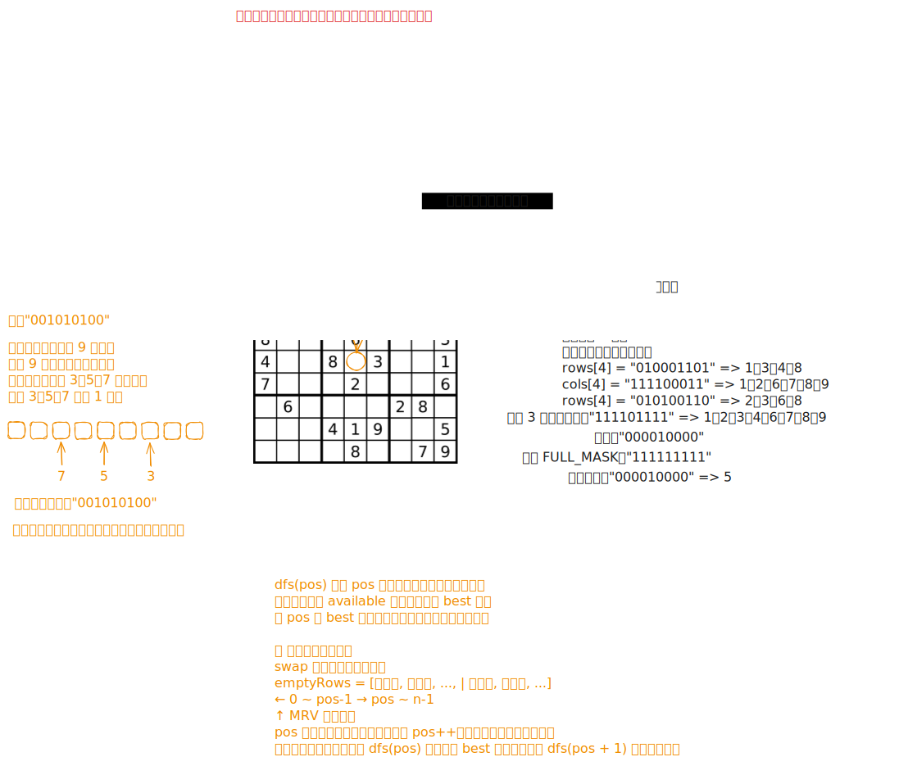

# [0037. 解数独【困难】](https://github.com/tnotesjs/TNotes.leetcode/tree/main/notes/0037.%20%E8%A7%A3%E6%95%B0%E7%8B%AC%E3%80%90%E5%9B%B0%E9%9A%BE%E3%80%91)

<!-- region:toc -->

- [1. 📝 题目描述](#1--题目描述)
- [2. 🎯 s.1 - 回溯 + 位运算 + 最少候选优先](#2--s1---回溯--位运算--最少候选优先)

<!-- endregion:toc -->

## 1. 📝 题目描述

- [leetcode](https://leetcode.cn/problems/sudoku-solver/)

编写一个程序，通过填充空格来解决数独问题。

数独的解法需遵循如下规则：

1. 数字 `1-9` 在每一行只能出现一次。
2. 数字 `1-9` 在每一列只能出现一次。
3. 数字 `1-9` 在每一个以粗实线分隔的 `3x3` 宫内只能出现一次。（请参考示例图）

数独部分空格内已填入了数字，空白格用 `'.'` 表示。

---

示例 1：


```txt
输入：board = [
  ["5", "3", ".", ".", "7", ".", ".", ".", "."],
  ["6", ".", ".", "1", "9", "5", ".", ".", "."],
  [".", "9", "8", ".", ".", ".", ".", "6", "."],
  ["8", ".", ".", ".", "6", ".", ".", ".", "3"],
  ["4", ".", ".", "8", ".", "3", ".", ".", "1"],
  ["7", ".", ".", ".", "2", ".", ".", ".", "6"],
  [".", "6", ".", ".", ".", ".", "2", "8", "."],
  [".", ".", ".", "4", "1", "9", ".", ".", "5"],
  [".", ".", ".", ".", "8", ".", ".", "7", "9"]
]
输出：[
  ["5", "3", "4", "6", "7", "8", "9", "1", "2"],
  ["6", "7", "2", "1", "9", "5", "3", "4", "8"],
  ["1", "9", "8", "3", "4", "2", "5", "6", "7"],
  ["8", "5", "9", "7", "6", "1", "4", "2", "3"],
  ["4", "2", "6", "8", "5", "3", "7", "9", "1"],
  ["7", "1", "3", "9", "2", "4", "8", "5", "6"],
  ["9", "6", "1", "5", "3", "7", "2", "8", "4"],
  ["2", "8", "7", "4", "1", "9", "6", "3", "5"],
  ["3", "4", "5", "2", "8", "6", "1", "7", "9"]
]
```

解释：输入的数独如上图所示，唯一有效的解决方案如下所示：


---

提示：

- `board.length == 9`
- `board[i].length == 9`
- `board[i][j]` 是一位数字或者 `'.'`
- 题目数据保证输入数独仅有一个解

## 2. 🎯 s.1 - 回溯 + 位运算 + 最少候选优先



::: code-group

<<< ./solutions/1/1.c [c]

<<< ./solutions/1/1.js [js]

<<< ./solutions/1/1.py [py]

:::

- 时间复杂度：$O(E \times 9^E)$，其中 $E$ 是空格数，位掩码将单次合法性判断压到 $O(1)$，最少候选优先能显著减少实际搜索分支
- 空间复杂度：$O(E)$，递归栈深度和空格位置记录都与空格数成正比

算法思路：

- 用 `rows`、`cols`、`boxes` 三个长度为 `9` 的位掩码数组分别记录每一行、每一列、每一宫已经使用过的数字
- 初始化时扫描棋盘，把所有空格位置记录下来，对于已填数字 `d`，将对应的第 `d - 1` 位标记到所在的行、列、宫中
- 回溯时不按固定顺序填格子，而是在当前剩余空格中优先选择“可填数字个数最少”的格子，这样可以尽早触发剪枝
- 某个空格的可选数字集合可由 `available = FULL_MASK & ~(rows[r] | cols[c] | boxes[b])` 直接算出，其中 `FULL_MASK = (1 << 9) - 1`
- 每次取出 `available` 的最低位 `1` 作为本次尝试的数字，更新棋盘和三个状态数组后继续递归；若后续失败，再撤销本次选择
- 当所有空格都被填完时，说明已经找到唯一合法解，搜索结束
