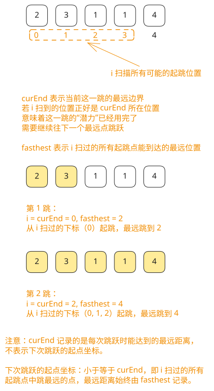

## 1. 题目描述

- [leetcode](https://leetcode.cn/problems/jump-game-ii/)

给定一个长度为 `n` 的 0 索引 整数数组 `nums`。初始位置在下标 0。

每个元素 `nums[i]` 表示从索引 `i` 向后跳转的最大长度。换句话说，如果你在索引 `i` 处，你可以跳转到任意 `(i + j)` 处：

- `0 <= j <= nums[i]` 且
- `i + j < n`

返回到达 `n - 1` 的最小跳跃次数。测试用例保证可以到达 `n - 1`。

---

示例 1：

```txt
输入: nums = [2, 3, 1, 1, 4]
输出: 2
```

解释：

- 跳到最后一个位置的最小跳跃数是 2。
- 从下标为 0 跳到下标为 1 的位置，跳 1 步，然后跳 3 步到达数组的最后一个位置。

---

示例 2：

```txt
输入: nums = [2, 3, 0, 1, 4]
输出: 2
```

---

提示：

- `1 <= nums.length <= 10^4`
- `0 <= nums[i] <= 1000`
- 题目保证可以到达 `n - 1`

## 2. s.1 - 贪心



::: code-group

```c [c]
int jump(int* nums, int numsSize) {
    int jumps = 0, curEnd = 0, farthest = 0;
    for (int i = 0; i < numsSize - 1; i++) {
        if (i + nums[i] > farthest)
            farthest = i + nums[i];
        if (i == curEnd) { // 到达当前轮次边界，必须跳一次
            jumps++;
            curEnd = farthest;
        }
    }
    return jumps;
}
```

```js [js]
/**
 * @param {number[]} nums
 * @return {number}
 */
var jump = function (nums) {
  let jumps = 0 // 跳跃次数
  let curEnd = 0 // 当前跳跃轮次能到达的最远下标
  let farthest = 0 // 遍历过程中能到达的最远下标

  for (let i = 0; i < nums.length - 1; i++) {
    farthest = Math.max(farthest, i + nums[i])
    if (i === curEnd) {
      // 到达当前轮次边界，必须跳一次
      jumps++
      curEnd = farthest
    }
  }

  return jumps
}
```

```py [py]
class Solution:
    def jump(self, nums: List[int]) -> int:
        jumps = 0
        cur_end = 0  # 当前跳跃轮次能到达的最远下标
        farthest = 0  # 遍历中能到达的最远下标

        for i in range(len(nums) - 1):
            farthest = max(farthest, i + nums[i])
            if i == cur_end:  # 到达当前轮次边界，必须跳一次
                jumps += 1
                cur_end = farthest

        return jumps
```

:::

- 时间复杂度：$O(n)$，只需遍历一次数组
- 空间复杂度：$O(1)$，只使用常数级额外空间

算法思路：

- 将跳跃过程分「轮次」：每轮从上一次跳跃落点出发，贪心地找出这一轮所有位置能到达的最远下标 `farthest`
- 遍历时用 `curEnd` 记录当前轮次的右边界，当 `i == curEnd` 时说明必须跳一次，更新 `curEnd = farthest`，跳跃次数加一
- 循环只到 `n - 2`，因为到达最后一个位置时无需再计数
