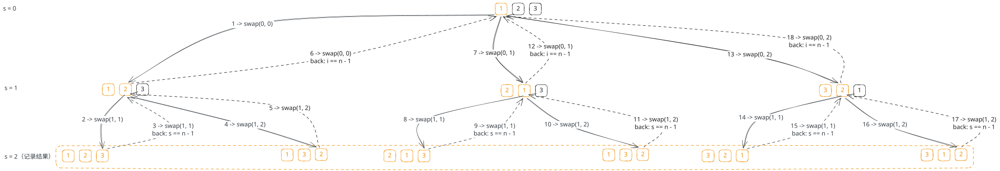
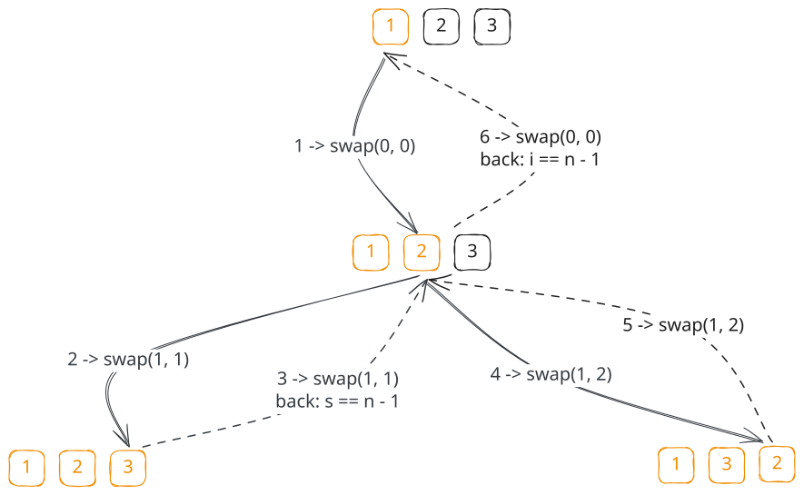
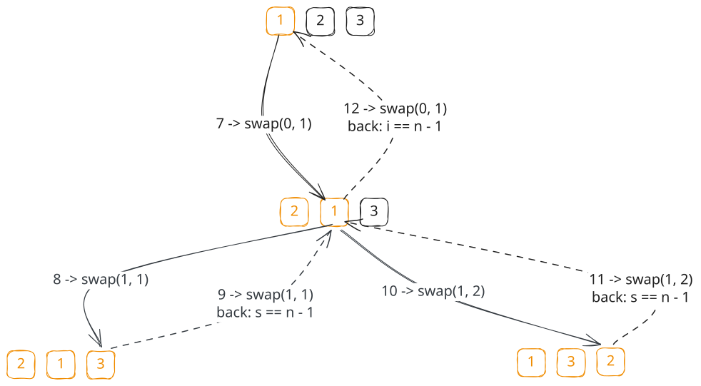
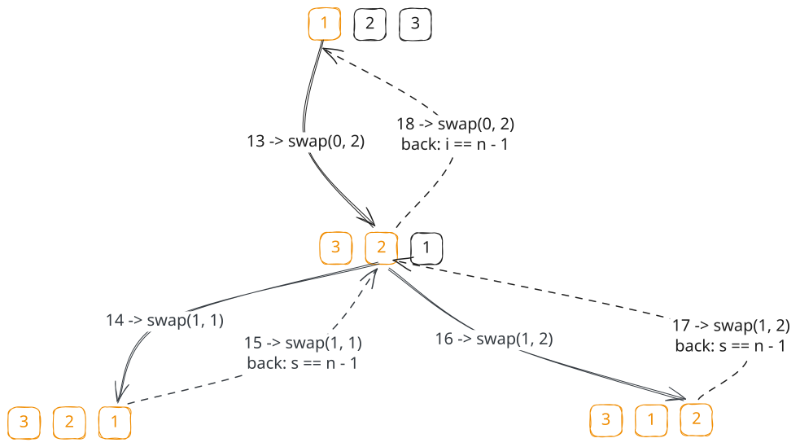

## 1. 题目描述

- [leetcode](https://leetcode.cn/problems/permutations/)

给定一个不含重复数字的数组 `nums`，返回其所有可能的全排列。你可以按任意顺序返回答案。

---

示例 1：

```txt
输入：nums = [1,2,3]
输出：[
  [1, 2, 3],
  [1, 3, 2],
  [2, 1, 3],
  [2, 3, 1],
  [3, 1, 2],
  [3, 2, 1]
]
```

---

示例 2：

```txt
输入：nums = [0,1]
输出：[[0,1],[1,0]]
```

---

示例 3：

```txt
输入：nums = [1]
输出：[[1]]
```

---

提示：

- `1 <= nums.length <= 6`
- `-10 <= nums[i] <= 10`
- `nums` 中的所有整数互不相同

## 2. s.1 - 回溯 + 交换



::: swiper







:::

::: code-group

```c [c]
/**
 * Return an array of arrays of size *returnSize.
 * The sizes of the arrays are returned as *returnColumnSizes array.
 * Note: Both returned array and *columnSizes array must be malloced, assume
 * caller calls free().
 */
int** res;
int resSize;
int n;

void swap(int* a, int* b) {
    int tmp = *a;
    *a = *b;
    *b = tmp;
}

void backtrack(int* nums, int start, int* col) {
    if (start == n - 1) {
        int* perm = (int*)malloc(n * sizeof(int));
        memcpy(perm, nums, n * sizeof(int));
        col[resSize] = n;
        res[resSize++] = perm;
        return;
    }
    for (int i = start; i < n; i++) {
        swap(&nums[start], &nums[i]);
        backtrack(nums, start + 1, col);
        swap(&nums[start], &nums[i]);
    }
}

int** permute(int* nums, int numsSize, int* returnSize,
              int** returnColumnSizes) {
    n = numsSize;
    int total = 1;
    for (int i = 1; i <= n; i++)
        total *= i;
    res = (int**)malloc(total * sizeof(int*));
    *returnColumnSizes = (int*)malloc(total * sizeof(int));
    resSize = 0;
    backtrack(nums, 0, *returnColumnSizes);
    *returnSize = resSize;
    return res;
}
```

```js [js]
/**
 * @param {number[]} nums
 * @return {number[][]}
 */
var permute = function (nums) {
  const res = []
  const n = nums.length
  const backtrack = (start) => {
    if (start === n - 1) {
      res.push(nums.slice())
      return
    }
    for (let i = start; i < n; i++) {
      ;[nums[start], nums[i]] = [nums[i], nums[start]]
      backtrack(start + 1)
      ;[nums[start], nums[i]] = [nums[i], nums[start]]
    }
  }
  backtrack(0)
  return res
}
```

```py [py]
class Solution:
    def permute(self, nums: List[int]) -> List[List[int]]:
        res = []
        n = len(nums)

        def backtrack(start: int) -> None:
            if start == n - 1:
                res.append(nums[:])
                return
            for i in range(start, n):
                nums[start], nums[i] = nums[i], nums[start]
                backtrack(start + 1)
                nums[start], nums[i] = nums[i], nums[start]

        backtrack(0)
        return res
```

:::

- 时间复杂度：$O(n \times n!)$，共生成 $n!$ 个排列，每个排列加入答案时都要复制长度为 $n$ 的数组；由于采用原地交换，单次状态修改的额外开销较小
- 空间复杂度：$O(n)$，主要来自递归栈深度；除答案外只在原数组上原地交换，额外辅助空间更少

算法思路：

- 用 `start` 指针将数组分为“已固定”和“待选”两段，
  - 已固定区域：`[0, start]`
  - 待选区域：`[start + 1, n - 1]`
- 每次从“待选区域”选一个数与 `start` 位置交换，递归固定下一位
- 递归回退时恢复交换（回溯），保证不同分支互不干扰
- 当 `start === n - 1` 时，当前数组就是一个完整排列，加入结果集

## 3. s.2 - 回溯 + used 数组

::: code-group

```c [c]
/**
 * Return an array of arrays of size *returnSize.
 * The sizes of the arrays are returned as *returnColumnSizes array.
 * Note: Both returned array and *columnSizes array must be malloced, assume
 * caller calls free().
 */
int** answers;
int answerSize;
int numsLength;
int path[6];
bool used[6];

void backtrack(int* nums, int depth, int* returnColumnSizes) {
    if (depth == numsLength) {
        int* permutation = (int*)malloc(numsLength * sizeof(int));
        memcpy(permutation, path, numsLength * sizeof(int));
        returnColumnSizes[answerSize] = numsLength;
        answers[answerSize++] = permutation;
        return;
    }

    for (int i = 0; i < numsLength; i++) {
        if (used[i])
            continue;

        path[depth] = nums[i];
        used[i] = true;
        backtrack(nums, depth + 1, returnColumnSizes);
        used[i] = false;
    }
}

int** permute(int* nums, int numsSize, int* returnSize,
              int** returnColumnSizes) {
    numsLength = numsSize;
    answerSize = 0;
    int total = 1;
    for (int i = 1; i <= numsLength; i++)
        total *= i;

    answers = (int**)malloc(total * sizeof(int*));
    *returnColumnSizes = (int*)malloc(total * sizeof(int));
    memset(used, 0, sizeof(used));

    backtrack(nums, 0, *returnColumnSizes);

    *returnSize = answerSize;
    return answers;
}
```

```js [js]
/**
 * @param {number[]} nums
 * @return {number[][]}
 */
var permute = function (nums) {
  const ans = []
  const path = []
  const used = new Array(nums.length).fill(false)

  const backtrack = () => {
    if (path.length === nums.length) {
      ans.push([...path])
      return
    }

    for (let i = 0; i < nums.length; i++) {
      if (used[i]) continue

      path.push(nums[i])
      used[i] = true

      backtrack()

      path.pop()
      used[i] = false
    }
  }

  backtrack()
  return ans
}
```

```py [py]
class Solution:
    def permute(self, nums: List[int]) -> List[List[int]]:
        ans: List[List[int]] = []
        path: List[int] = []
        used = [False] * len(nums)

        def backtrack() -> None:
            if len(path) == len(nums):
                ans.append(path[:])
                return

            for i, num in enumerate(nums):
                if used[i]:
                    continue

                path.append(num)
                used[i] = True
                backtrack()
                path.pop()
                used[i] = False

        backtrack()
        return ans
```

:::

- 时间复杂度：$O(n \times n!)$，共生成 $n!$ 个排列，每个排列加入答案时都要复制长度为 $n$ 的路径；同时每层都要遍历整个数组并结合 `used` 判断当前数字是否可选，常数开销相对更大
- 空间复杂度：$O(n)$，递归栈、`path` 和 `used` 数组都需要额外空间；虽然渐进复杂度仍为 $O(n)$，但辅助空间常数比原地交换更大

算法思路：

- 用 `path` 记录当前已经选出的排列前缀，用 `used[i]` 标记 `nums[i]` 是否已经被放入 `path`
- 每一层递归都在枚举“当前这一位放哪个数”：
  - 遍历整个数组 `nums`
  - 如果 `used[i]` 为 `true`，说明这个数已经用过，直接跳过
  - 否则将 `nums[i]` 放入 `path`，并标记 `used[i] = true`
- 递归进入下一层，继续决定下一个位置放什么数
- 回溯时撤销本层选择：
  - 从 `path` 末尾移除当前加入的数
  - 将 `used[i]` 恢复为 `false`
- 当 `path` 的长度等于 `nums.length` 时，说明已经构造出一个完整排列，将其拷贝后加入答案
