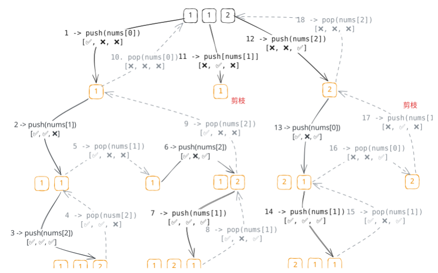

## 1. 题目描述

- [leetcode](https://leetcode.cn/problems/permutations-ii/)

给定一个可包含重复数字的序列 `nums`，按任意顺序返回所有不重复的全排列。

---

示例 1：

```txt
输入：nums = [1,1,2]
输出：[
  [1, 1, 2],
  [1, 2, 1],
  [2, 1, 1]
]
```

---

示例 2：

```txt
输入：nums = [1,2,3]
输出：[
  [1, 2, 3],
  [1, 3, 2],
  [2, 1, 3],
  [2, 3, 1],
  [3, 1, 2],
  [3, 2, 1]
]
```

---

提示：

- `1 <= nums.length <= 8`
- `-10 <= nums[i] <= 10`

## 2. s.1 - 回溯 + 排序去重



::: code-group

```c [c]
/**
 * Return an array of arrays of size *returnSize.
 * The sizes of the arrays are returned as *returnColumnSizes array.
 * Note: Both returned array and *columnSizes array must be malloced, assume
 * caller calls free().
 */
int compare(const void* a, const void* b) {
    return *(int*)a - *(int*)b;
}

int** g_ans;
int* g_colSizes;
int g_ansSize;
int g_path[8];
int g_pathLen;
int g_used[8];

void backtrack(int* nums, int n) {
    if (g_pathLen == n) {
        g_ans[g_ansSize] = (int*)malloc(n * sizeof(int));
        memcpy(g_ans[g_ansSize], g_path, n * sizeof(int));
        g_colSizes[g_ansSize] = n;
        g_ansSize++;
        return;
    }
    for (int i = 0; i < n; i++) {
        if (g_used[i])
            continue;
        if (i > 0 && nums[i] == nums[i - 1] && !g_used[i - 1])
            continue; // 同层去重
        g_used[i] = 1;
        g_path[g_pathLen++] = nums[i];
        backtrack(nums, n);
        g_pathLen--;
        g_used[i] = 0;
    }
}

int** permuteUnique(int* nums, int numsSize, int* returnSize,
                    int** returnColumnSizes) {
    qsort(nums, numsSize, sizeof(int), compare);
    g_ans = (int**)malloc(50000 * sizeof(int*));
    g_colSizes = (int*)malloc(50000 * sizeof(int));
    g_ansSize = 0;
    g_pathLen = 0;
    memset(g_used, 0, sizeof(g_used));
    backtrack(nums, numsSize);
    *returnSize = g_ansSize;
    *returnColumnSizes = g_colSizes;
    return g_ans;
}
```

```js [js]
/**
 * @param {number[]} nums
 * @return {number[][]}
 */
var permuteUnique = function (nums) {
  nums.sort((a, b) => a - b)
  const ans = []
  const used = new Array(nums.length).fill(false)

  const backtrack = (path) => {
    if (path.length === nums.length) {
      ans.push([...path])
      return
    }
    for (let i = 0; i < nums.length; i++) {
      if (used[i]) continue
      // 同层跳过重复：前一个相同元素未使用，说明在同一层已经枚举过
      if (i > 0 && nums[i] === nums[i - 1] && !used[i - 1]) continue
      used[i] = true
      path.push(nums[i])
      backtrack(path)
      path.pop()
      used[i] = false
    }
  }

  backtrack([])
  return ans
}
```

```py [py]
class Solution:
    def permuteUnique(self, nums: List[int]) -> List[List[int]]:
        nums.sort()
        ans = []
        used = [False] * len(nums)

        def backtrack(path: List[int]) -> None:
            if len(path) == len(nums):
                ans.append(path[:])
                return
            for i in range(len(nums)):
                if used[i]:
                    continue
                # 同层去重：前一个相同元素未使用，说明同一层已枚举过
                if i > 0 and nums[i] == nums[i - 1] and not used[i - 1]:
                    continue
                used[i] = True
                path.append(nums[i])
                backtrack(path)
                path.pop()
                used[i] = False

        backtrack([])
        return ans
```

:::

- 时间复杂度：$O(n \times n!)$，最多有 $n!$ 个排列，每个排列需 $O(n)$ 复制
- 空间复杂度：$O(n)$，递归栈深度和 `used` 数组均为 $O(n)$（不计输出结果）

算法思路：

- 先排序使相同元素相邻，用 `used` 数组标记当前路径已选取的位置
- 每层枚举时，若 `used[i]` 为真则跳过；若 `nums[i] == nums[i-1]` 且 `!used[i-1]`，说明同一层已经枚举过值相同的分支，跳过以避免重复排列
- 路径长度等于 `nums.length` 时收集结果
