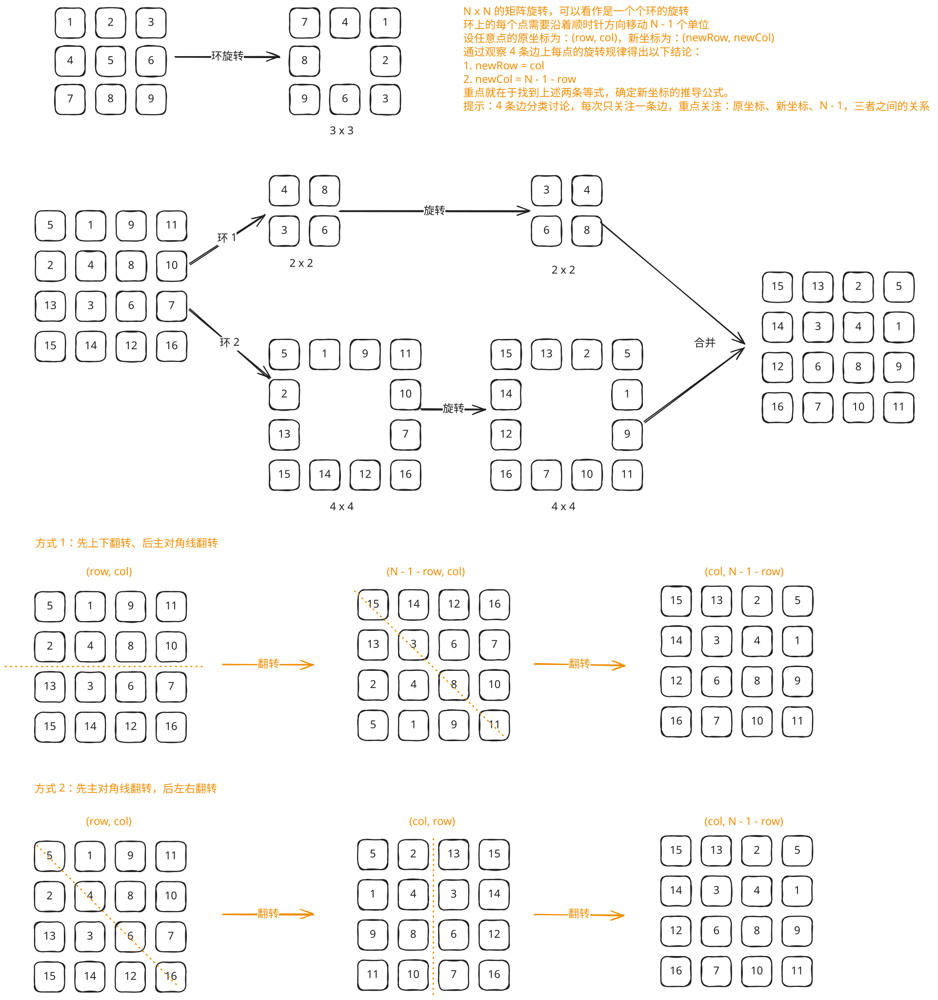

## 1. 题目描述

- [leetcode](https://leetcode.cn/problems/rotate-image)

给定一个 n × n 的二维矩阵 `matrix` 表示一个图像。请你将图像顺时针旋转 90 度。

你必须在 [原地][1] 旋转图像，这意味着你需要直接修改输入的二维矩阵。请不要使用另一个矩阵来旋转图像。

---

示例 1：


```txt
输入：matrix = [
  [1, 2, 3],
  [4, 5, 6],
  [7, 8, 9]
]

输出：[
  [7, 4, 1],
  [8, 5, 2],
  [9, 6, 3]
]
```

---

示例 2：


```txt
输入：matrix = [
  [5, 1, 9, 11],
  [2, 4, 8, 10],
  [13, 3, 6, 7],
  [15, 14, 12, 16]
]
输出：[
  [15, 13, 2, 5],
  [14, 3, 4, 1],
  [12, 6, 8, 9],
  [16, 7, 10, 11]
]
```

---

提示：

- `n == matrix.length == matrix[i].length`
- `1 <= n <= 20`
- `-1000 <= matrix[i][j] <= 1000`

## 2. s.1 - 根据规律翻转图像



::: code-group

```c [c]
void rotate(int** matrix, int matrixSize, int* matrixColSize) {
    (void)matrixColSize;

    for (int row = 0; row < matrixSize / 2; row++) {
        int* tempRow = matrix[row];
        matrix[row] = matrix[matrixSize - row - 1];
        matrix[matrixSize - row - 1] = tempRow;
    }

    for (int row = 0; row < matrixSize; row++) {
        for (int col = 0; col < row; col++) {
            int temp = matrix[row][col];
            matrix[row][col] = matrix[col][row];
            matrix[col][row] = temp;
        }
    }
}
```

```js [js]
/**
 * @param {number[][]} matrix
 * @return {void} Do not return anything, modify matrix in-place instead.
 */
var rotate = function (matrix) {
  const n = matrix.length
  for (let i = 0; i < Math.floor(n / 2); i++) {
    // 上下翻转
    ;[matrix[i], matrix[n - i - 1]] = [matrix[n - i - 1], matrix[i]]
  }
  for (let i = 0; i < n; i++) {
    // 主对角线翻转
    for (let j = 0; j < i; j++) {
      if (i === j) continue
      ;[matrix[i][j], matrix[j][i]] = [matrix[j][i], matrix[i][j]]
    }
  }
}
```

```py [py]
class Solution:
    def rotate(self, matrix: List[List[int]]) -> None:
        """
        Do not return anything, modify matrix in-place instead.
        """
        n = len(matrix)

        for row in range(n // 2):
            matrix[row], matrix[n - row - 1] = matrix[n - row - 1], matrix[row]

        for row in range(n):
            for col in range(row):
                matrix[row][col], matrix[col][row] = matrix[col][row], matrix[row][col]
```

:::

- 时间复杂度：$O(n^2)$，两次翻转都需要遍历矩阵中的元素
- 空间复杂度：$O(1)$，只使用了常数级别的额外空间

算法思路：

- 先将第 $i$ 行与第 $n-i-1$ 行交换，对整个矩阵做一次上下翻转
- 再沿主对角线交换 `matrix[i][j]` 和 `matrix[j][i]`，完成矩阵转置
- 这两个操作组合后的效果，恰好等价于将矩阵顺时针旋转 $90$ 度，且全程原地修改

## 3. 引用

- [百度百科 - 原地算法][1]

[1]: https://baike.baidu.com/item/%E5%8E%9F%E5%9C%B0%E7%AE%97%E6%B3%95
