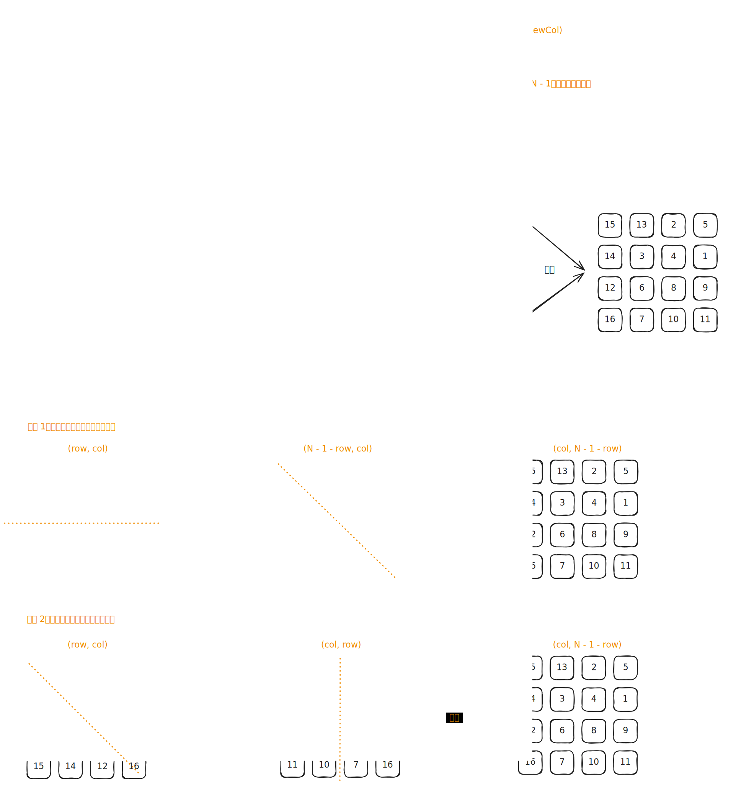

# [0048. 旋转图像【中等】](https://github.com/tnotesjs/TNotes.leetcode/tree/main/notes/0048.%20%E6%97%8B%E8%BD%AC%E5%9B%BE%E5%83%8F%E3%80%90%E4%B8%AD%E7%AD%89%E3%80%91)

<!-- region:toc -->

- [1. 📝 题目描述](#1--题目描述)
- [2. 🎯 s.1 - 根据规律翻转图像](#2--s1---根据规律翻转图像)
- [3. 🔗 引用](#3--引用)

<!-- endregion:toc -->

## 1. 📝 题目描述

- [leetcode](https://leetcode.cn/problems/rotate-image)

给定一个 n × n 的二维矩阵 `matrix` 表示一个图像。请你将图像顺时针旋转 90 度。

你必须在 [原地][1] 旋转图像，这意味着你需要直接修改输入的二维矩阵。请不要使用另一个矩阵来旋转图像。

---

示例 1：


```txt
输入：matrix = [
  [1, 2, 3],
  [4, 5, 6],
  [7, 8, 9]
]

输出：[
  [7, 4, 1],
  [8, 5, 2],
  [9, 6, 3]
]
```

---

示例 2：


```txt
输入：matrix = [
  [5, 1, 9, 11],
  [2, 4, 8, 10],
  [13, 3, 6, 7],
  [15, 14, 12, 16]
]
输出：[
  [15, 13, 2, 5],
  [14, 3, 4, 1],
  [12, 6, 8, 9],
  [16, 7, 10, 11]
]
```

---

提示：

- `n == matrix.length == matrix[i].length`
- `1 <= n <= 20`
- `-1000 <= matrix[i][j] <= 1000`

## 2. 🎯 s.1 - 根据规律翻转图像



::: code-group

<<< ./solutions/1/1.c [c]

<<< ./solutions/1/1.js [js]

<<< ./solutions/1/1.py [py]

:::

- 时间复杂度：$O(n^2)$，两次翻转都需要遍历矩阵中的元素
- 空间复杂度：$O(1)$，只使用了常数级别的额外空间

算法思路：

- 先将第 $i$ 行与第 $n-i-1$ 行交换，对整个矩阵做一次上下翻转
- 再沿主对角线交换 `matrix[i][j]` 和 `matrix[j][i]`，完成矩阵转置
- 这两个操作组合后的效果，恰好等价于将矩阵顺时针旋转 $90$ 度，且全程原地修改

## 3. 🔗 引用

- [百度百科 - 原地算法][1]

[1]: https://baike.baidu.com/item/%E5%8E%9F%E5%9C%B0%E7%AE%97%E6%B3%95
