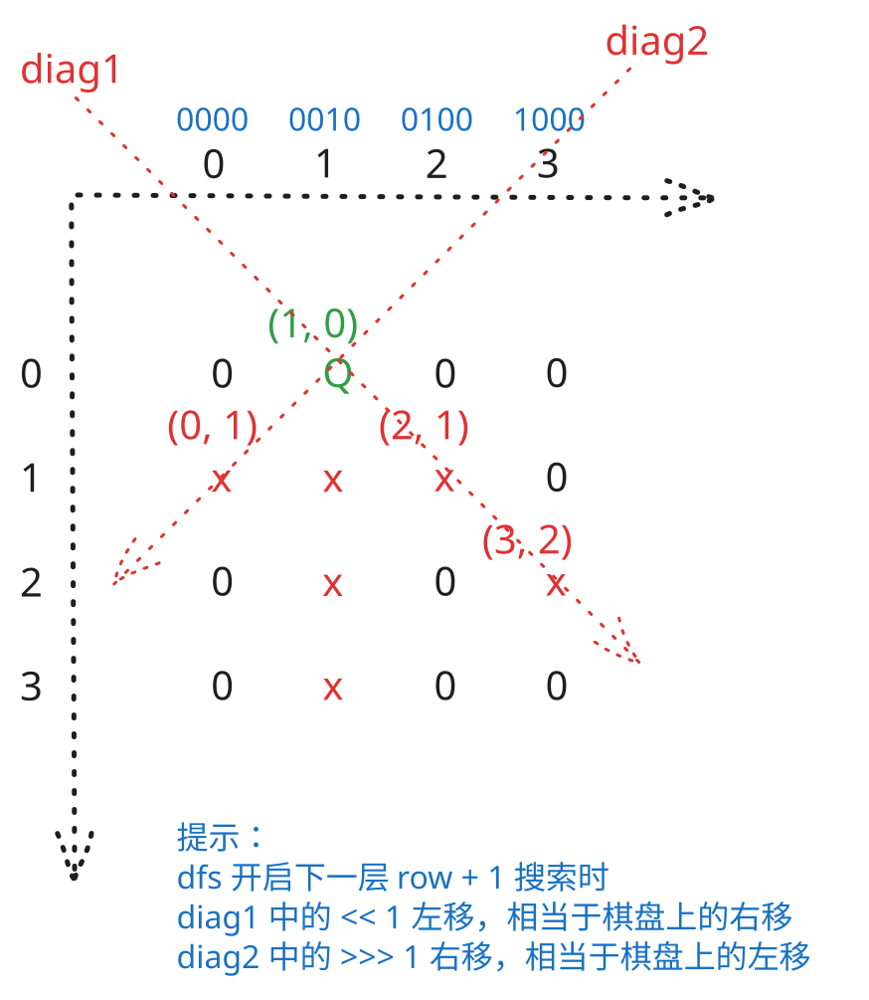

## 1. 题目描述

- [leetcode](https://leetcode.cn/problems/n-queens/)

按照国际象棋的规则，皇后可以攻击与之处在同一行或同一列或同一斜线上的棋子。

`n` 皇后问题研究的是如何将 `n` 个皇后放置在 `n×n` 的棋盘上，并且使皇后彼此之间不能相互攻击。

给你一个整数 `n`，返回所有不同的 n 皇后问题的解决方案。

每一种解法包含一个不同的 n 皇后问题的棋子放置方案，该方案中 `'Q'` 和 `'.'` 分别代表了皇后和空位。

---

示例 1：


```txt
输入：n = 4
输出：[
  [".Q..","...Q","Q...","..Q."],
  ["..Q.","Q...","...Q",".Q.."]
]
```

解释：如上图所示，4 皇后问题存在两个不同的解法。

---

示例 2：

```txt
输入：n = 1
输出：[["Q"]]
```

---

提示：

- `1 <= n <= 9`

## 2. s.1 - 回溯 + 位运算



::: code-group

```c [c]
/**
 * Return an array of arrays of size *returnSize.
 * The sizes of the arrays are returned as *returnColumnSizes array.
 * Note: Both returned array and *columnSizes array must be malloced, assume
 * caller calls free().
 */
char*** answers;
int* columnSizes;
int answerSize;
int answerCap;
int queenCols[9];
int limitMask;
int boardSize;

int getColIndex(int bit) {
    int col = 0;
    while ((bit >>= 1) != 0)
        col++;
    return col;
}

void ensureCapacity() {
    if (answerSize < answerCap)
        return;
    answerCap *= 2;
    answers = (char***)realloc(answers, answerCap * sizeof(char**));
    columnSizes = (int*)realloc(columnSizes, answerCap * sizeof(int));
}

void storeBoard() {
    ensureCapacity();
    char** board = (char**)malloc(boardSize * sizeof(char*));
    for (int row = 0; row < boardSize; row++) {
        board[row] = (char*)malloc((boardSize + 1) * sizeof(char));
        for (int col = 0; col < boardSize; col++)
            board[row][col] = '.';
        board[row][queenCols[row]] = 'Q';
        board[row][boardSize] = '\0';
    }
    columnSizes[answerSize] = boardSize;
    answers[answerSize++] = board;
}

void dfs(int row, int cols, int diag1, int diag2) {
    if (row == boardSize) {
        storeBoard();
        return;
    }

    int available = limitMask & ~(cols | diag1 | diag2);
    while (available != 0) {
        int bit = available & -available;
        available ^= bit;
        queenCols[row] = getColIndex(bit);
        dfs(row + 1, cols | bit, ((diag1 | bit) << 1) & limitMask,
            (diag2 | bit) >> 1);
    }
}

char*** solveNQueens(int n, int* returnSize, int** returnColumnSizes) {
    boardSize = n;
    limitMask = (1 << n) - 1;
    answerSize = 0;
    answerCap = 16;
    answers = (char***)malloc(answerCap * sizeof(char**));
    columnSizes = (int*)malloc(answerCap * sizeof(int));

    dfs(0, 0, 0, 0);

    *returnSize = answerSize;
    *returnColumnSizes = columnSizes;
    return answers;
}
```

```js [js]
/**
 * @param {number} n
 * @return {string[][]}
 */
var solveNQueens = function (n) {
  const res = []
  const queens = new Array(n).fill(0)
  const limit = (1 << n) - 1

  const buildBoard = () =>
    queens.map((col) => '.'.repeat(col) + 'Q' + '.'.repeat(n - col - 1))

  const dfs = (row, cols, diag1, diag2) => {
    if (row === n) {
      res.push(buildBoard())
      return
    }

    let available = limit & ~(cols | diag1 | diag2)
    while (available !== 0) {
      const bit = available & -available
      available ^= bit
      queens[row] = 31 - Math.clz32(bit) // 或 queens[row] = Math.log2(bit)
      dfs(
        row + 1,
        cols | bit,
        ((diag1 | bit) << 1) & limit,
        (diag2 | bit) >>> 1,
      )
    }
  }

  dfs(0, 0, 0, 0)
  return res
}
```

```py [py]
class Solution:
    def solveNQueens(self, n: int) -> List[List[str]]:
        res: List[List[str]] = []
        queens = [0] * n
        limit = (1 << n) - 1

        def build_board() -> List[str]:
            return ["." * col + "Q" + "." * (n - col - 1) for col in queens]

        def dfs(row: int, cols: int, diag1: int, diag2: int) -> None:
            if row == n:
                res.append(build_board())
                return

            available = limit & ~(cols | diag1 | diag2)
            while available:
                bit = available & -available
                available ^= bit
                queens[row] = bit.bit_length() - 1
                dfs(
                    row + 1,
                    cols | bit,
                    ((diag1 | bit) << 1) & limit,
                    (diag2 | bit) >> 1,
                )

        dfs(0, 0, 0, 0)
        return res
```

:::

- 时间复杂度：$O(n!)$，按行回溯枚举皇后位置，位运算将列和对角线冲突判断优化为 $O(1)$，构造答案的额外开销为 $O(ans \times n^2)$
- 空间复杂度：$O(n)$，递归栈和每行皇后所在列的记录数组都是 $O(n)$（不计答案）

算法思路：

- 核心思想：用三个整数的二进制位来表示列和两条对角线的占用情况，取代传统的二维数组标记，从而用位运算高效地找到可放置位置并回溯。
- `limit` 为 `(1 << n) - 1`，起到一个掩码的作用，主要用于后续的位运算时忽略高位的影响
- 每次递归都是在按行放置皇后，每个第 `row` 行只需要关心皇后放在哪一列，需确保这一列是安全的（不会被攻击）
- 用三个二进制状态记录攻击范围：
  - `cols` 表示已占用的列
  - `diag1` 表示主对角线（即 ↘️ 方向对角线）的攻击位置
  - `diag2` 表示副对角线（即 ↙️ 方向对角线）的攻击位置
- `available`
  - 表示当前行的可选集合
  - 当前行所有合法位置可由 `available = limit & ~(cols | diag1 | diag2)` 一次算出
  - 每次取出 `available` 的最低位 `1`，表示选择一个合法列放置皇后
- 递归到下一行时，主对角线攻击范围左移一位，副对角线攻击范围右移一位
- 当递归到第 `n` 行时，说明找到了一个合法布局，再根据每一行记录的列位置构造棋盘并加入答案
