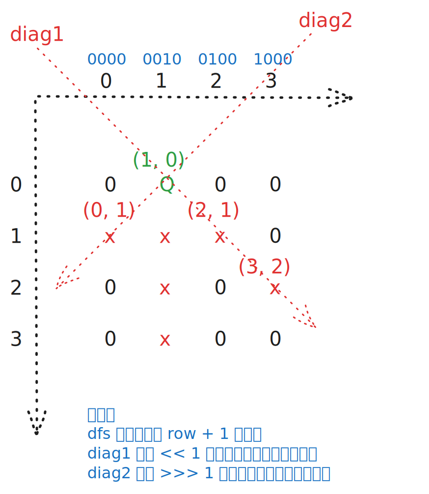

# [0051. N 皇后【困难】](https://github.com/tnotesjs/TNotes.leetcode/tree/main/notes/0051.%20N%20%E7%9A%87%E5%90%8E%E3%80%90%E5%9B%B0%E9%9A%BE%E3%80%91)

<!-- region:toc -->

- [1. 📝 题目描述](#1--题目描述)
- [2. 🎯 s.1 - 回溯 + 位运算](#2--s1---回溯--位运算)

<!-- endregion:toc -->

## 1. 📝 题目描述

- [leetcode](https://leetcode.cn/problems/n-queens/)

按照国际象棋的规则，皇后可以攻击与之处在同一行或同一列或同一斜线上的棋子。

`n` 皇后问题研究的是如何将 `n` 个皇后放置在 `n×n` 的棋盘上，并且使皇后彼此之间不能相互攻击。

给你一个整数 `n`，返回所有不同的 n 皇后问题的解决方案。

每一种解法包含一个不同的 n 皇后问题的棋子放置方案，该方案中 `'Q'` 和 `'.'` 分别代表了皇后和空位。

---

示例 1：


```txt
输入：n = 4
输出：[
  [".Q..","...Q","Q...","..Q."],
  ["..Q.","Q...","...Q",".Q.."]
]
```

解释：如上图所示，4 皇后问题存在两个不同的解法。

---

示例 2：

```txt
输入：n = 1
输出：[["Q"]]
```

---

提示：

- `1 <= n <= 9`

## 2. 🎯 s.1 - 回溯 + 位运算



::: code-group

<<< ./solutions/1/1.c [c]

<<< ./solutions/1/1.js [js]

<<< ./solutions/1/1.py [py]

:::

- 时间复杂度：$O(n!)$，按行回溯枚举皇后位置，位运算将列和对角线冲突判断优化为 $O(1)$，构造答案的额外开销为 $O(ans \times n^2)$
- 空间复杂度：$O(n)$，递归栈和每行皇后所在列的记录数组都是 $O(n)$（不计答案）

算法思路：

- `limit` 为 `(1 << n) - 1`，起到一个掩码的作用，主要用于后续的位运算时忽略高位的影响
- 按行放置皇后，第 `row` 行只需要决定皇后放在哪一列
- 用三个二进制状态记录攻击范围：
  - `cols` 表示已占用的列
  - `diag1` 表示主对角线（即 `\` 方向对角线 $row - col$ 不变）的攻击位置
  - `diag2` 表示副（即 `/` 方向对角线 $row + col$ 不变）的攻击位置
- `available`
  - 表示当前行的可选集合
  - 当前行所有合法位置可由 `available = limit & ~(cols | diag1 | diag2)` 一次算出
  - 每次取出 `available` 的最低位 `1`，表示选择一个合法列放置皇后
- 递归到下一行时，主对角线攻击范围左移一位，副对角线攻击范围右移一位
- 当递归到第 `n` 行时，说明找到了一个合法布局，再根据每一行记录的列位置构造棋盘并加入答案
