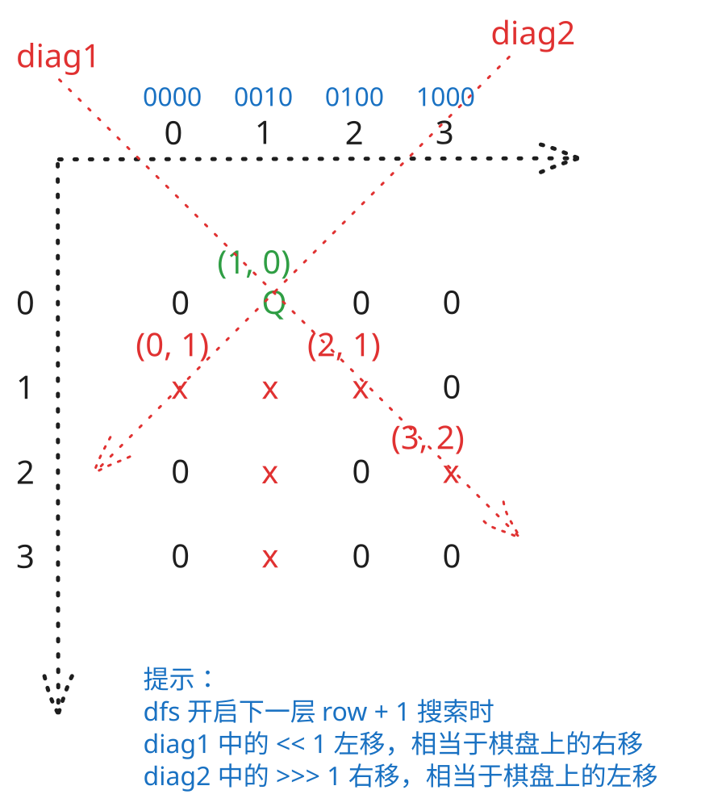

## 1. 题目描述

- [leetcode](https://leetcode.cn/problems/n-queens-ii/)

n 皇后问题研究的是如何将 `n` 个皇后放置在 `n × n` 的棋盘上，并且使皇后彼此之间不能相互攻击。

给你一个整数 `n`，返回 n 皇后问题不同的解决方案的数量。

---

示例 1：


```txt
输入：n = 4
输出：2
```

解释：如上图所示，4 皇后问题存在两个不同的解法。

---

示例 2：

```txt
输入：n = 1
输出：1
```

---

提示：

- `1 <= n <= 9`

## 2. s.1 - 回溯 + 位运算



::: code-group

```c [c]
int answerCount;
int boardSize;
int limitMask;

void dfs(int row, int cols, int diag1, int diag2) {
	if (row == boardSize) {
		answerCount++;
		return;
	}

	int available = limitMask & ~(cols | diag1 | diag2);
	while (available != 0) {
		int bit = available & -available;
		available ^= bit;
		dfs(row + 1, cols | bit, ((diag1 | bit) << 1) & limitMask, (diag2 | bit) >> 1);
	}
}

int totalNQueens(int n) {
	boardSize = n;
	limitMask = (1 << n) - 1;
	answerCount = 0;
	dfs(0, 0, 0, 0);
	return answerCount;
}
```

```js [js]
/**
 * @param {number} n
 * @return {number}
 */
var totalNQueens = function (n) {
  const limit = (1 << n) - 1
  let count = 0

  const dfs = (row, cols, diag1, diag2) => {
    if (row === n) {
      count++
      return
    }

    let available = limit & ~(cols | diag1 | diag2)
    while (available !== 0) {
      const bit = available & -available
      available ^= bit
      dfs(
        row + 1,
        cols | bit,
        ((diag1 | bit) << 1) & limit,
        (diag2 | bit) >>> 1,
      )
    }
  }

  dfs(0, 0, 0, 0)
  return count
}
```

```py [py]
class Solution:
	def totalNQueens(self, n: int) -> int:
		limit = (1 << n) - 1
		answer = 0

		def dfs(row: int, cols: int, diag1: int, diag2: int) -> None:
			nonlocal answer
			if row == n:
				answer += 1
				return

			available = limit & ~(cols | diag1 | diag2)
			while available:
				bit = available & -available
				available ^= bit
				dfs(row + 1, cols | bit, ((diag1 | bit) << 1) & limit, (diag2 | bit) >> 1)

		dfs(0, 0, 0, 0)
		return answer
```

:::

- 时间复杂度：$O(n!)$，按行回溯枚举皇后位置，位运算可将每一步的冲突判断压到 $O(1)$
- 空间复杂度：$O(n)$，递归深度最多为 $n$，额外只使用常数个整型状态

算法思路：

- 和 0051 一样按行回溯，但本题只需要返回方案总数，因此不必保存整张棋盘
- 用三个二进制状态表示已经被占用或攻击到的位置：
  - `cols` 表示已占用的列
  - `diag1` 表示主对角线（即 `\` 方向对角线）的攻击范围
  - `diag2` 表示副对角线（即 `/` 方向对角线）的攻击范围
- `limit = (1 << n) - 1` 用来保留低 `n` 位，忽略位移后产生的高位干扰
- 当前行的所有合法位置可以一次算出：`available = limit & ~(cols | diag1 | diag2)`
- 每次取 `available` 的最低位 `1` 作为当前皇后的落点，然后递归处理下一行
- 进入下一行时：
  - 列占用更新为 `cols | bit`
  - 主对角线攻击范围左移一位
  - 副对角线攻击范围右移一位
- 当递归到第 `n` 行时，说明找到一种合法摆法，答案加一
