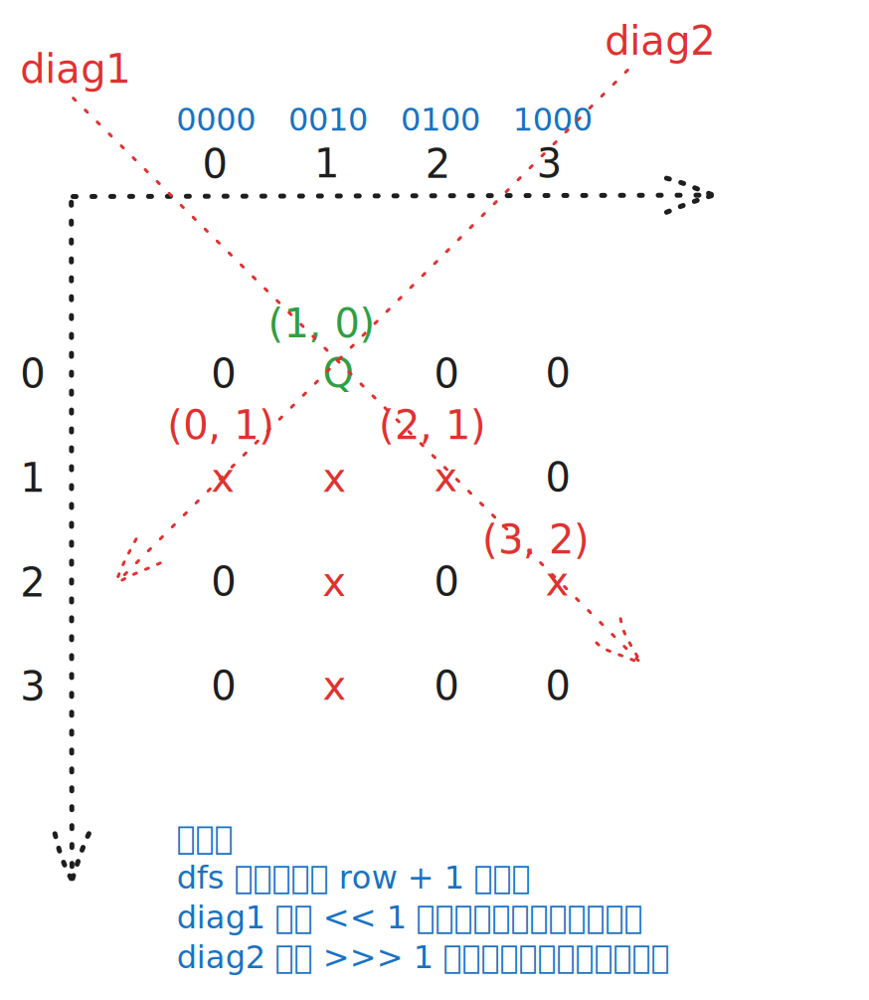

# [0052. N 皇后 II【困难】](https://github.com/tnotesjs/TNotes.leetcode/tree/main/notes/0052.%20N%20%E7%9A%87%E5%90%8E%20II%E3%80%90%E5%9B%B0%E9%9A%BE%E3%80%91)

<!-- region:toc -->

- [1. 📝 题目描述](#1--题目描述)
- [2. 🎯 s.1 - 回溯 + 位运算](#2--s1---回溯--位运算)

<!-- endregion:toc -->

## 1. 📝 题目描述

- [leetcode](https://leetcode.cn/problems/n-queens-ii/)

n 皇后问题 研究的是如何将 `n` 个皇后放置在 `n × n` 的棋盘上，并且使皇后彼此之间不能相互攻击。

给你一个整数 `n`，返回 n 皇后问题不同的解决方案的数量。

---

示例 1：


```txt
输入：n = 4
输出：2
```

解释：如上图所示，4 皇后问题存在两个不同的解法。

---

示例 2：

```txt
输入：n = 1
输出：1
```

---

提示：

- `1 <= n <= 9`

## 2. 🎯 s.1 - 回溯 + 位运算



::: code-group

<<< ./solutions/1/1.c [c]

<<< ./solutions/1/1.js [js]

<<< ./solutions/1/1.py [py]

:::

- 时间复杂度：$O(n!)$，按行回溯枚举皇后位置，位运算可将每一步的冲突判断压到 $O(1)$
- 空间复杂度：$O(n)$，递归深度最多为 $n$，额外只使用常数个整型状态

算法思路：

- 和 0051 一样按行回溯，但本题只需要返回方案总数，因此不必保存整张棋盘
- 用三个二进制状态表示已经被占用或攻击到的位置：
  - `cols` 表示已占用的列
  - `diag1` 表示主对角线（即 `\` 方向对角线）的攻击范围
  - `diag2` 表示副对角线（即 `/` 方向对角线）的攻击范围
- `limit = (1 << n) - 1` 用来保留低 `n` 位，忽略位移后产生的高位干扰
- 当前行的所有合法位置可以一次算出：`available = limit & ~(cols | diag1 | diag2)`
- 每次取 `available` 的最低位 `1` 作为当前皇后的落点，然后递归处理下一行
- 进入下一行时：
  - 列占用更新为 `cols | bit`
  - 主对角线攻击范围左移一位
  - 副对角线攻击范围右移一位
- 当递归到第 `n` 行时，说明找到一种合法摆法，答案加一
