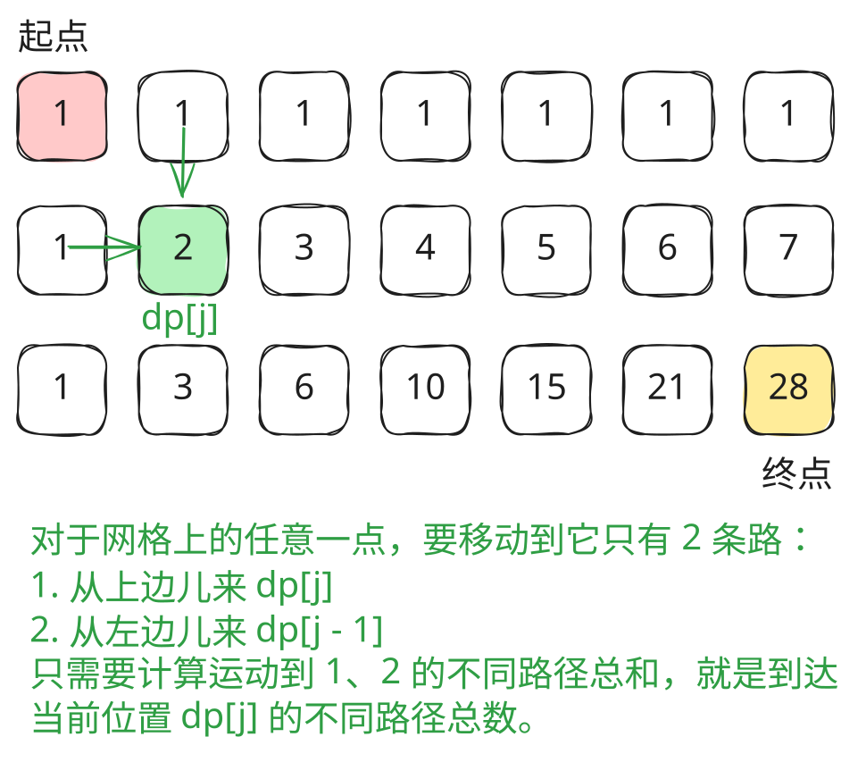

## 1. 题目描述

- [leetcode](https://leetcode.cn/problems/unique-paths/)

一个机器人位于一个 `m x n` 网格的左上角 （起始点在下图中标记为 “Start” ）。

机器人每次只能向下或者向右移动一步。机器人试图达到网格的右下角（在下图中标记为 “Finish” ）。

问总共有多少条不同的路径？

---

示例 1：


```txt
输入：m = 3, n = 7
输出：28
```

---

示例 2：

```txt
输入：m = 3, n = 2
输出：3
```

解释：

从左上角开始，总共有 3 条路径可以到达右下角。

1. 向右 -> 向下 -> 向下
2. 向下 -> 向下 -> 向右
3. 向下 -> 向右 -> 向下

---

示例 3：

```txt
输入：m = 7, n = 3
输出：28
```

---

示例 4：

```txt
输入：m = 3, n = 3
输出：6
```

---

提示：

- `1 <= m, n <= 100`
- 题目数据保证答案小于等于 `2 * 10^9`

## 2. s.1 - 动态规划（滚动数组）



::: code-group

```c [c]
int uniquePaths(int m, int n) {
    int dp[n];
    for (int j = 0; j < n; j++)
        dp[j] = 1; // 第一行全为 1
    for (int i = 1; i < m; i++)
        for (int j = 1; j < n; j++)
            dp[j] += dp[j - 1]; // dp[j] = 上方 + 左方
    return dp[n - 1];
}
```

```js [js]
/**
 * @param {number} m
 * @param {number} n
 * @return {number}
 */
var uniquePaths = function (m, n) {
  const dp = new Array(n).fill(1) // 第一行全为 1
  for (let i = 1; i < m; i++) for (let j = 1; j < n; j++) dp[j] += dp[j - 1] // dp[j] = 上方 + 左方
  return dp[n - 1]
}
```

```py [py]
class Solution:
    def uniquePaths(self, m: int, n: int) -> int:
        dp = [1] * n  # 第一行全为 1
        for i in range(1, m):
            for j in range(1, n):
                dp[j] += dp[j - 1]  # dp[j] = 上方 + 左方
        return dp[n - 1]
```

:::

- 时间复杂度：$O(m \times n)$，遍历整个网格
- 空间复杂度：$O(n)$，只使用一维滚动数组

算法思路：

- 状态定义：`dp[j]` 表示到达当前行第 `j` 列的路径数
- 第一行所有位置路径数均为 1（只能从左往右走）
- 状态转移：`dp[j] = dp[j] + dp[j-1]`（上方 + 左方），逐行滚动更新
