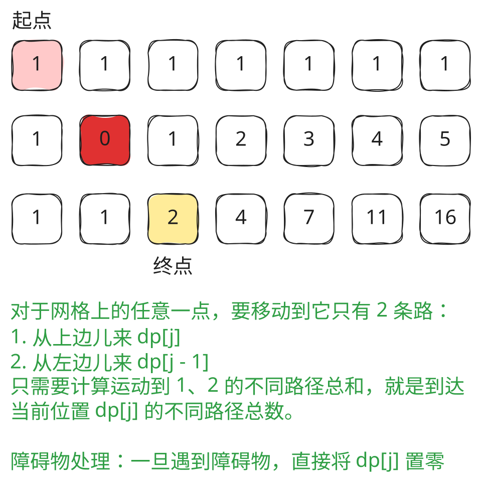

## 1. 题目描述

- [leetcode](https://leetcode.cn/problems/unique-paths-ii/)

给定一个 `m x n` 的整数数组 `grid`。一个机器人初始位于左上角（即 `grid[0][0]`）。机器人尝试移动到右下角（即 `grid[m - 1][n - 1]`）。机器人每次只能向下或者向右移动一步。

网格中的障碍物和空位置分别用 `1` 和 `0` 来表示。机器人的移动路径中不能包含任何有障碍物的方格。

返回机器人能够到达右下角的不同路径数量。

测试用例保证答案小于等于 `2 * 10^9`。

---

示例 1：


```txt
输入：obstacleGrid = [
  [0, 0, 0],
  [0, 1, 0],
  [0, 0, 0]
]
输出：2
```

解释：3x3 网格的正中间有一个障碍物。

从左上角到右下角一共有 2 条不同的路径：

1. 向右 -> 向右 -> 向下 -> 向下
2. 向下 -> 向下 -> 向右 -> 向右

---

示例 2：


```txt
输入：obstacleGrid = [
  [0, 1],
  [0, 0]
]
输出：1
```

---

提示：

- `m == obstacleGrid.length`
- `n == obstacleGrid[i].length`
- `1 <= m, n <= 100`
- `obstacleGrid[i][j]` 为 `0` 或 `1`

## 2. s.1 - 动态规划（滚动数组）



::: code-group

```c [c]
int uniquePathsWithObstacles(int** obstacleGrid, int obstacleGridSize,
                             int* obstacleGridColSize) {
    int m = obstacleGridSize, n = obstacleGridColSize[0];
    int dp[n];
    dp[0] = obstacleGrid[0][0] == 0 ? 1 : 0;
    for (int j = 1; j < n; j++)
        dp[j] = obstacleGrid[0][j] == 1 ? 0 : dp[j - 1]; // 第一行初始化

    for (int i = 1; i < m; i++) {
        dp[0] = obstacleGrid[i][0] == 1 ? 0 : dp[0]; // 第一列
        for (int j = 1; j < n; j++)
            dp[j] = obstacleGrid[i][j] == 1 ? 0 : dp[j] + dp[j - 1];
    }
    return dp[n - 1];
}
```

```js [js]
/**
 * @param {number[][]} obstacleGrid
 * @return {number}
 */
var uniquePathsWithObstacles = function (obstacleGrid) {
  const m = obstacleGrid.length,
    n = obstacleGrid[0].length
  const dp = new Array(n).fill(0)
  dp[0] = obstacleGrid[0][0] === 0 ? 1 : 0
  for (let j = 1; j < n; j++) dp[j] = obstacleGrid[0][j] === 1 ? 0 : dp[j - 1] // 第一行初始化

  for (let i = 1; i < m; i++) {
    dp[0] = obstacleGrid[i][0] === 1 ? 0 : dp[0] // 第一列
    for (let j = 1; j < n; j++)
      dp[j] = obstacleGrid[i][j] === 1 ? 0 : dp[j] + dp[j - 1]
  }
  return dp[n - 1]
}
```

```py [py]
class Solution:
    def uniquePathsWithObstacles(self, obstacleGrid: List[List[int]]) -> int:
        m, n = len(obstacleGrid), len(obstacleGrid[0])
        dp = [0] * n
        dp[0] = 1 if obstacleGrid[0][0] == 0 else 0
        for j in range(1, n):
            dp[j] = 0 if obstacleGrid[0][j] == 1 else dp[j - 1]  # 第一行初始化

        for i in range(1, m):
            dp[0] = 0 if obstacleGrid[i][0] == 1 else dp[0]  # 第一列
            for j in range(1, n):
                dp[j] = 0 if obstacleGrid[i][j] == 1 else dp[j] + dp[j - 1]
        return dp[n - 1]
```

:::

- 时间复杂度：$O(m \times n)$，遍历整个网格
- 空间复杂度：$O(n)$，只使用一维滚动数组

算法思路：

- 在 0062 的基础上增加障碍物处理：遇到障碍物的位置路径数直接置 0
- 状态转移：若 `obstacleGrid[i][j] == 1`，则 `dp[j] = 0`；否则 `dp[j] = dp[j] + dp[j-1]`
- 第一行和第一列需单独处理：一旦遇到障碍物，后续位置均不可达
