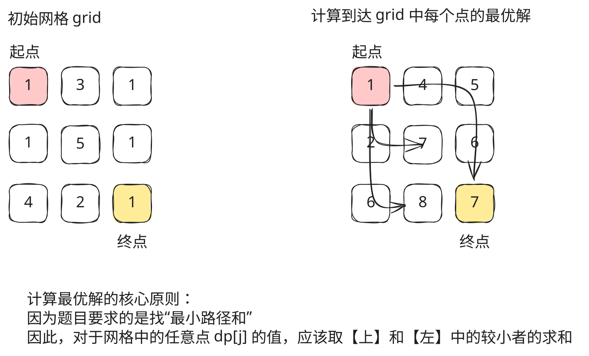

## 1. 题目描述

- [leetcode](https://leetcode.cn/problems/minimum-path-sum/)

给定一个包含非负整数的 `m x n` 网格 `grid`，请找出一条从左上角到右下角的路径，使得路径上的数字总和为最小。

说明：每次只能向下或者向右移动一步。

---

示例 1：


```txt
输入：grid = [
  [1, 3, 1],
  [1, 5, 1],
  [4, 2, 1]
]

输出：7
```

解释：因为路径 1 -> 3 -> 1 -> 1 -> 1 的总和最小。

---

示例 2：

```txt
输入：grid = [
  [1, 2, 3],
  [4, 5, 6]
]

输出：12
```

---

提示：

- `m == grid.length`
- `n == grid[i].length`
- `1 <= m, n <= 200`
- `0 <= grid[i][j] <= 200`

## 2. s.1 - 动态规划（滚动数组）



::: code-group

```c [c]
int minPathSum(int** grid, int gridSize, int* gridColSize) {
    int m = gridSize, n = gridColSize[0];
    int dp[n];
    dp[0] = grid[0][0];
    for (int j = 1; j < n; j++)
        dp[j] = dp[j - 1] + grid[0][j]; // 第一行前缀和

    for (int i = 1; i < m; i++) {
        dp[0] += grid[i][0]; // 第一列累加
        for (int j = 1; j < n; j++) {
            int top = dp[j], left = dp[j - 1];
            dp[j] = (top < left ? top : left) + grid[i][j];
        }
    }
    return dp[n - 1];
}
```

```js [js]
/**
 * @param {number[][]} grid
 * @return {number}
 */
var minPathSum = function (grid) {
  const m = grid.length,
    n = grid[0].length
  const dp = new Array(n)
  dp[0] = grid[0][0]
  for (let j = 1; j < n; j++) dp[j] = dp[j - 1] + grid[0][j] // 第一行前缀和

  for (let i = 1; i < m; i++) {
    dp[0] += grid[i][0] // 第一列累加
    for (let j = 1; j < n; j++) dp[j] = Math.min(dp[j], dp[j - 1]) + grid[i][j]
  }
  return dp[n - 1]
}
```

```py [py]
class Solution:
    def minPathSum(self, grid: List[List[int]]) -> int:
        m, n = len(grid), len(grid[0])
        dp = [0] * n
        dp[0] = grid[0][0]
        for j in range(1, n):
            dp[j] = dp[j - 1] + grid[0][j]  # 第一行前缀和

        for i in range(1, m):
            dp[0] += grid[i][0]  # 第一列累加
            for j in range(1, n):
                dp[j] = min(dp[j], dp[j - 1]) + grid[i][j]
        return dp[n - 1]
```

:::

- 时间复杂度：$O(m \times n)$，遍历整个网格
- 空间复杂度：$O(n)$，只使用一维滚动数组

算法思路：

- 状态定义：`dp[j]` 表示到达当前行第 `j` 列的最小路径和
- 第一行初始化为前缀和，第一列逐行累加
- 状态转移：`dp[j] = min(dp[j], dp[j-1]) + grid[i][j]`（取上方和左方的较小值加上当前格值）
