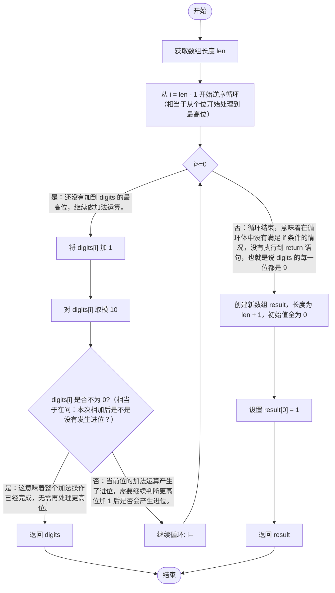

# [0066. 加一【简单】](https://github.com/tnotesjs/TNotes.leetcode/tree/main/notes/0066.%20%E5%8A%A0%E4%B8%80%E3%80%90%E7%AE%80%E5%8D%95%E3%80%91)

<!-- region:toc -->

- [1. 📝 题目描述](#1--题目描述)
- [2. 🎯 s.1 - 逆序循环](#2--s1---逆序循环)

<!-- endregion:toc -->

## 1. 📝 题目描述

- [leetcode](https://leetcode.cn/problems/plus-one/)

给定一个由 **整数** 组成的 **非空** 数组所表示的非负整数，在该数的基础上加一。

最高位数字存放在数组的首位， 数组中每个元素只存储**单个**数字。

你可以假设除了整数 0 之外，这个整数不会以零开头。

**示例  1：**

```
输入：digits = [1,2,3]
输出：[1,2,4]
解释：输入数组表示数字 123。
```

**示例  2：**

```
输入：digits = [4,3,2,1]
输出：[4,3,2,2]
解释：输入数组表示数字 4321。
```

**示例 3：**

```
输入：digits = [9]
输出：[1,0]
解释：输入数组表示数字 9。
加 1 得到了 9 + 1 = 10。
因此，结果应该是 [1,0]。
```

**提示：**

- `1 <= digits.length <= 100`
- `0 <= digits[i] <= 9`

## 2. 🎯 s.1 - 逆序循环

```javascript
var plusOne = function (digits) {
  const len = digits.length
  for (let i = len - 1; i >= 0; i--) {
    digits[i]++
    digits[i] %= 10
    if (digits[i] !== 0) return digits
  }
  const result = Array(len + 1).fill(0)
  result[0] = 1
  return result
}
```

- 时间复杂度：O(n)
- 空间复杂度：O(1)
  - 除非发生了全 9 的情况，这时会创建一个额外的数组，导致空间复杂度变为 O(n)。
- 实现流程：
  1. **获取数组长度**：首先，通过 `const len = digits.length` 获取输入数组 `digits` 的长度，这将用于循环遍历数组。
  2. **从末尾开始遍历数组**：使用 `for (let i = len - 1; i >= 0; i--)` 从数组的最后一个元素（即个位）向前遍历到第一个元素（即最高位）。这是因为加法运算通常是从最低位（个位）开始向高位进行的，如果某一位加上 1 后产生进位，则需要将其余数存回该位置，并将进位加到下一位上。
  3. **加 1 并取模**：
     - 在循环中，先对当前位 `digits[i]` 加 1。
     - 然后使用 `digits[i] %= 10` 对 10 取模，这是因为如果加 1 后的结果是 10（即产生了进位），那么取模后的值就是 0，相当于该位变成了 0，而进位则会在下一个循环迭代中被处理。
     - 如果加 1 后没有产生进位（即 `digits[i]` 不等于 0），则直接返回修改后的数组 `digits`，因为这意味着整个加法操作已经完成，无需再处理更高位。
  4. **处理全部为 9 的情况**：如果循环结束时仍未返回（即所有位都产生了进位，最终变成了 `[0, 0, ..., 0]`），则说明原始数组是一个由全 9 组成的数字（如 999）。此时需要创建一个新的比原数组长一位的新数组 `result`，并将第一位设为 1，其余位默认为 0，这相当于原来的数字加 1 后变成了 1000...0 这样的形式。最后返回这个新数组。
- 流程图：


