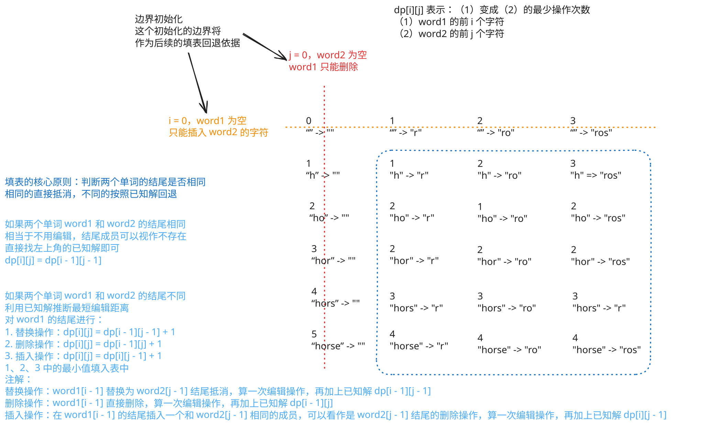

## 1. 题目描述

- [leetcode](https://leetcode.cn/problems/edit-distance/)

给你两个单词 `word1` 和 `word2`，请返回将 `word1` 转换成 `word2` 所使用的最少操作数。

你可以对一个单词进行如下三种操作：

- 插入一个字符
- 删除一个字符
- 替换一个字符

---

示例 1：

```txt
输入：word1 = "horse", word2 = "ros"
输出：3
```

解释：

- `horse` -> `rorse`（将 'h' 替换为 'r'）
- `rorse` -> `rose`（删除 'r'）
- `rose` -> `ros`（删除 'e'）

---

示例 2：

```txt
输入：word1 = "intention", word2 = "execution"
输出：5
```

解释：

- `intention` -> `inention`（删除 't'）
- `inention` -> `enention`（将 'i' 替换为 'e'）
- `enention` -> `exention`（将 'n' 替换为 'x'）
- `exention` -> `exection`（将 'n' 替换为 'c'）
- `exection` -> `execution`（插入 'u'）

---

提示：

- `0 <= word1.length, word2.length <= 500`
- `word1` 和 `word2` 由小写英文字母组成

## 2. s.1 - 动态规划（二维数组）



::: code-group

```c [c]
int minDistance(char* word1, char* word2) {
    int m = strlen(word1), n = strlen(word2);

    int dp[m + 1][n + 1];
    for (int i = 0; i <= m; i++)
        dp[i][0] = i;
    for (int j = 0; j <= n; j++)
        dp[0][j] = j;

    for (int i = 1; i <= m; i++) {
        for (int j = 1; j <= n; j++) {
            if (word1[i - 1] == word2[j - 1]) {
                dp[i][j] = dp[i - 1][j - 1];
            } else {
                int a = dp[i - 1][j - 1]; // 替换
                int b = dp[i - 1][j];     // 删除
                int c = dp[i][j - 1];     // 插入
                dp[i][j] = (a < b ? (a < c ? a : c) : (b < c ? b : c)) + 1;
            }
        }
    }
    return dp[m][n];
}
```

```js [js]
/**
 * @param {string} word1
 * @param {string} word2
 * @return {number}
 */
var minDistance = function (word1, word2) {
  const m = word1.length
  const n = word2.length

  const dp = Array.from({ length: m + 1 }, () => Array(n + 1).fill(0))

  // word2 为空，word1 只能删除
  for (let i = 0; i <= m; i++) {
    dp[i][0] = i
  }

  // word1 为空，只能插入 word2 的字符
  for (let j = 0; j <= n; j++) {
    dp[0][j] = j
  }

  for (let i = 1; i <= m; i++) {
    for (let j = 1; j <= n; j++) {
      if (word1[i - 1] === word2[j - 1]) {
        dp[i][j] = dp[i - 1][j - 1]
      } else {
        dp[i][j] =
          Math.min(
            dp[i - 1][j - 1], // 替换
            dp[i - 1][j], // 删除
            dp[i][j - 1], // 插入
          ) + 1
      }
    }
  }

  return dp[m][n]
}
```

```py [py]
class Solution:
    def minDistance(self, word1: str, word2: str) -> int:
        m, n = len(word1), len(word2)
        dp = [[0] * (n + 1) for _ in range(m + 1)]

        for i in range(m + 1):
            dp[i][0] = i
        for j in range(n + 1):
            dp[0][j] = j

        for i in range(1, m + 1):
            for j in range(1, n + 1):
                if word1[i - 1] == word2[j - 1]:
                    dp[i][j] = dp[i - 1][j - 1]
                else:
                    dp[i][j] = min(dp[i - 1][j - 1], dp[i - 1][j], dp[i][j - 1]) + 1

        return dp[m][n]
```

:::

- 时间复杂度：$O(m \times n)$，其中 $m$ 和 $n$ 分别是 `word1` 和 `word2` 的长度，需要填充 $m \times n$ 个状态
- 空间复杂度：$O(m \times n)$，使用二维数组存储所有状态

算法思路：

- 状态定义：`dp[i][j]` 表示将 `word1[0..i-1]` 转换为 `word2[0..j-1]` 所需的最少操作数
- 边界：`dp[i][0] = i`（`word2` 为空时需删除 $i$ 次），`dp[0][j] = j`（`word1` 为空时需插入 $j$ 次）
- 状态转移：若 `word1[i-1] == word2[j-1]`，则 `dp[i][j] = dp[i-1][j-1]`（无需操作）；否则取以下三种操作的最小值加一：
  - 替换：`dp[i-1][j-1]`
  - 删除：`dp[i-1][j]`
  - 插入：`dp[i][j-1]`

## 3. s.2 - 动态规划（一维滚动数组）

::: code-group

```c [c]
int minDistance(char* word1, char* word2) {
    int m = strlen(word1), n = strlen(word2);
    int dp[n + 1];
    for (int j = 0; j <= n; j++)
        dp[j] = j; // word1 为空时，插入 j 次

    for (int i = 1; i <= m; i++) {
        int prev = dp[0]; // 保存左上角 dp[i-1][j-1]
        dp[0] = i;        // word2 为空时，删除 i 次
        for (int j = 1; j <= n; j++) {
            int temp = dp[j];
            if (word1[i - 1] == word2[j - 1]) {
                dp[j] = prev; // 字符相同，无需操作
            } else {
                int a = prev, b = dp[j], c = dp[j - 1]; // 替换、删除、插入
                dp[j] = (a < b ? (a < c ? a : c) : (b < c ? b : c)) + 1;
            }
            prev = temp;
        }
    }
    return dp[n];
}
```

```js [js]
/**
 * @param {string} word1
 * @param {string} word2
 * @return {number}
 */
var minDistance = function (word1, word2) {
  const m = word1.length,
    n = word2.length
  const dp = Array.from({ length: n + 1 }, (_, j) => j) // word1 为空时，插入 j 次

  for (let i = 1; i <= m; i++) {
    let prev = dp[0] // 保存左上角 dp[i-1][j-1]
    dp[0] = i // word2 为空时，删除 i 次
    for (let j = 1; j <= n; j++) {
      const temp = dp[j]
      if (word1[i - 1] === word2[j - 1]) {
        dp[j] = prev // 字符相同，无需操作
      } else {
        dp[j] = Math.min(prev, dp[j], dp[j - 1]) + 1 // 替换、删除、插入
      }
      prev = temp
    }
  }
  return dp[n]
}
```

```py [py]
class Solution:
    def minDistance(self, word1: str, word2: str) -> int:
        m, n = len(word1), len(word2)
        dp = list(range(n + 1))  # word1 为空时，插入 j 次

        for i in range(1, m + 1):
            prev = dp[0]  # 保存左上角 dp[i-1][j-1]
            dp[0] = i  # word2 为空时，删除 i 次
            for j in range(1, n + 1):
                temp = dp[j]
                if word1[i - 1] == word2[j - 1]:
                    dp[j] = prev  # 字符相同，无需操作
                else:
                    dp[j] = min(prev, dp[j], dp[j - 1]) + 1  # 替换、删除、插入
                prev = temp
        return dp[n]
```

:::

- 时间复杂度：$O(m \times n)$，其中 m 和 n 分别是两个字符串的长度
- 空间复杂度：$O(n)$，只使用一维滚动数组

算法思路：

- 状态定义：`dp[j]` 表示 `word1[0..i-1]` 转换为 `word2[0..j-1]` 的最少操作数
- 边界：`dp[j] = j`（word1 为空时需插入 j 次），`dp[0] = i`（word2 为空时需删除 i 次）
- 状态转移：
  - 若 `word1[i-1] == word2[j-1]`，则 `dp[j] = prev`（无需操作）
  - 否则 `dp[j] = min(prev, dp[j], dp[j-1]) + 1`（分别对应替换、删除、插入）
- 用 `prev` 变量保存滚动更新前的左上角值 `dp[i-1][j-1]`
