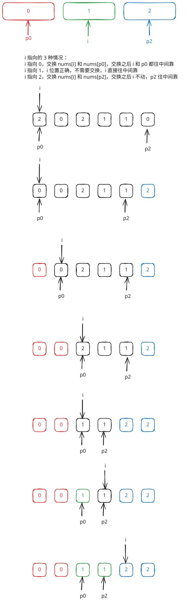

## 1. 题目描述

- [leetcode](https://leetcode.cn/problems/sort-colors)

给定一个包含红色、白色和蓝色、共 `n` 个元素的数组 `nums`，[原地](https://baike.baidu.com/item/%E5%8E%9F%E5%9C%B0%E7%AE%97%E6%B3%95) 对它们进行排序，使得相同颜色的元素相邻，并按照红色、白色、蓝色顺序排列。

我们使用整数 `0`、 `1` 和 `2` 分别表示红色、白色和蓝色。

必须在不使用库内置的 sort 函数的情况下解决这个问题。

---

示例 1：

```
输入：nums = [2,0,2,1,1,0]
输出：[0,0,1,1,2,2]
```

---

示例 2：

```
输入：nums = [2,0,1]
输出：[0,1,2]
```

---

提示：

- `n == nums.length`
- `1 <= n <= 300`
- `nums[i]` 为 `0`、`1` 或 `2`

---

进阶：

- 你能想出一个仅使用常数空间的一趟扫描算法吗？

## 2. s.1 - 三指针分区



::: code-group

```c [c]
void sortColors(int* nums, int numsSize) {
    int p0 = 0, p2 = numsSize - 1, i = 0;

    while (i <= p2) {
        if (nums[i] == 0) {
            int tmp = nums[i];
            nums[i] = nums[p0];
            nums[p0] = tmp;
            p0++;
            i++;
        } else if (nums[i] == 2) {
            int tmp = nums[i];
            nums[i] = nums[p2];
            nums[p2] = tmp;
            p2--;
        } else {
            i++;
        }
    }
}
```

```js [js]
/**
 * @param {number[]} nums
 * @return {void} Do not return anything, modify nums in-place instead.
 */
var sortColors = function (nums) {
  let p0 = 0
  let p2 = nums.length - 1
  let i = 0

  while (i <= p2) {
    if (nums[i] === 0) {
      // 将0交换到前面
      ;[nums[i], nums[p0]] = [nums[p0], nums[i]]
      p0++
      i++
    } else if (nums[i] === 2) {
      // 将2交换到后面，i不动
      ;[nums[i], nums[p2]] = [nums[p2], nums[i]]
      p2--
    } else {
      // nums[i] === 1，位置正确，继续前进
      i++
    }
  }
}
```

```py [py]
class Solution:
    def sortColors(self, nums: list[int]) -> None:
        """
        Do not return anything, modify nums in-place instead.
        """
        p0, p2, i = 0, len(nums) - 1, 0

        while i <= p2:
            if nums[i] == 0:
                nums[i], nums[p0] = nums[p0], nums[i]
                p0 += 1
                i += 1
            elif nums[i] == 2:
                nums[i], nums[p2] = nums[p2], nums[i]
                p2 -= 1
            else:
                i += 1
```

:::

- 时间复杂度：$O(n)$，只需遍历数组一次
- 空间复杂度：$O(1)$，原地交换，只使用常数额外空间

算法思路：

- 维护三个指针：`p0` 指向 0 区域的右边界，`p2` 指向 2 区域的左边界，`i` 为当前扫描指针
- 当 `nums[i] == 0` 时，与 `nums[p0]` 交换并同时推进 `p0` 和 `i`
- 当 `nums[i] == 2` 时，与 `nums[p2]` 交换并只推进 `p2`（`i` 不动，因为换来的元素尚未检查）
- 当 `nums[i] == 1` 时，直接推进 `i`
- 循环结束时 `[0, p0-1]` 全为 0，`[p2+1, n-1]` 全为 2，中间全为 1
