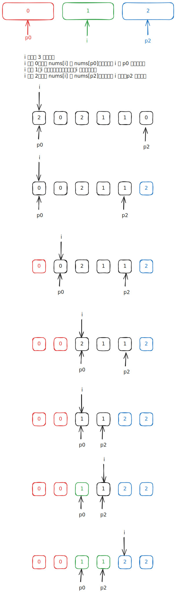

# [0075. 颜色分类【中等】](https://github.com/tnotesjs/TNotes.leetcode/tree/main/notes/0075.%20%E9%A2%9C%E8%89%B2%E5%88%86%E7%B1%BB%E3%80%90%E4%B8%AD%E7%AD%89%E3%80%91)

<!-- region:toc -->

- [1. 题目描述](#1-题目描述)
- [2. s.1 - 三指针分区](#2-s1---三指针分区)

<!-- endregion:toc -->

## 1. 题目描述

- [leetcode](https://leetcode.cn/problems/sort-colors)

给定一个包含红色、白色和蓝色、共 `n` 个元素的数组 `nums`，[原地](https://baike.baidu.com/item/%E5%8E%9F%E5%9C%B0%E7%AE%97%E6%B3%95) 对它们进行排序，使得相同颜色的元素相邻，并按照红色、白色、蓝色顺序排列。

我们使用整数 `0`、 `1` 和 `2` 分别表示红色、白色和蓝色。

必须在不使用库内置的 sort 函数的情况下解决这个问题。

---

示例 1：

```
输入：nums = [2,0,2,1,1,0]
输出：[0,0,1,1,2,2]
```

---

示例 2：

```
输入：nums = [2,0,1]
输出：[0,1,2]
```

---

提示：

- `n == nums.length`
- `1 <= n <= 300`
- `nums[i]` 为 `0`、`1` 或 `2`

---

进阶：

- 你能想出一个仅使用常数空间的一趟扫描算法吗？

## 2. s.1 - 三指针分区



::: code-group

<<< ./solutions/1/1.c [c]

<<< ./solutions/1/1.js [js]

<<< ./solutions/1/1.py [py]

:::

- 时间复杂度：$O(n)$，只需遍历数组一次
- 空间复杂度：$O(1)$，原地交换，只使用常数额外空间

算法思路：

- 维护三个指针：`p0` 指向 0 区域的右边界，`p2` 指向 2 区域的左边界，`i` 为当前扫描指针
- 当 `nums[i] == 0` 时，与 `nums[p0]` 交换并同时推进 `p0` 和 `i`
- 当 `nums[i] == 2` 时，与 `nums[p2]` 交换并只推进 `p2`（`i` 不动，因为换来的元素尚未检查）
- 当 `nums[i] == 1` 时，直接推进 `i`
- 循环结束时 `[0, p0-1]` 全为 0，`[p2+1, n-1]` 全为 2，中间全为 1
