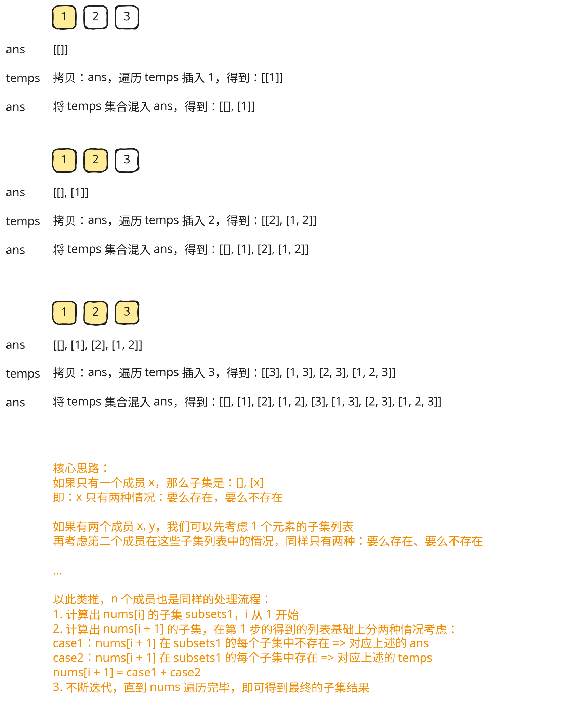
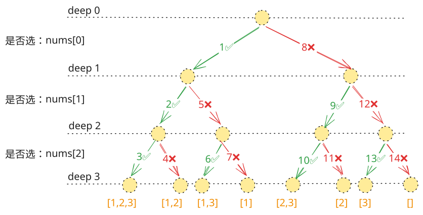
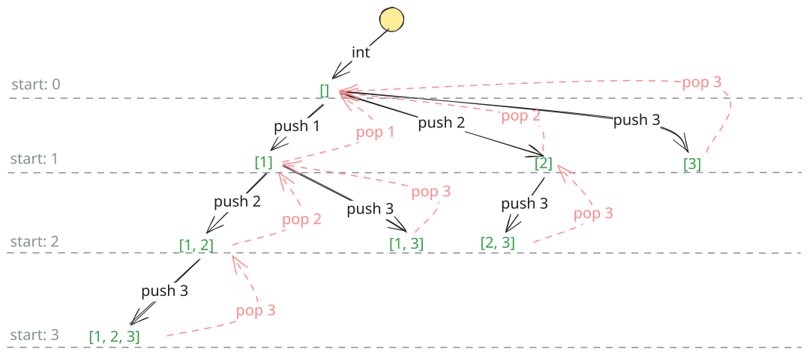

## 1. 题目描述

- [leetcode](https://leetcode.cn/problems/subsets/)

给你一个整数数组 `nums`，数组中的元素互不相同。返回该数组所有可能的子集（幂集）。

> 数组的子集是从数组中选择一些元素（可能为空）。

解集不能包含重复的子集。你可以按任意顺序返回解集。

---

示例 1：

```txt
输入：nums = [1,2,3]
输出：[[], [1], [2], [1, 2], [3], [1, 3], [2, 3], [1, 2, 3]]
```

---

示例 2：

```txt
输入：nums = [0]
输出：[[], [0]]
```

---

提示：

- `1 <= nums.length <= 10`
- `-10 <= nums[i] <= 10`
- `nums` 中的所有元素 互不相同

## 2. s.1 - 增量构造



::: code-group

```c [c]
/**
 * Return an array of arrays of size *returnSize.
 * The sizes of the arrays are returned as *returnColumnSizes array.
 * Note: Both returned array and *columnSizes array must be malloced, assume caller calls free().
 */
int** subsets(int* nums, int numsSize, int* returnSize, int** returnColumnSizes) {
	int total = 1 << numsSize;
	int** ans = (int**)malloc(total * sizeof(int*));
	*returnColumnSizes = (int*)malloc(total * sizeof(int));

	ans[0] = (int*)malloc(0);
	(*returnColumnSizes)[0] = 0;
	int ansSize = 1;

	for (int i = 0; i < numsSize; i++) {
		int currentSize = ansSize;
		for (int j = 0; j < currentSize; j++) {
			int subsetSize = (*returnColumnSizes)[j];
			int* subset = (int*)malloc((subsetSize + 1) * sizeof(int));
			for (int k = 0; k < subsetSize; k++) subset[k] = ans[j][k];
			subset[subsetSize] = nums[i];

			ans[ansSize] = subset;
			(*returnColumnSizes)[ansSize] = subsetSize + 1;
			ansSize++;
		}
	}

	*returnSize = ansSize;
	return ans;
}
```

```js [js]
/**
 * @param {number[]} nums
 * @return {number[][]}
 */
var subsets = function (nums) {
  let ans = [[]] // 初始：空集
  for (let i = 0; i < nums.length; i++) {
    const temps = []
    for (let k = 0; k < ans.length; k++) temps.push(ans[k].slice()) // 复制
    for (let j = 0; j < temps.length; j++) temps[j].push(nums[i]) // 插入
    ans = [...ans, ...temps] // 合并
  }
  return ans
}
```

```py [py]
class Solution:
	def subsets(self, nums: List[int]) -> List[List[int]]:
		ans: List[List[int]] = [[]]

		for num in nums:
			temps = [subset[:] for subset in ans]
			for subset in temps:
				subset.append(num)
			ans.extend(temps)

		return ans
```

:::

- 时间复杂度：$O(n \times 2^n)$，长度为 $n$ 的数组一共有 $2^n$ 个子集；处理每个元素时，都要基于已有子集复制出一批新子集并追加当前元素
- 空间复杂度：$O(n \times 2^n)$，返回结果需要存储全部 $2^n$ 个子集，所有子集中的元素总数为 $O(n \times 2^n)$

算法思路：

- 先把答案初始化为只包含一个空集：`ans = [[]]`
- 依次遍历数组中的每个元素 `nums[i]`
- 在处理 `nums[i]` 之前，`ans` 中保存的是“前面若干元素能够组成的所有子集”
- 对 `ans` 中的每个已有子集做一份拷贝，并在拷贝末尾追加当前元素 `nums[i]`
- 这些新子集表示“选择了 `nums[i]`”的所有情况，再将它们合并回 `ans`
- 每处理一个新元素，答案中的子集数量都会翻倍：
  - 原有子集表示“不选当前元素”
  - 新增子集表示“选当前元素”
- 当所有元素都处理完后，`ans` 中就是完整的幂集

## 3. s.2 - 回溯 - 二叉决策树



::: code-group

```c [c]
/**
 * Return an array of arrays of size *returnSize.
 * The sizes of the arrays are returned as *returnColumnSizes array.
 * Note: Both returned array and *columnSizes array must be malloced, assume caller calls free().
 */
int** answers;
int answerSize;
int numsLength;
int path[10];
int pathSize;

void storeSubset(int* returnColumnSizes) {
	int* subset = (int*)malloc(pathSize * sizeof(int));
	for (int i = 0; i < pathSize; i++) subset[i] = path[i];
	answers[answerSize] = subset;
	returnColumnSizes[answerSize] = pathSize;
	answerSize++;
}

void dfs(int* nums, int depth, int* returnColumnSizes) {
	if (depth == numsLength) {
		storeSubset(returnColumnSizes);
		return;
	}

	path[pathSize++] = nums[depth];
	dfs(nums, depth + 1, returnColumnSizes);
	pathSize--;

	dfs(nums, depth + 1, returnColumnSizes);
}

int** subsets(int* nums, int numsSize, int* returnSize, int** returnColumnSizes) {
	int total = 1 << numsSize;
	answers = (int**)malloc(total * sizeof(int*));
	*returnColumnSizes = (int*)malloc(total * sizeof(int));
	answerSize = 0;
	numsLength = numsSize;
	pathSize = 0;

	dfs(nums, 0, *returnColumnSizes);

	*returnSize = answerSize;
	return answers;
}
```

```js [js]
/**
 * @param {number[]} nums
 * @return {number[][]}
 */
var subsets = function (nums) {
  const t = []
  const ans = []
  const dfs = (deep) => {
    if (deep === nums.length) {
      // console.log(t);
      ans.push([...t])
      return
    }
    t.push(nums[deep])
    dfs(deep + 1)
    t.pop()
    dfs(deep + 1)
  }
  dfs(0)
  return ans
}
```

```py [py]
class Solution:
	def subsets(self, nums: List[int]) -> List[List[int]]:
		path: List[int] = []
		ans: List[List[int]] = []

		def dfs(depth: int) -> None:
			if depth == len(nums):
				ans.append(path[:])
				return

			path.append(nums[depth])
			dfs(depth + 1)
			path.pop()
			dfs(depth + 1)

		dfs(0)
		return ans
```

:::

- 时间复杂度：$O(n \times 2^n)$，每个元素都有“选”或“不选”两种分支，整棵递归树共有 $2^n$ 个叶子节点，记录每个子集时拷贝路径的开销最多为 $O(n)$
- 空间复杂度：$O(n)$，递归栈深度和当前路径长度最多都为 $n$；若计入返回结果，总空间为 $O(n \times 2^n)$

算法思路：

- 用 `dfs(depth)` 表示当前处理到下标 `depth`，需要决定 `nums[depth]` 是否放入当前子集
- 这是一棵典型的二叉决策树：
  - 左分支表示“选当前元素”
  - 右分支表示“不选当前元素”
- 如果选择当前元素，就先把 `nums[depth]` 加入 `path`，递归处理下一个位置
- 回溯时将刚加入的元素弹出，再走“不选当前元素”的分支
- 当 `depth === nums.length` 时，说明每个元素都已经做完“选/不选”的决策，此时 `path` 就是一个完整子集，将其拷贝加入答案

## 4. s.3 - 回溯 - 多叉树遍历



::: code-group

```c [c]
/**
 * Return an array of arrays of size *returnSize.
 * The sizes of the arrays are returned as *returnColumnSizes array.
 * Note: Both returned array and *columnSizes array must be malloced, assume caller calls free().
 */
int** answers;
int answerSize;
int numsLength;
int path[10];
int pathSize;

void storeSubset(int* returnColumnSizes) {
	int* subset = (int*)malloc(pathSize * sizeof(int));
	for (int i = 0; i < pathSize; i++) subset[i] = path[i];
	answers[answerSize] = subset;
	returnColumnSizes[answerSize] = pathSize;
	answerSize++;
}

void backtrack(int* nums, int start, int* returnColumnSizes) {
	storeSubset(returnColumnSizes);

	for (int i = start; i < numsLength; i++) {
		path[pathSize++] = nums[i];
		backtrack(nums, i + 1, returnColumnSizes);
		pathSize--;
	}
}

int** subsets(int* nums, int numsSize, int* returnSize, int** returnColumnSizes) {
	int total = 1 << numsSize;
	answers = (int**)malloc(total * sizeof(int*));
	*returnColumnSizes = (int*)malloc(total * sizeof(int));
	answerSize = 0;
	numsLength = numsSize;
	pathSize = 0;

	backtrack(nums, 0, *returnColumnSizes);

	*returnSize = answerSize;
	return answers;
}
```

```js [js]
/**
 * @param {number[]} nums
 * @return {number[][]}
 */
var subsets = function (nums) {
  const res = []

  function backtrack(start, path) {
    res.push([...path])
    for (let i = start; i < nums.length; i++) {
      path.push(nums[i]) // 选择
      backtrack(i + 1, path)
      path.pop() // 撤销选择（回溯）
    }
  }

  backtrack(0, [])
  return res
}
```

```py [py]
class Solution:
	def subsets(self, nums: List[int]) -> List[List[int]]:
		ans: List[List[int]] = []
		path: List[int] = []

		def backtrack(start: int) -> None:
			ans.append(path[:])

			for i in range(start, len(nums)):
				path.append(nums[i])
				backtrack(i + 1)
				path.pop()

		backtrack(0)
		return ans
```

:::

- 时间复杂度：$O(n \times 2^n)$，一共会枚举出 $2^n$ 个子集，每次将当前路径加入答案时都需要拷贝，单次开销最多为 $O(n)$
- 空间复杂度：$O(n)$，递归栈深度和当前路径长度最多都为 $n$；若计入返回结果，总空间为 $O(n \times 2^n)$

算法思路：

- 用 `backtrack(start)` 表示接下来只能从区间 `[start, n - 1]` 中继续选数来扩展当前子集
- 和分支法不同，这里每进入一层递归，当前 `path` 本身就是一个合法子集，因此先加入答案
- 然后从 `start` 开始循环枚举下一个要加入子集的元素 `nums[i]`
- 选择 `nums[i]` 后，将其加入 `path`，并递归到 `backtrack(i + 1)`，表示后续只能继续选择它右侧的元素
- 递归返回后弹出 `nums[i]`，继续尝试同层中的下一个候选元素
- 因为每次都只向右选数，所以不会重复生成同一个子集；整棵搜索树中每个节点都对应一个不同的子集，这种写法更适合从“枚举下一个可选元素”的角度理解回溯

## 5. 对比：s.2 和 s.3

第一种 s.1 是在做是非题（选不选它？），第二种 s.3 是在做选择题（接下来选哪个？）。在解决子集和组合问题时，第二种（循环法）通常代码更简洁，也更容易进行剪枝优化。

### 5.1. s.2 是二叉决策树 `Binary Decision Tree`

- 别名：分支法、选/不选法
- 核心逻辑：针对每一个元素，只有两条路 => 选或者不选
- 树的结构：这是一棵二叉树
- 代码特征：函数内部有两个 `backtrack` 调用

### 5.2. s.3 是多叉树遍历 `N-ary Tree Traversal`

- 别名：循环迭代法、横向遍历法
- 核心逻辑：我不关心“不选”谁，我只关心“接下来能选谁”
  - 通过 `for` 循环，依次尝试把剩下的每一个元素作为“下一个加入的元素”
- 树的结构：这是一棵多叉树（N叉树）
  - 根节点是空集 `[]`
  - 第一层分支有3个选择（假设数组长度为3）：选1、选2、选3
  - 选了1之后，下一层分支有2个选择：选2、选3
  - 选中的相当于被固定了，没选的是下次选择的待选列表
- 代码特征：函数内部只有一个 `backtrack` 调用，但它被包裹在一个 `for` 循环中

### 5.3. 小结

| 特性     | s.2 二叉决策树                                  | s.3 多叉树/循环法                          |
| :------- | :---------------------------------------------- | :----------------------------------------- |
| 专业术语 | 子集树 `Subset Tree` 模型                       | 排列树 `Permutation Tree` 模型的变体       |
| 遍历方式 | 纵向：深度优先，每个节点做是非题                | 横向：广度优先的感觉，每个节点遍历剩余选项 |
| 递归调用 | 2次（选/不选）                                  | 1次（在循环内）                            |
| 结果收集 | `index == len` => 到达叶子节点时收集            | `res.push` => 进入节点时立刻收集           |
| 适用场景 | 0/1背包问题、需要明确判断“是否包含某元素”的问题 | 组合问题、子集问题、全排列问题             |
