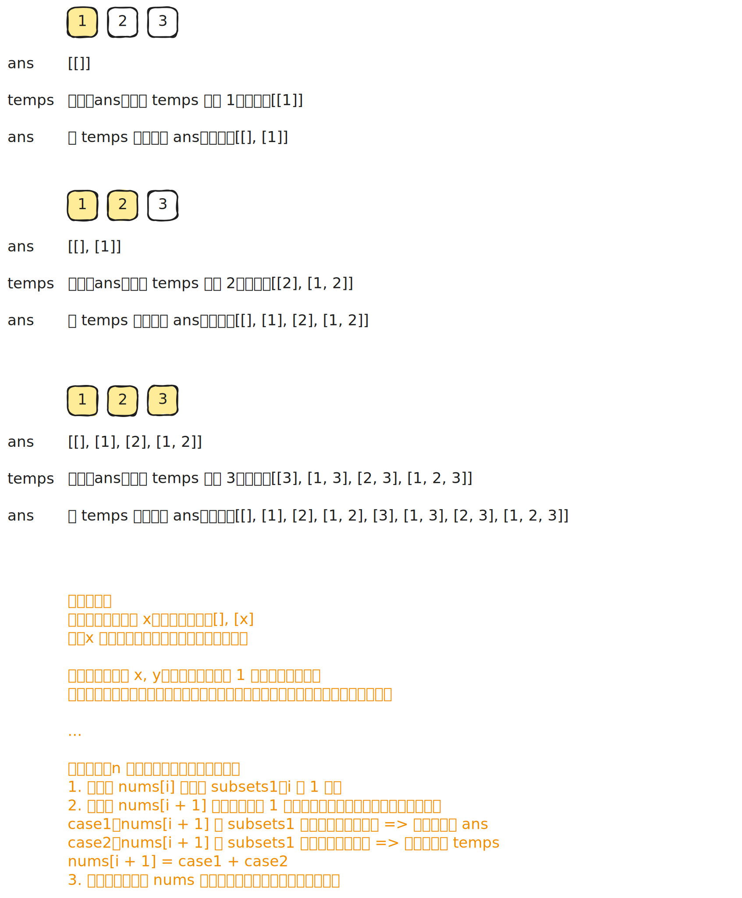
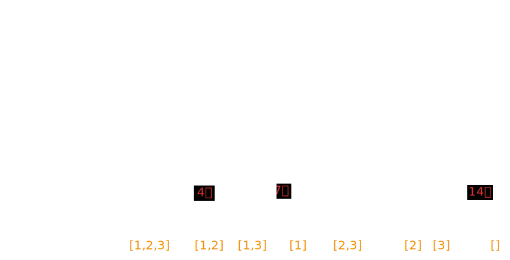
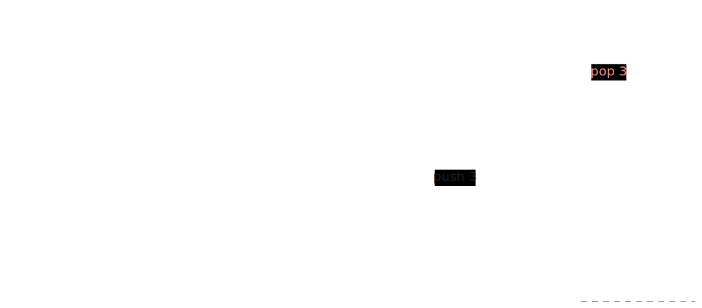

# [0078. 子集【中等】](https://github.com/tnotesjs/TNotes.leetcode/tree/main/notes/0078.%20%E5%AD%90%E9%9B%86%E3%80%90%E4%B8%AD%E7%AD%89%E3%80%91)

<!-- region:toc -->

- [1. 📝 题目描述](#1--题目描述)
- [2. 🎯 s.1 - 增量构造](#2--s1---增量构造)
- [3. 🎯 s.2 - 回溯 - 二叉决策树](#3--s2---回溯---二叉决策树)
- [4. 🎯 s.3 - 回溯 - 多叉树遍历](#4--s3---回溯---多叉树遍历)
  - [4.1. 对比：s.2 和 s.3](#41-对比s2-和-s3)

<!-- endregion:toc -->

## 1. 📝 题目描述

- [leetcode](https://leetcode.cn/problems/subsets/)

给你一个整数数组 `nums`，数组中的元素互不相同。返回该数组所有可能的子集（幂集）。

> 数组的子集是从数组中选择一些元素（可能为空）。

解集不能包含重复的子集。你可以按任意顺序返回解集。

---

示例 1：

```txt
输入：nums = [1,2,3]
输出：[[],[1],[2],[1,2],[3],[1,3],[2,3],[1,2,3]]
```

---

示例 2：

```txt
输入：nums = [0]
输出：[[],[0]]
```

---

提示：

- `1 <= nums.length <= 10`
- `-10 <= nums[i] <= 10`
- `nums` 中的所有元素 互不相同

## 2. 🎯 s.1 - 增量构造



::: code-group

<<< ./solutions/1/1.c [c]

<<< ./solutions/1/1.js [js]

<<< ./solutions/1/1.py [py]

:::

- 时间复杂度：$O(n \times 2^n)$，长度为 $n$ 的数组一共有 $2^n$ 个子集；处理每个元素时，都要基于已有子集复制出一批新子集并追加当前元素
- 空间复杂度：$O(n \times 2^n)$，返回结果需要存储全部 $2^n$ 个子集，所有子集中的元素总数为 $O(n \times 2^n)$

算法思路：

- 先把答案初始化为只包含一个空集：`ans = [[]]`
- 依次遍历数组中的每个元素 `nums[i]`
- 在处理 `nums[i]` 之前，`ans` 中保存的是“前面若干元素能够组成的所有子集”
- 对 `ans` 中的每个已有子集做一份拷贝，并在拷贝末尾追加当前元素 `nums[i]`
- 这些新子集表示“选择了 `nums[i]`”的所有情况，再将它们合并回 `ans`
- 每处理一个新元素，答案中的子集数量都会翻倍：
  - 原有子集表示“不选当前元素”
  - 新增子集表示“选当前元素”
- 当所有元素都处理完后，`ans` 中就是完整的幂集

## 3. 🎯 s.2 - 回溯 - 二叉决策树



::: code-group

<<< ./solutions/2/1.c [c]

<<< ./solutions/2/1.js [js]

<<< ./solutions/2/1.py [py]

:::

- 时间复杂度：$O(n \times 2^n)$，每个元素都有“选”或“不选”两种分支，整棵递归树共有 $2^n$ 个叶子节点，记录每个子集时拷贝路径的开销最多为 $O(n)$
- 空间复杂度：$O(n)$，递归栈深度和当前路径长度最多都为 $n$；若计入返回结果，总空间为 $O(n \times 2^n)$

算法思路：

- 用 `dfs(depth)` 表示当前处理到下标 `depth`，需要决定 `nums[depth]` 是否放入当前子集
- 这是一棵典型的二叉决策树：
  - 左分支表示“选当前元素”
  - 右分支表示“不选当前元素”
- 如果选择当前元素，就先把 `nums[depth]` 加入 `path`，递归处理下一个位置
- 回溯时将刚加入的元素弹出，再走“不选当前元素”的分支
- 当 `depth === nums.length` 时，说明每个元素都已经做完“选/不选”的决策，此时 `path` 就是一个完整子集，将其拷贝加入答案

## 4. 🎯 s.3 - 回溯 - 多叉树遍历



::: code-group

<<< ./solutions/3/1.c [c]

<<< ./solutions/3/1.js [js]

<<< ./solutions/3/1.py [py]

:::

- 时间复杂度：$O(n \times 2^n)$，一共会枚举出 $2^n$ 个子集，每次将当前路径加入答案时都需要拷贝，单次开销最多为 $O(n)$
- 空间复杂度：$O(n)$，递归栈深度和当前路径长度最多都为 $n$；若计入返回结果，总空间为 $O(n \times 2^n)$

算法思路：

- 用 `backtrack(start)` 表示接下来只能从区间 `[start, n - 1]` 中继续选数来扩展当前子集
- 和分支法不同，这里每进入一层递归，当前 `path` 本身就是一个合法子集，因此先加入答案
- 然后从 `start` 开始循环枚举下一个要加入子集的元素 `nums[i]`
- 选择 `nums[i]` 后，将其加入 `path`，并递归到 `backtrack(i + 1)`，表示后续只能继续选择它右侧的元素
- 递归返回后弹出 `nums[i]`，继续尝试同层中的下一个候选元素
- 因为每次都只向右选数，所以不会重复生成同一个子集；整棵搜索树中每个节点都对应一个不同的子集，这种写法更适合从“枚举下一个可选元素”的角度理解回溯

### 4.1. 对比：s.2 和 s.3

第一种 s.1 是在做是非题（选不选它？），第二种 s.3 是在做选择题（接下来选哪个？）。在解决子集和组合问题时，第二种（循环法）通常代码更简洁，也更容易进行剪枝优化。

- s.2 是二叉决策树 `Binary Decision Tree`
  - 别名：分支法、选/不选法
  - 核心逻辑：针对每一个元素，只有两条路——选或者不选
  - 树的结构：这是一棵二叉树
  - 代码特征：函数内部有两个 `backtrack` 调用
- s.3 是多叉树遍历 `N-ary Tree Traversal`
  - 别名：循环迭代法、横向遍历法、增量构造法
  - 核心逻辑：我不关心“不选”谁，我只关心“接下来能选谁”
    - 通过 `for` 循环，依次尝试把剩下的每一个元素作为“下一个加入的元素”
  - 树的结构：这是一棵多叉树（N叉树）
    - 根节点是空集 `[]`
    - 第一层分支有3个选择（假设数组长度为3）：选1、选2、选3
    - 选了1之后，下一层分支有2个选择：选2、选3
    - 选中的相当于被固定了，没选的是下次选择的待选列表
  - 代码特征：函数内部只有一个 `backtrack` 调用，但它被包裹在一个 `for` 循环中

| 特性 | s.2 二叉决策树 | s.3 多叉树/循环法 |
| :-- | :-- | :-- |
| 专业术语 | 子集树 `Subset Tree` 模型 | 排列树 `Permutation Tree` 模型的变体 |
| 遍历方式 | 纵向：深度优先，每个节点做是非题 | 横向：广度优先的感觉，每个节点遍历剩余选项 |
| 递归调用 | 2次（选/不选） | 1次（在循环内） |
| 结果收集 | `index == len` => 到达叶子节点时收集 | `res.push` => 进入节点时立刻收集 |
| 适用场景 | 0/1背包问题、需要明确判断“是否包含某元素”的问题 | 组合问题、子集问题、全排列问题 |
